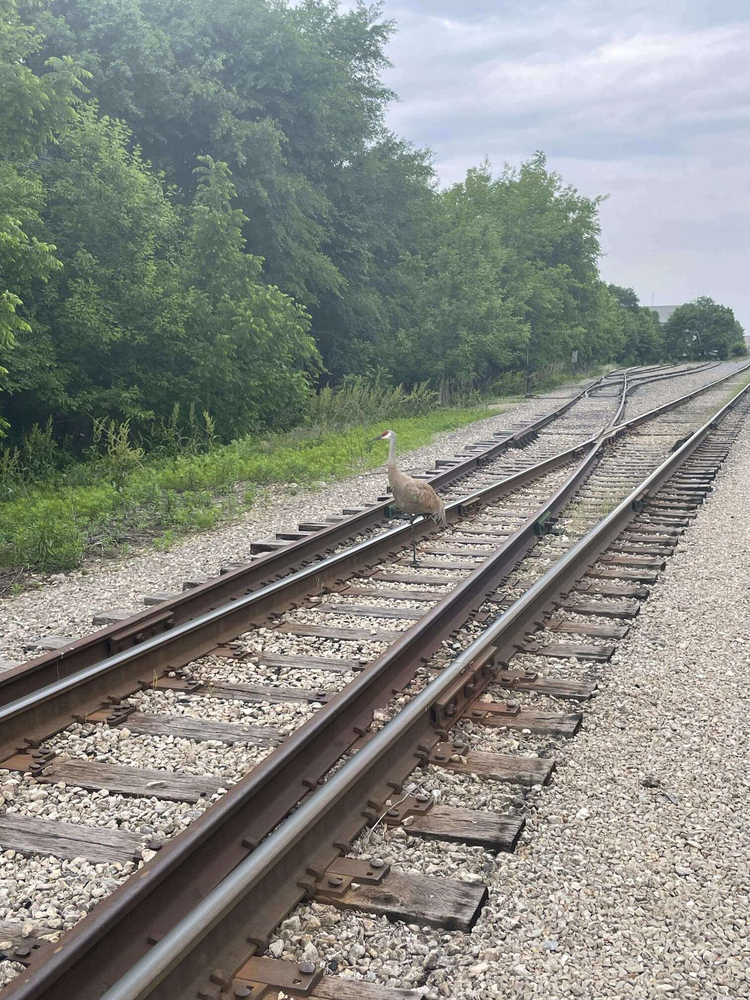
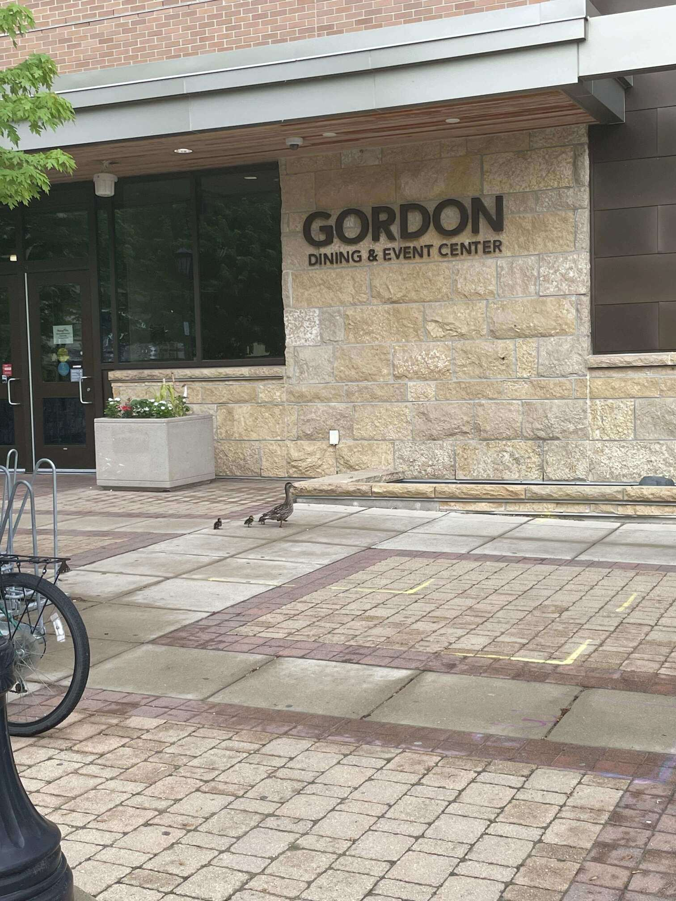
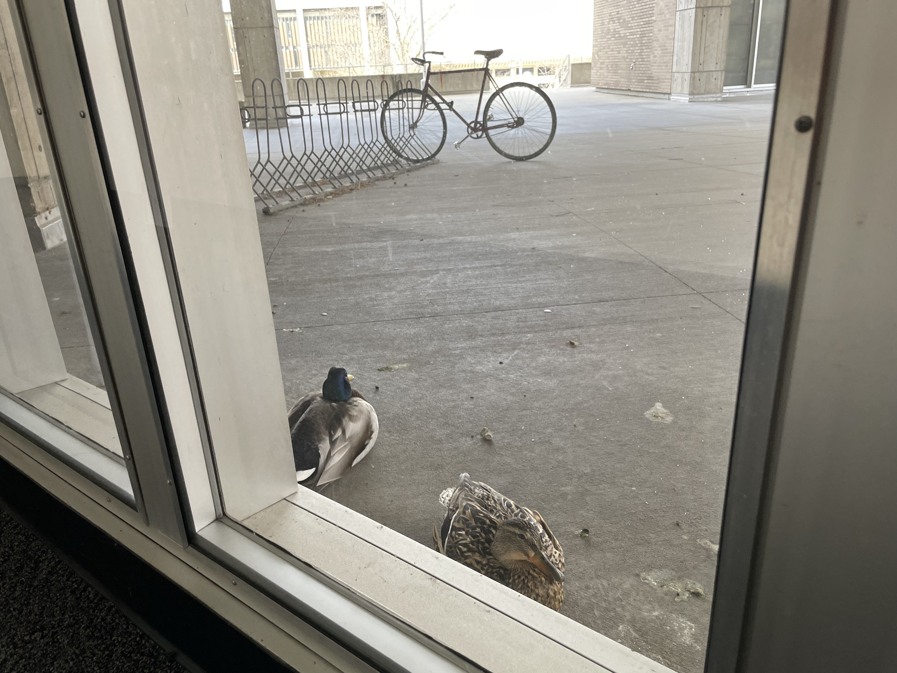
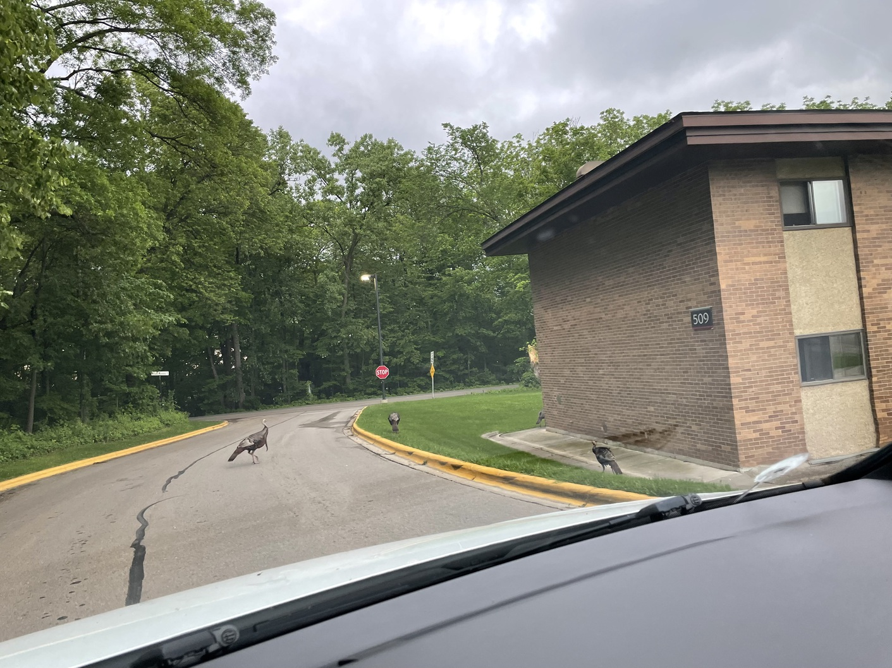
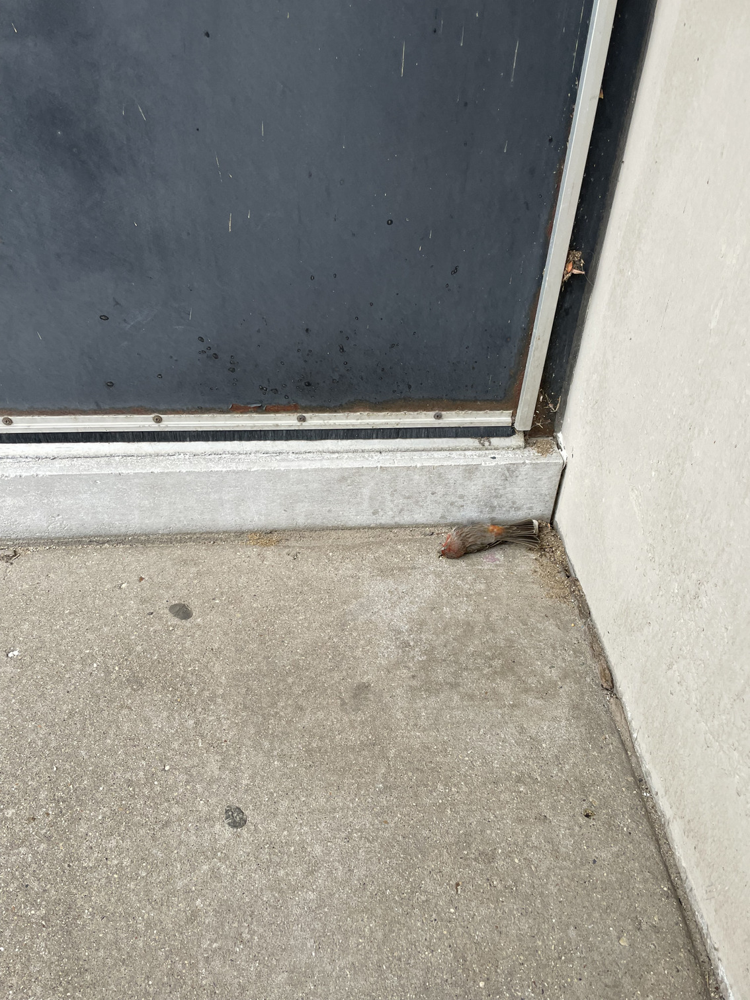

 
> Does it sit erect with its tail straight down like a prim little prig, or does it hold its tail up, like it thinks it is better than everybody? Does it dart around on the ground endlessly like an excitable idiot, or does it waste everyone’s time perching and singing all day? The behavior of a bird can tell you a lot about what kind of asshole you’re dealing with —— Kracht, Matt. *The Field Guide to Dumb Birds of North America* (p. 19). 

_Field Day 1, lesson 1：不要在这里转悠_

_今天火鸡帮不上房顶了，活动改为占道与围攻我_

_在 Memorial Library 前安静地离去_