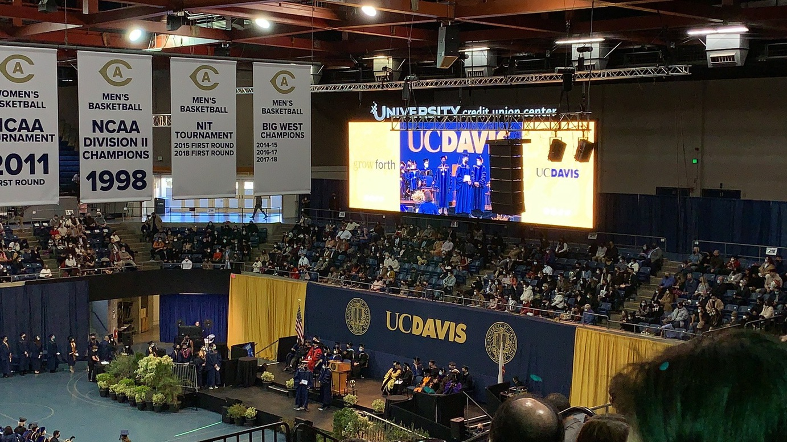
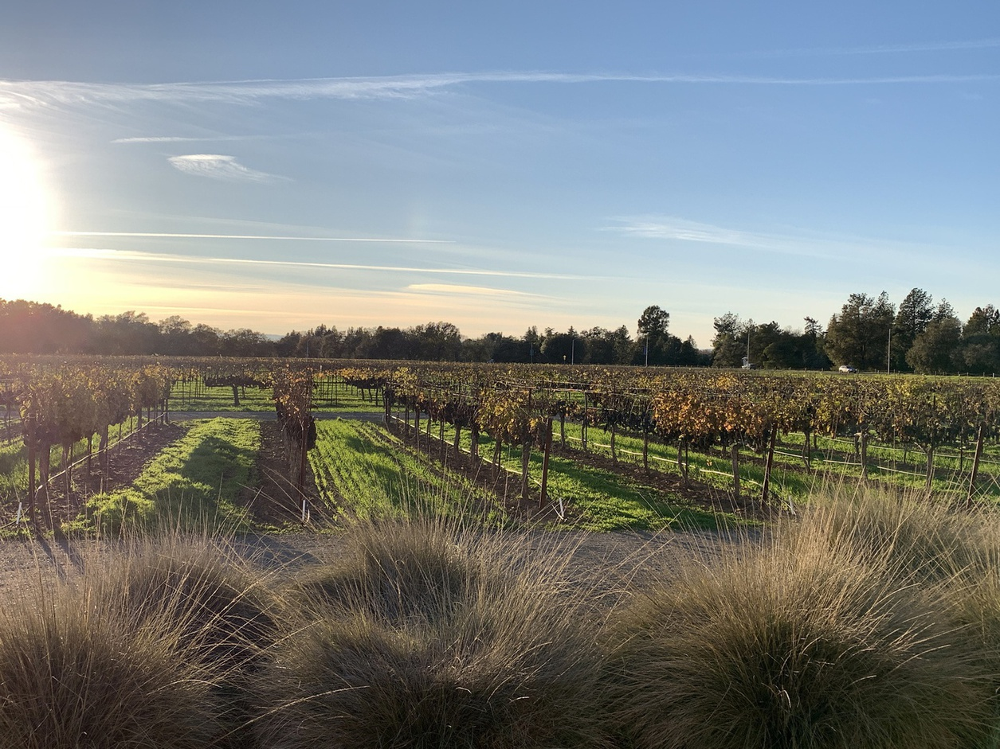
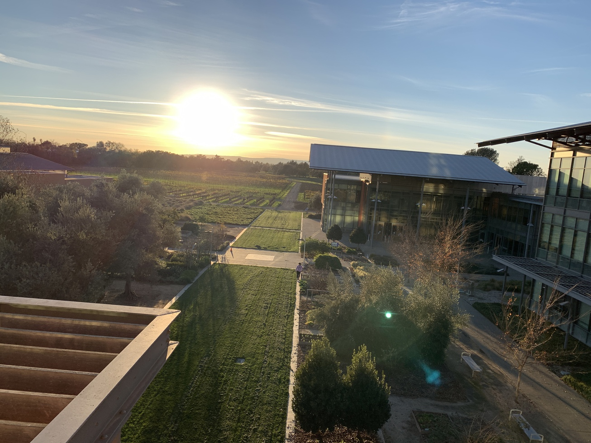
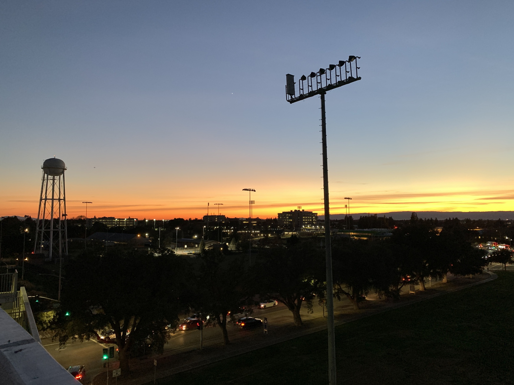

2021年12月10号，我们从各地赶回 Davis 去参加2020届的毕业典礼。在一年半后返校，最终算是毕了业。和往届不同的是，我们都已经相当于“步入社会”一年多了，有的已经工作了，有的像我也已经在新学校扎了根（虽然还是不知道在学啥），没有刚毕业那种兴奋劲，以及对未来的未知，不过真到给我象征性地颁毕业证的时候，还是很兴奋，得到了一股久违的满足，内心里潜伏的迷茫也得到了压制。

_毕业典礼_

_学校的葡萄田_

_农院，红酒系旁_

