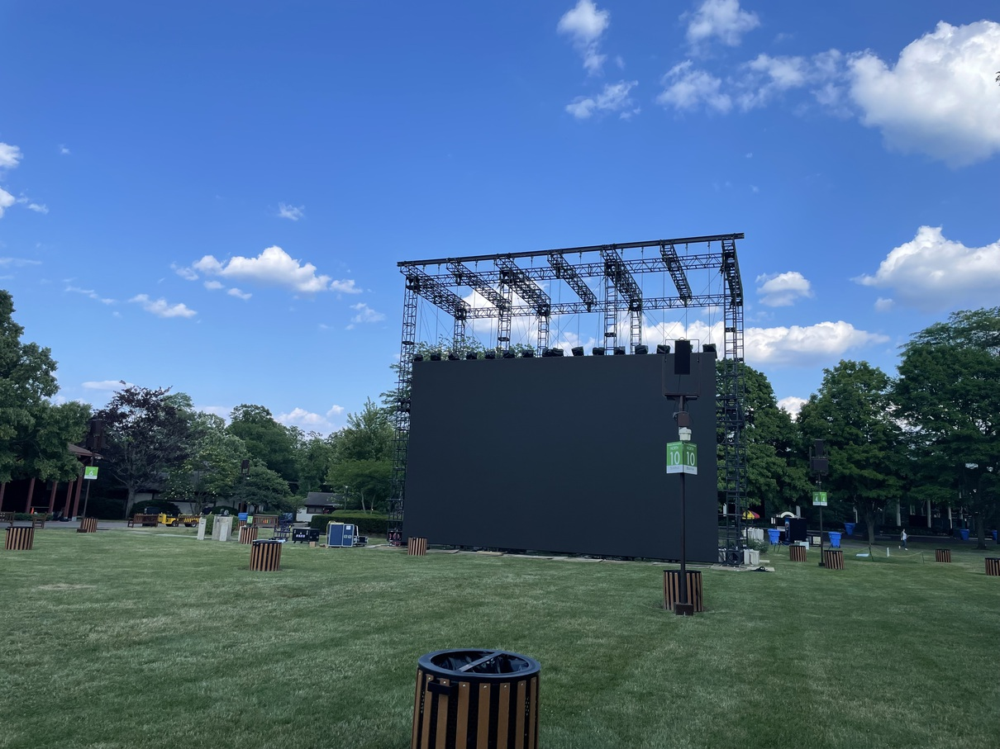
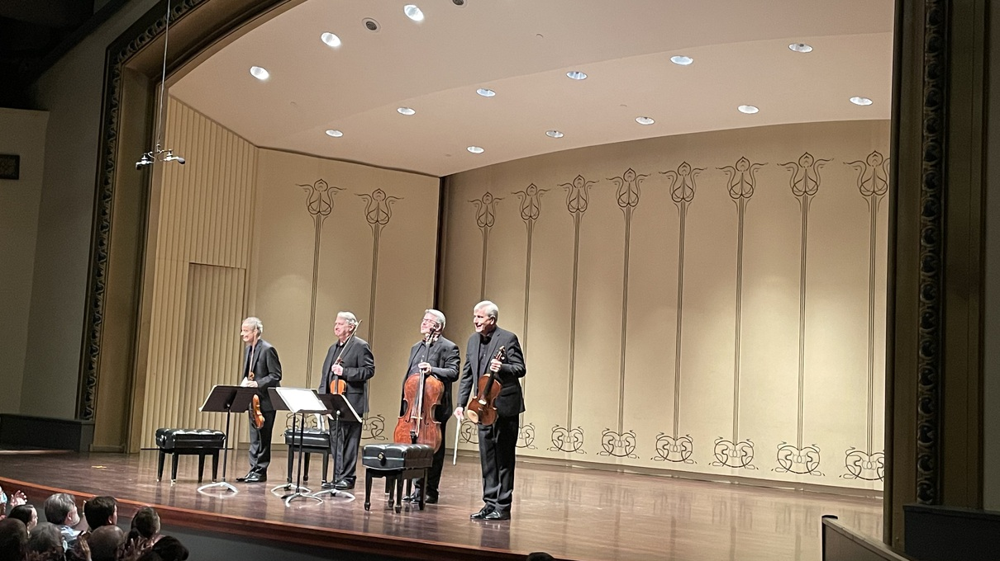
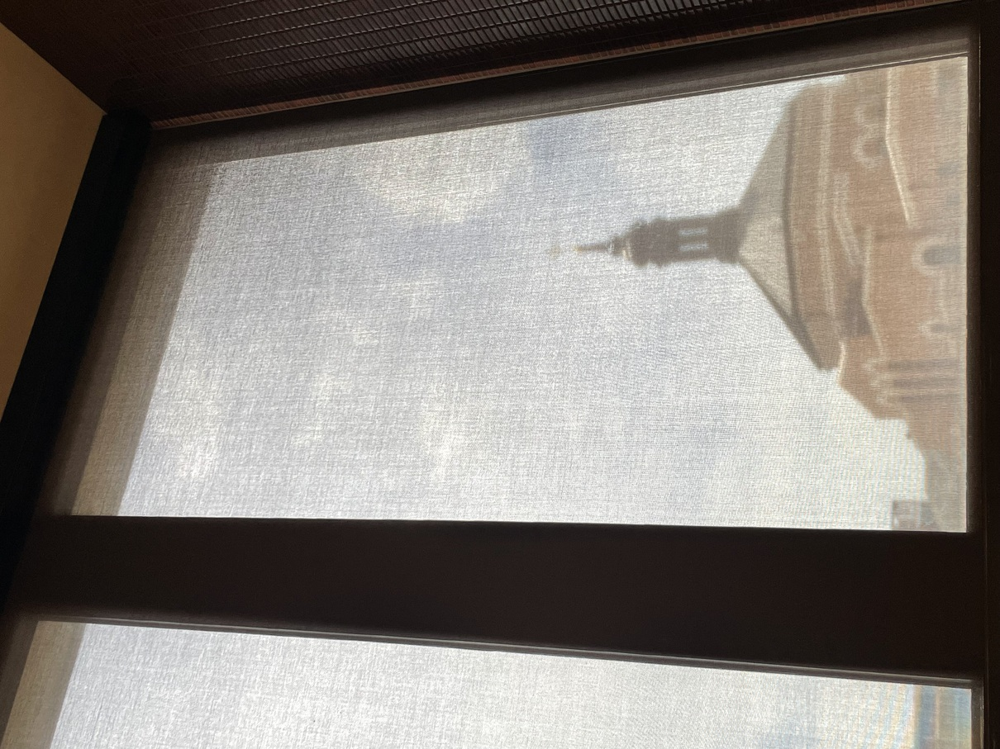

最近手比较懒，没有怎么更新，也没有什么能够让我足够兴奋以至于能冲淡这份 ennui，直到昨天。还有，我前两周每天基本上也在读 geb 这个大工程，经常磕磕绊绊的。今天决定简单记录一下这过去十天。

## Casablanca

首先说一下昨天让我很兴奋以至于觉得不记下来就怕忘的吧。昨天 cinematheque 放了 35mm 胶卷的卡萨布兰卡。这片太有名了，以至于我之前也尝试看了。为什么是尝试呢，因为我只看了大概十五分钟就懒得看下去了，因为感觉又是美国那个时候标准的一个大美女和一个每个女人都爱的声音低沉的白老男人的故事。昨天看完后，才发现我之前的印象错的有点离谱。这片直接可以到我现在的 top 15，这还是我已经因为怕这是最近的印象导致排名太高而折扣后的排名，如果直觉的话可能是 top 9。太平衡舒服，感人的时候也能极为感人，幽默的时候又是极其的幽默，更不要提这是1942年正处于二战最焦灼的时候上映的片子 (拍的时候珍珠港事件还没发生，美国还是中立，和 Rick 开始时中立的姿态相对应）。结尾最后 Rick 走上了反抗纳粹的道路，这种俗套的结局放在那个时候就一点都不俗套了，因为我们现在如果拍二战的片所有的结果都清楚了，我们大可以安全地反对纳粹，但当时在战局并不明朗，政府又是中立的情况下能这样拍真的厉害。这片可以说是所有拍二战或者以二战为背景的电影里最真实的了，在现在看也完全不过时，即使它是“局中人”局内的产物，或许这份产物就是得益于它处于局内，而（我看过的）其他片都是事后。平衡舒服的方面是，如果简单来说这个片是二战背景下的三角恋，这三个字一出来就感觉很难平衡和舒服，但这个片就处理的很舒服和平衡。 这段三角恋的形成究其根本都是因为 Bergman（真是大美女）饰演的角色所做出一系列决定，但这些决定放在战争这个背景下就极为合理，甚至是本片极为感人的原因之一，即在战争下三个浮萍（尤其 Ilsa）的命运被战争所玩弄。比如 Ilsa 爱上 Rick 是因为她以为丈夫在集中营里死了，她一言不发离开 Rick 也是因为她听说丈夫其实没死现在还受重伤需要她，而且如果她说了的话 Rick 这个被法西斯悬赏捕捉的人肯定会留下来，所以她没说。不过，她这个不辞而别也造成 Rick cynical 的性格的形成，（而且我认为在战争中这个什么荒谬都能发生的时期很难不变的 cynical，尤其是在 Casablanca），这一切都很合理以至于不让我出戏，然后最后 lead up to 结尾的那句对白：Ilsa: what about us? （当时 Bergman 在拍摄期间都不知道剧本结尾她会跟谁走，所以在电影结尾之前她的表情里的纠结是那么真实）Rick: we'll always have Paris。我必须得承认，当时真的忍不住哭了。

还有一个能让本片特别平衡的是其他角色的出彩，比如 Ilsa 丈夫那种革命在心头，但也很爱 Ilsa，他即使知道但不清楚 Ilsa 和 Rick 之间发生的事也不逼问，一切都尊重 Ilsa 的选择；比如法国警长，他嘴里的词简直和 Rick 的词一样精彩，甚至更精彩，最后的那句 “round up the usual suspects” 在我看片之前就知道的情况下让我还是很难忍住不笑。

总的来说，这个80岁的电影，可以称得上是（对我来说）once-in-a-life-time movie。

## CSO on 6.10

这个一直被拖着，因为我想专门写一篇文章来专门讨论老柴的 Romeo and Juliet Overture 是如何讲故事的，但一直没写。一直拖到现在，直到感觉在最近都不会再写的时候，决定还是先写个对这场音乐会我的座位的印象 （好像没啥关系哈哈）。我这个座位所在区域叫 terrace，我还是 terrace 第一排（一共就三四排）正中间。这个区域上次（6/3）是给合唱团的，这次因为没有合唱团我就可以买了，所以我们是面对指挥和观众的（我们也是其他观众观看的对象，所以不让照相）。面对指挥（James Gaffigan，很年轻很有激情，我很喜欢）真的可以看得清他的细微表情，以及中间有一段他还跳起小舞来了。还有一点坐在 terrace 的好处是 （最大的好处），我眼皮底下就是长号，座位正底下是大号。这为什么好呢？因为CSO 的铜管区一直是世界最好的，而比如 Jay Friedman 更是从 1965年就是长号首席，从 CSO 的所谓黄金时期 (Solti) 一直留到现在。当天的作品也很给力，尤其是最后两个俄国作品，A Night on Bald Mountain 和Romeo and Juliet 都有很多铜管的片段（如果熟悉老柴和他的罗密欧与朱丽叶就会知道他的铜管片段是多么震撼和催人泪下，我之前也写过关于他的第六交响乐第一乐章长号部分），我坐在那里简直要被吹飞了震麻了（in a good way）。就跟上次来 CSO 的经历一样，比我听过的 recording 从某些角度要好。唯一美中不足的是，铜管强了后 (按小泽征尔的话来说，就是铜管被“放到了 foreground”)，弦乐（的音量）相对来说就弱了，有时候甚至被盖过去了，以至于请来的小提琴 soloist 就感觉还好。座位旁边的老爷子从1968年就来 CSO 听了，他一开始还买的学生票，3 刀一张，直到现在基本上都选 terrace 区域的座位。我估计以后也会这样。

## 蓝宇
在北京拍的，感觉很亲切，尤其拍的城乡结合部的连绵不绝的工地，蓝色挡板，还有北京那些切口。
刘烨说的那句：我已经不小了，已经28了（从大学刚入学到28），这种自然不经意的对话里透出的时间跨度让我有点受不了，当时就忍不住了。我也快了。电影最后有加速（现实时间对应电影时长比例不断变大），除了最后突然蓝宇死了有点感觉突兀，其他的这种加速感觉也是因为不在一起后时间都变快了，眨眼就28了，感觉很符合实际。

## Ravinia Festival on 6.28 
为了听 Emerson String Quartet。他们当天的节目单是 Adagio for Strings; Brahms: String Quartet No. 1; Schubert: String Quartet No. 15。第一个就不用说了。第二个的最后一个乐章很好听，不知道是单独的好听，还是有一定依仗于之前乐章的积聚。最后一个感觉都挺好听的。

__Ravinia Festival 的草坪__

这个音乐节卖两大类的票，一种是音乐厅里按座卖票（和普通音乐会差不多），还有一种是草坪票。草坪票就得自带（或现场租）椅子毯子之类的，而且看不到表演者的人，只能通过大屏幕或音箱来听/看。虽说如此，不过也可以野餐之类的，比音乐厅里自由很多。

__Emerson String Quartet__

1976年他们就一起了，但是 22-23 季即将是他们的最后一季。

## La Piscine 游泳池
Cinemathque 的 summer season 有一个 Alain Delon 的系列，他在这部片里和他之前订婚却因为他出轨后来没结成的 Romy Schneider 饰演一对，怎么说，极具张力的情侣。据说是 Alain 点名要的 Romy 来演这个角色。不仅是他们俩，另外一对父女和他们一共四个人的 6 段关系之间的张力都被展现地极为揪心，但又同时很自然。很好看的一部。

## 图书馆
其他时间基本都在图书馆看 geb 或其它书了。

__图书馆一角__