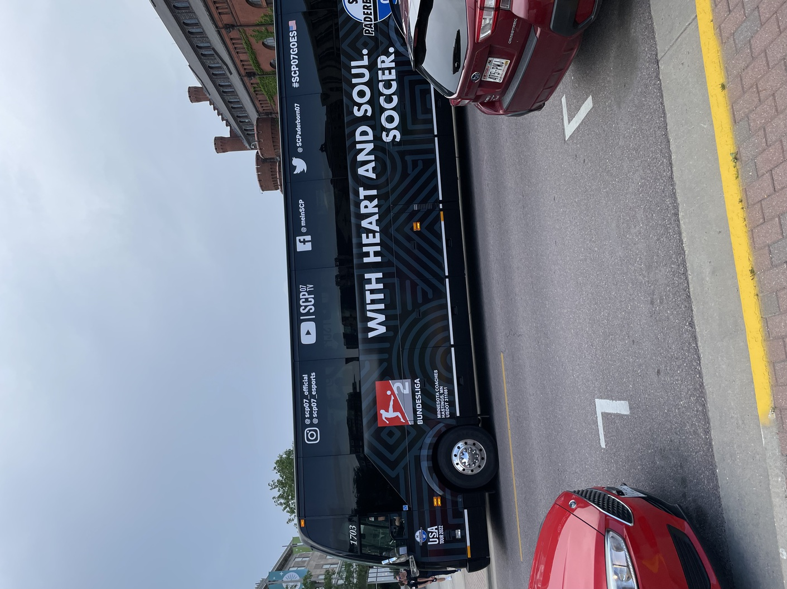
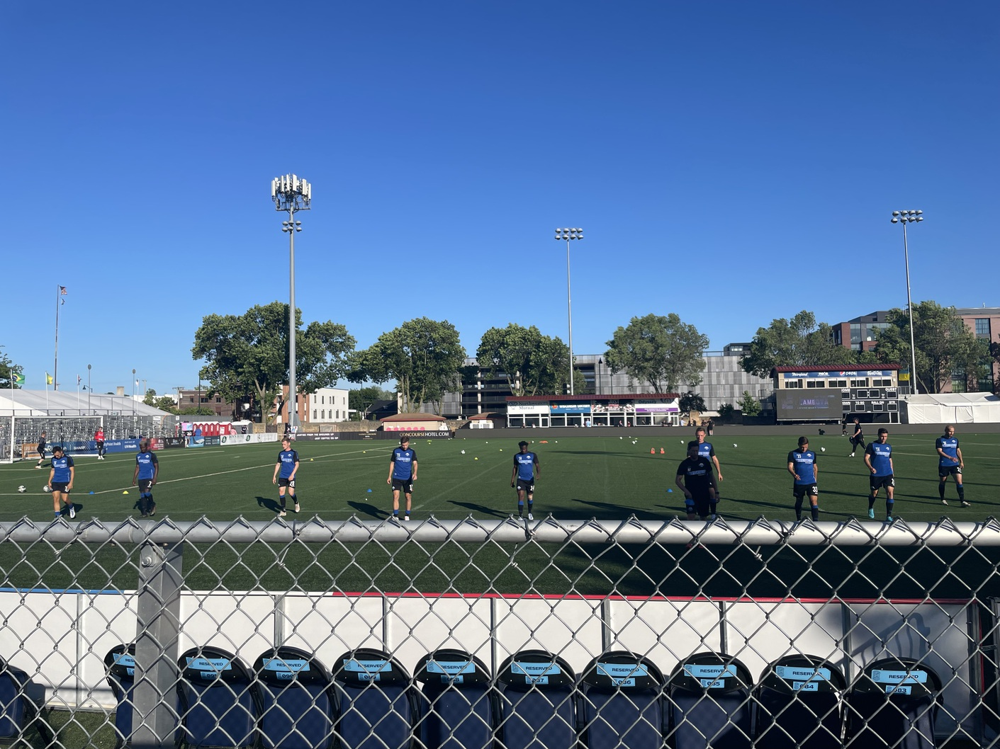
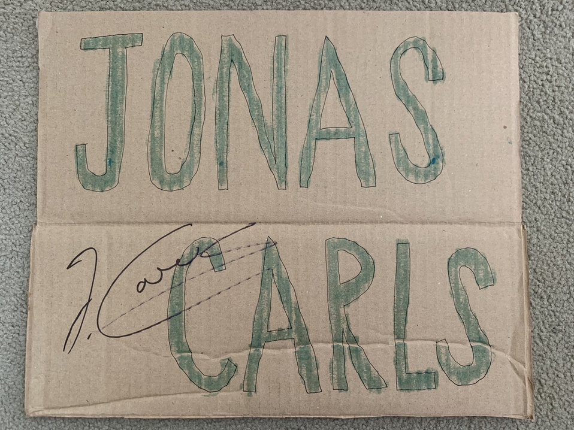
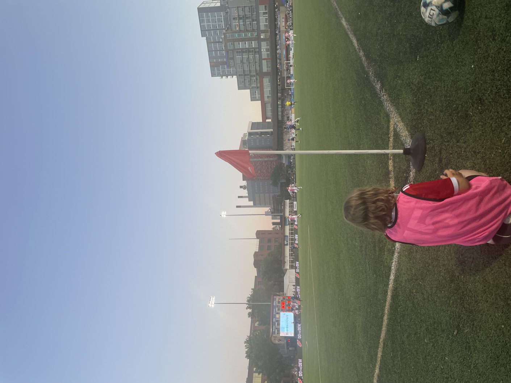
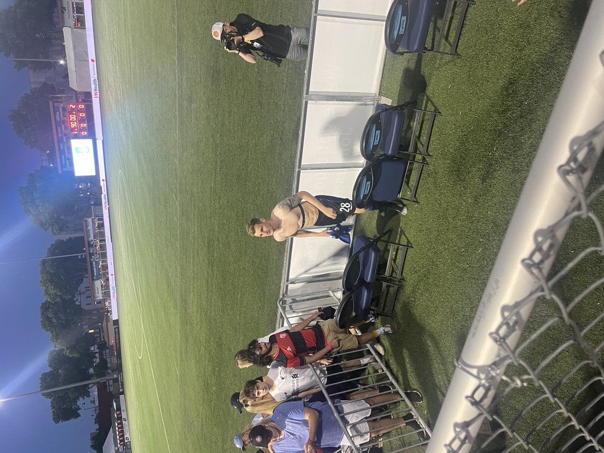
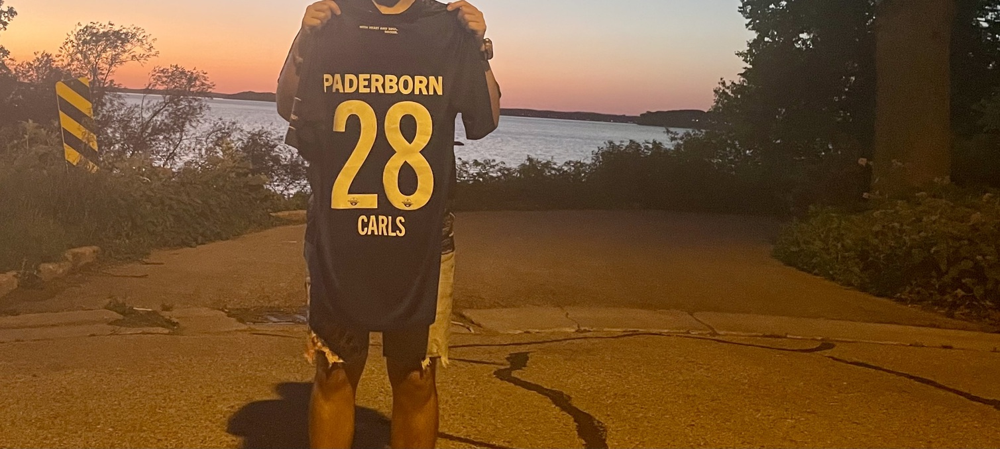
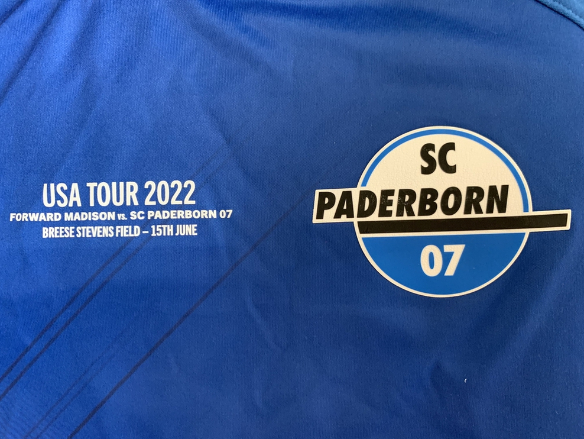

周三下午在校园中心撞到了一个有德乙标的大巴，走近一看居然是还有点印象的帕德伯恩（他们曾经在两年前以及更早一些年升入过德甲，所以我有点印象，不过他们上个赛季又降级了）。所幸是原定于当天晚上的比赛因为麦迪逊晚上的极端天气改到周四晚上，于是我赶紧订票，也算是顺便第一次看了麦迪逊本地足球队（Forward Madison FC，美国足球第三级别联赛）的主场比赛。他们的主场也就能容纳5000人，和 UW Madison的橄榄球场 Camp Randall 能容纳八万人差太远了，不过能在算是市中心有这么一个场已经很不错了，。当天上座人数大约就两千多人，所以我比赛前晚选座位还能选到正中央的位置，虽然下半场我也跟我朋友去角球旗区站着去看了。

## 更新

_帕德伯恩的 youtube 账号最新发的视频的封面是我和我朋友，虽然视频里没有我们什么事，可能是因为笑得过于开心_

_帕德伯恩旅美大巴，他们刚游览完我们学校靠湖的 Memorial Union_

_比赛前的训练_

我遇到一个之前一起踢过球的兄弟，他是沙尔克04铁杆，见证了沙尔克进过欧冠半决赛，四分之一决赛，直到20-21赛季降级（上赛季德乙夺冠又打回德甲了），他专门为了帕德伯恩阵中两个沙尔克青训出品的球员做了牌子（另外一个球员没上场）：

_Jonas Carls。他本人赛后为牌子签了名_

我们下半场去主场角球旗区看球去了，因为帕德伯恩大部分时间还是压着打主队，然后我这边的角球旗又正对着左边翼位 Jonas Carls 的进攻路线。

_小球童非常负责，她这边一旦没球就立马指挥她的小伙全场找球，还可以偷闲吃点棒冰_

最后我朋友也如愿以偿地拿到了 Jonas 的落场球衣（他打满全场，最后也接受参访，我们通过之前给我们照过相的随队摄影小哥吸引了 Jonas 的注意），我也顺便蹭一下，摸了一把，手上全是汗味。

_最后比分定格为 1:2，Forward Madison FC 补时扳回一球_

_这部分字记录着专属于这场比赛的信息（除了比赛改期到了16号而不是15号），在店里买是买不到这些的，只有落场球衣有_