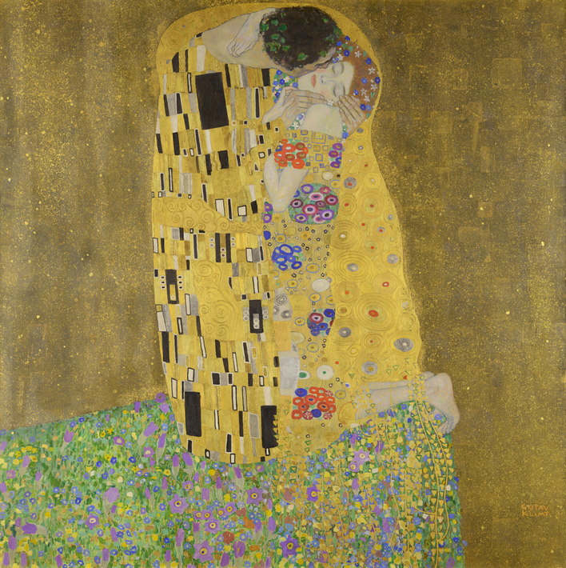

我今天在整理照片的时候，发现在有将近2000张照片的相簿里的第一张照片和相簿里的倒数第五张是一样的：古斯塔夫·克里姆特的*吻*。我是最近把它放在屏保，因为被画中的金碧辉煌却蕴含着无法言说的忧郁的感觉，以及画中男女之间的某种张力所吸引。没想到，我在2015年3月，七年多前，也因为某种原因被它吸引并把它下载到了相簿里，并且在不断换手机换账号的“洗牌”里成为“幸存者”里最早的一个。一幅画穿越时空，把七年多前的我和现在的我联结起来，最终把两个我的心境里的某种相似捕捉。我今天做的事也同样是追溯到很久以前，尽量真实地恢复以前的所思所想，“截图”并记录下来，希望还不算晚。

因为原图太大了，建议想看的还是去比如Wiki上查看原图。