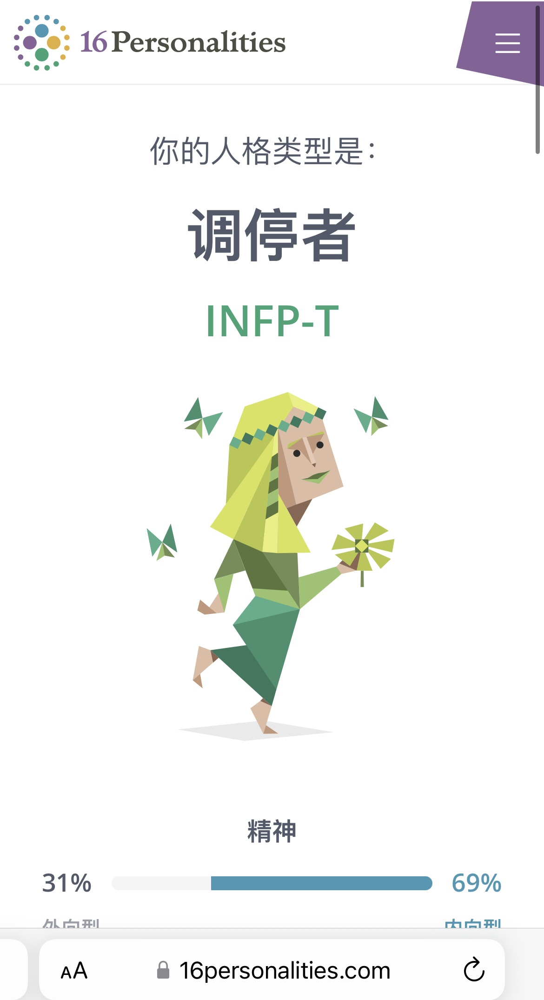

> Mediator personalities are true idealists, always looking for the hint of good in even the worst of people and events, searching for ways to make things better. While they may be perceived as calm, reserved, or even shy, Mediators have an inner flame and passion that can truly shine. Comprising just 4% of the population, the risk of feeling misunderstood is unfortunately high for the Mediator personality type – but when they find like-minded people to spend their time with, the harmony they feel will be a fountain of joy and inspiration.
> At their best, these qualities enable Mediators to communicate deeply with others, easily speaking in metaphors and parables, and understanding and creating symbols to share their ideas. 

