## 源起
本周二（6-14号）晚，一名中国博士生晚间路过 University Avenue（学校主街）回家时（我每晚也会去距离事发5米的公交站坐车回家），被五名非亚裔年轻人当街不由分说地殴打（没有抢财物），直至受害人呼救并引起路人注意才结束。案发同晚，另外两组毫无关系的亚裔也被同一组人袭击。我们都是通过受害人当晚在微博发的文才知晓此事，学校与警方没有发出任何通知，在警方报告上也一再强调此事与因为种族歧视而引发的仇恨犯罪无关。于是，一些中国留学生决定自发组织，联合其他亚裔，学校关于多元化的组织，当地媒体，中文媒体，并且通知警局，从州议会大厦开始，沿着州街进行游行抗议。随着这件事被曝出来，一些其他在麦迪逊针对亚裔的犯罪也浮出水面，比如[卖手机被人用车来回撞](https://mp.weixin.qq.com/s/BR_qWUyCcVI9Pk7hem6_OQ)；包括两年前在同样的地点也有过类似的游行，不过效果现在看起来并不显著……

注：因为本文照片比较多，可能需要多刷新几次才能全部显示出来。

### 受害人照片

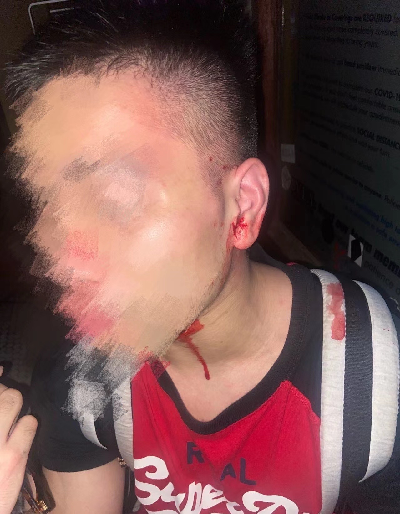

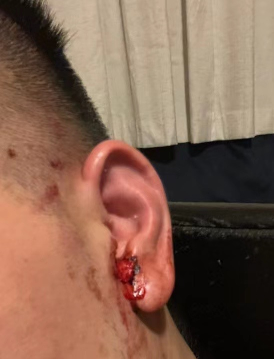

受害人的微博：大Tao_

## 游行抗议的instagram 账号

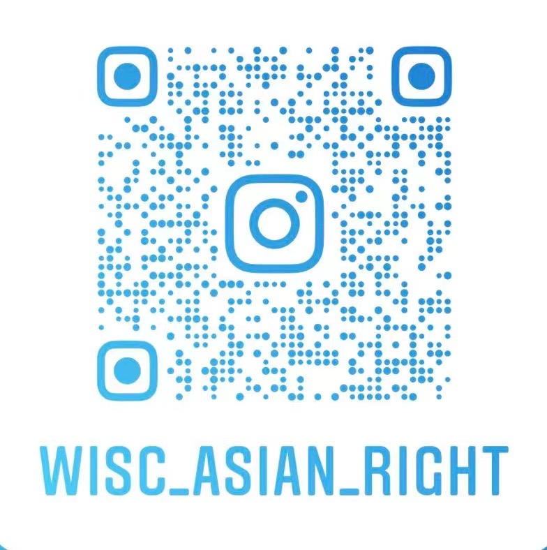

## 州议会大厦前
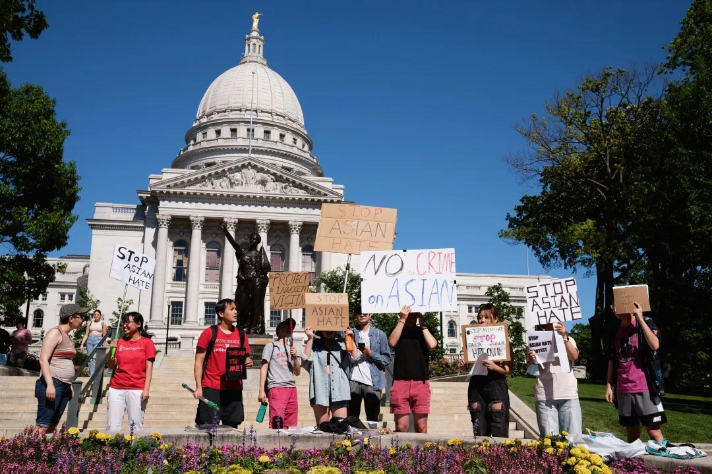
_刚开始的时候，人还不是很多，后来人就多了_

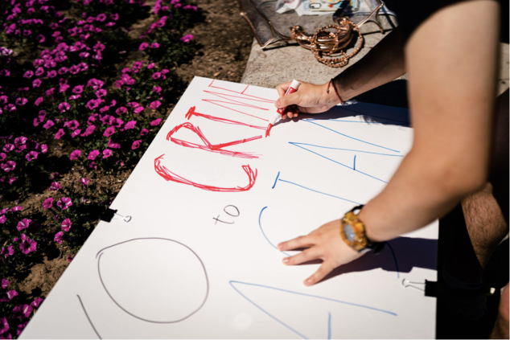
_第一次没什么经验，之前准备的字太细了，远一点根本看不清，所以现场加粗一下。这张照片取自[一位摄影师的网站](https://xinzouphotographyanddesign.pixieset.com/0617-stopasianhateprotest/)，想看更多照片的可以点进左侧链接。_

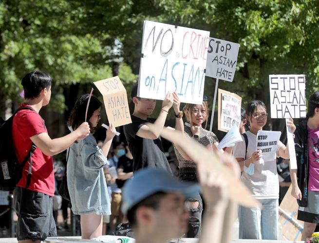
_这牌有点大，举起来有点累，下次弄个支架_

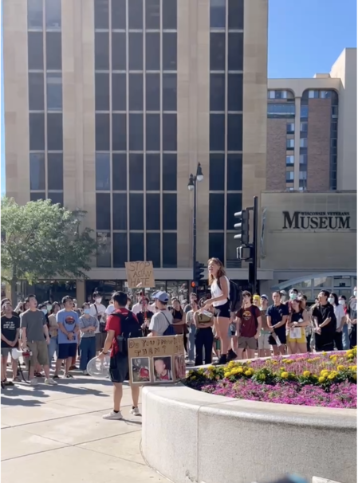
_后来人多了之后，人们就开始可以站在台上分享自己的经历_

## 行进中
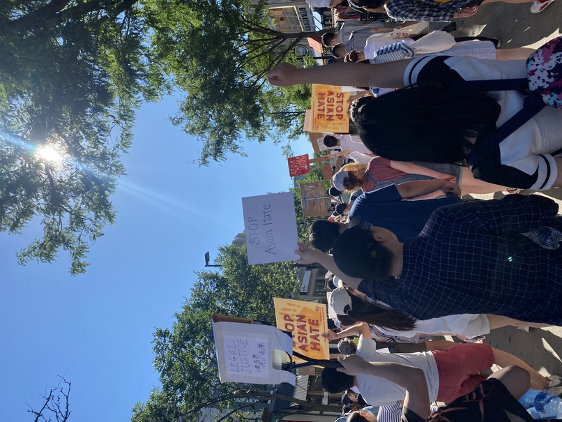

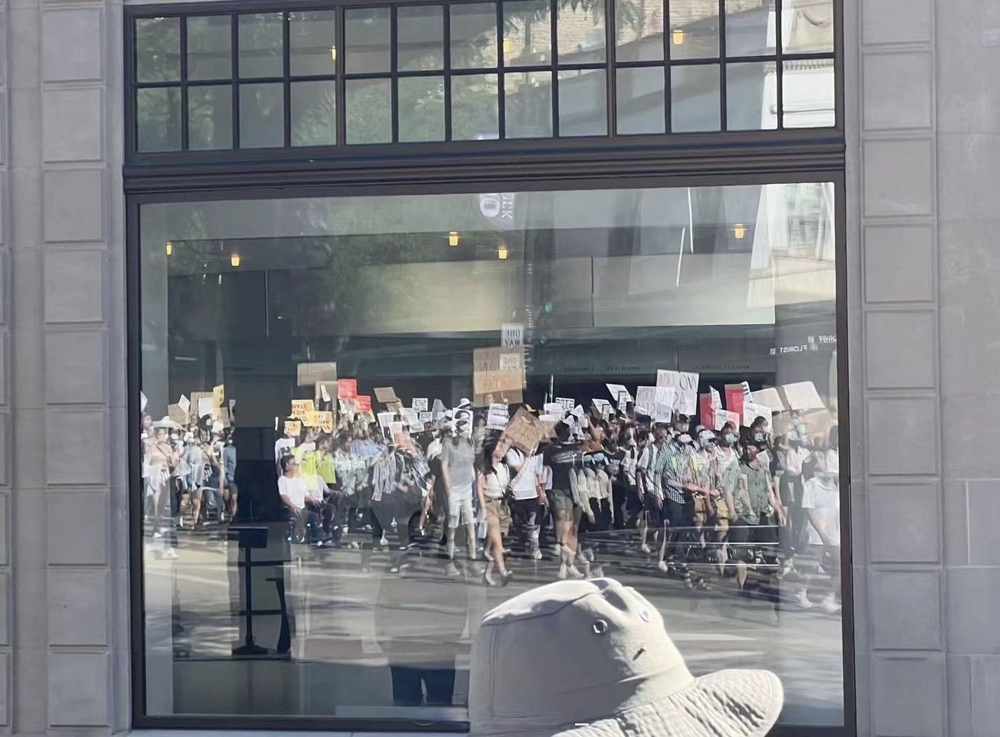

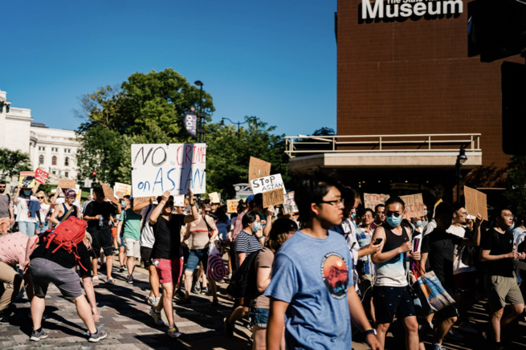

## 一些结果
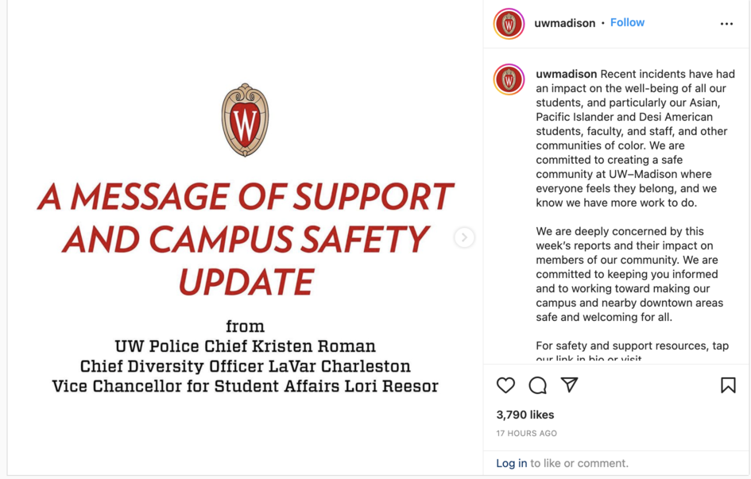
_学校账号在游行后发表的声明_

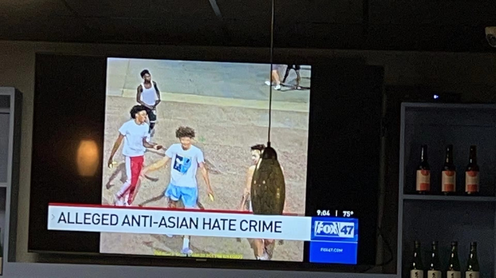
_Fox news当晚的新闻_

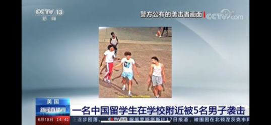
_CCTV 13_

## 采访
有幸被 **Wisconsin Watch** 和**麦迪讯**两家媒体采访。因为*麦迪讯*有提前联系我，所以我准备了一下他们的问题：
1. 为什么要来 protest
- I was shocked to hear the news that a Chinese Ph.D. was assaulted on University Avenue by a group of non-Asians using extreme brutality. Initially, I just felt for him and was not compelled to call this incident a hate crime. However, when I heard that the same group allegedly attacked another independent Asian person on the same night and more and more crimes involving Asians as victims began to emerge, and the bland reactions (meh, another day, another crime, no need to use emails to alert/bother the other people) by police and by the university. I was convinced that we as Asians need to speak up for ourselves. To fight for ourselves. In the past few years, we have witnessed crimes against Asian across the states, and we see a pattern. As an Asian, those news are knocking on our doors, we could ignore them, we could be too afraid to answer it and hope it would go away someday, or some years, but the truth is if we do not answer the door and face it directly, it will never go away.

2. 通过 protest 想达到的效果
- raise awareness：
    - Asian： we need to speak up.
    - Non-Asian: we have seen hate crimes/speech before, on Jews, on black people, on LGBTQ, now it is happening to another minority group in Madison, which is Asian and/or international students. it is a fact, unfortunately, if you see recent assault events. we need your help to fight against another deliberate assault from a majority group on a minority group.
    - Officials: we want to convince them that this is a real issue, and they cannot solve it by ignoring the elephant in the room and hoping it will go away someday.

3. 希望 official 做到些什么:
- addressing the issue directly. you may be too afraid to bring the sensitive word "race" onto the table, but as police and government the more you are afraid, the more those people would increase the magnitude and the frequency of hate crimes. And in the end, you will need to address the issue anyway, according to what happened to the black lives matter movement. 

大意是：
- 我一开始并不认为这是针对亚裔的犯罪，只是觉得这位同学不走运，但当我知道当晚还有另外两起很可能是同一伙人针对其他亚裔的攻击时，以及事件后续学校和执法部门的不作为，我认为作为亚裔，我们需要站起来为自己抗争权益，为自己发声。近几年来，针对亚裔的仇恨犯罪事件发生在美国各州，这些新闻就像不断地敲门声一样，你可以短暂地忽视它，也可能因为害怕而不敢去开门并希望终有一天或几年它们会自动消失，但现实是如果你不开门去面对它们它们是永远不会消失的。

- 对非亚裔我们想说，我们在经历对犹太裔，非裔，LGBTQ的仇恨犯罪后，现在这些犯罪正在实施在另外一个麦迪逊的少数族裔 —— 亚裔上。很不幸的是，这已经是一个事实了。我们需要全体的帮助来抗争着又一起多数人针对少数人的压迫。

- 对学校以及政府官员，我们希望他们能正视问题，而不是因为某些字眼，比如种族，太敏感而不敢搬上桌面来说。如果作为警察都不敢直视，那那些施暴者则会更加猖狂，而到最后，你们也不得不面对这些现在不敢面对的问题（那时候，情况会更糟），就像之前的 Black Lives Matter 运动一样。

## 更新
我们总结了6.17游行时的素材，出了一个视频：
- Youtube：


### 6.24
这次我们计划是请来一些 speakers 讲话，讲完之后游行。但当天早些时候出来一个大新闻，即最高法院推翻了1973年 Roe VS Wade 案的判决，将决定堕胎是否合法化的权利交给了各州。虽然此前的判决早在五月就从非官方渠道被泄露出来了，但还是一石激起千层浪，24号宣布当天各团体就决定到州议会大厦前上街抗议和游行。四点左右我到的时候，已经很多人举着堕胎自由（或者：如果堕胎是谋杀，那口交就是大屠杀）等牌子在大厦前聚集，虽然他们是 schedule 在五点，我们是四点。不过讲话还是我们到点了就开始讲，而且讲话内容都会大概联系一点女性自由被压迫等话题。而等到堕胎自由那一方讲话时，她们的 speaker 也会将对女性自由的压迫联系到对亚裔的仇恨，认为这都是相通的，即针对弱势群体的压迫。我听完亚裔的 speakers 讲完后，就继续站在原地听堕胎自由的 speakers 讲，其中有好几个speaker 更是女性中的少数，比如活动的组织者是 lesbian （虽然我不太清楚lesbian和堕胎之间的联系，不过那个 speaker 也提到了最高法院下一步就是要推翻同性婚姻的全国合法性），很多 speakers 都是黑人女性和拉丁裔女性们，这两个堕胎率相对高的群体。还有一点有意思的是，有几个 speakers 的组织里都有 socialist/socialism 的字眼，而且她们的讲话内容里都提到了除了游行示威外还要以罢工的形式来抗议，因为很明显她们不能再“依仗”民主党了。她们的集会还更激进的一点是，她们已经不相信警察了，甚至口号之一就是 fxxk the police，因为她们认为这种执法机构就是到时候执行不让堕胎的机构，所以她们组织了自己的护卫队，比如组织人之一的未婚妻就是成员之一，但她们据说也被附近的警察“骚扰”。相比之下，我们的游行就先报备了警察，让他们组织疏散车辆和行人。虽说讲话还是能各方各讲一个小时多，但最后的游行还是被另一方淹没了。

我的牌子：
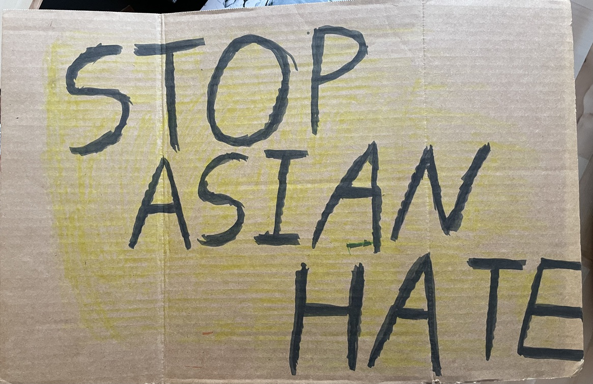
__面1__
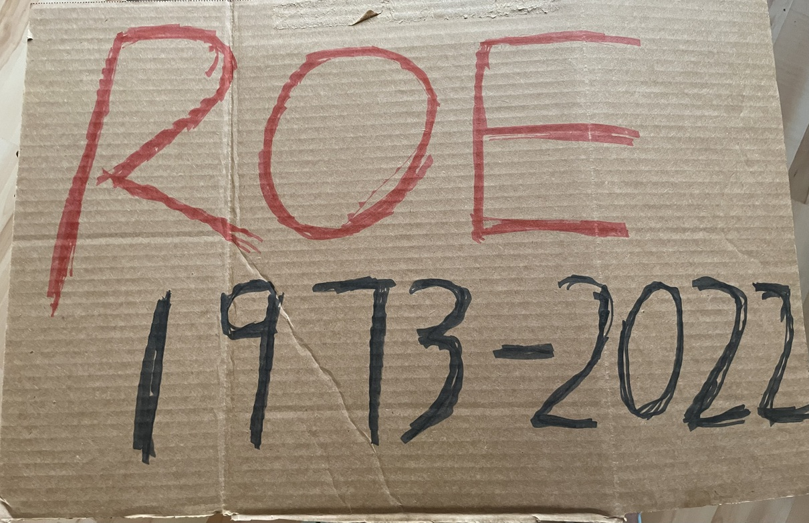
__面2__