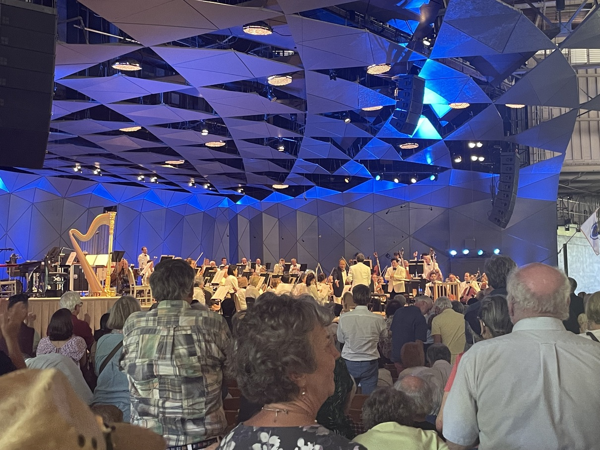

这个暑期除了之前提到过的[两场外]()，我之后去了 7.15 号 CSO (芝加哥交响乐团) 在 Ravinia 的 opening night，8.14 号 BSO (波士顿交响乐团) 与马友友 在 Tanglewood 音乐节 的演出，和 8.21 号 CSO 在 Ravinia 的 Tchaikovsky Spectacular with the CSO。

## CSO Opening Night @ Ravinia 音乐节

为了告慰近日发生于 Ravinia Park 所在社区的[独立日枪击事件](https://zh.wikipedia.org/wiki/2022%E5%B9%B4%E6%B5%B7%E5%85%B0%E5%B8%95%E5%85%8B%E6%B8%B8%E8%A1%8C%E6%9E%AA%E5%87%BB)的受害者及其家属，Marin Alsop 带领芝加哥交响乐团在原定的第一个曲目前演奏了 Elgar 的 Enigma Variations 中的 Nimrod。简短介绍一些 Enigma Variations：它包含了第一首原主题（original theme），以及紧随其后的基于原主题的 14 首变奏；其中每一首变奏都代表了包含他老婆和自己的某个 Elgar 的朋友。Nimrod 代表他的朋友 Jaegar（德语里的猎人，Nimrod 则是旧约里猎人的名字），他在 ELgar 最低落甚至要放弃音乐的时候鼓励他继续创作下去，这首变奏也是在描绘这一过程。Nimrod 常常被用在英国王室葬礼里（比如黛安娜王妃的和菲利普亲王），或英国其他正式场合（比如香港交回仪式与2012年奥运会开幕式里）。至于合不合适作为葬礼曲，那只能听一听后再做判断。


 

在 Nimrod 后，Marin Alsop 作为 Ravinia 的音乐总监选了 Julia Perry，一位现代女作曲家，的 *Short Piece for Large Orchestra*。Marin Alsop 作为仅有的几位指挥大交响乐团的女指挥今年在 Ravinia 发起了一个名为 “Breaking Barriers: Women on the Podium”（打破屏障：女性在指挥台上）的项目，其中一项即向大众介绍不是很有名的女作曲家。再多提几句 Marin Alsop，前几天看了她的传记片 [The Conductor](https://www.imdb.com/title/tt14622994/)，真是一部好片。其中她谈到了作为一对儿音乐家夫妻的独生女的孤单童年（父母经常要到处赶场演出），小时候（好像是8岁？）在父母的带领下第一次去伯恩斯坦的 Young People's Concert (这个是什么以及为什么重要我以后可能会写写) 的录制现场看到伯恩斯坦后立志要作为指挥的她，在指挥路上作为女性不断地被拒绝，因为一直被拒绝为了能当上指挥甚至自己成立了交响乐团，成为伯恩斯坦女弟子，起初被指派为巴尔的摩交响乐团音乐总监的巨大争议，以及巴尔的摩交响乐团是如何用音乐在犯罪率最高之一的巴尔的摩融入社区的，以及现在她的家庭，她的女伴侣和她的儿子等等。这一切都很真实、很动人地讲述了音乐与人生的关系。

说回这首作品，其实我现在还不太能理解它哪里好哈哈。不过，这个暑期我听到的另两首现代作曲家的作品都极为好听，碰巧她们也是女作曲家，也都和 Marin Alsop 有关系。一个是 BSO 演奏的 Anna Clyne 的 *Masquerade*。这首作品首演于 2013 年的 Proms (具体来说是 [Last Night of the Proms](https://en.wikipedia.org/wiki/BBC_Proms#Last_Night_of_the_Proms))，当时的指挥就是 Marin Alsop。另外一首是 Lera Auerbach 的 *EVE’S LAMENT “O Flowers, That Never Will Grow” for Orchestra*。在 The Conductor 最后的片段里，Marin 在指挥这首的首演。

Masquerade 在 youtube 上：

可惜 [Eve's Lament](https://leraauerbach.com/eves-lament/) 找不到视频源和音源，我也很想听完整版。

### Scheherazade
接下来，就是 Rimsky-Korsakov 的巨作 Scheherazade。Scheherazade 是丞相的女儿，她自告奋勇成为了王后，国王的妻子，尽管她知道很可能这是一条不归之路，因为国王是一个暴君：国王在发现了第一任妻子对他不忠后，决定每晚娶一个处女然后第二天早上处死她，这样她就没机会对自己不忠了。Scheherazade 怎么能让自己不被处死呢？她第一晚借着给妹妹讲故事的名义用一个故事吸引了在旁听的国王，可是黎明时分这个故事才讲到一半，国王无奈为了听完故事只能让她多活一天。结果在第二晚，你也猜到了，她讲完第一个故事后又开启了第二个故事，同样在黎明时故事正好停在关键处。这样持续了一千零一夜，以及一千个完整的故事，在这一千零一夜晚，国王爱上了她并让她成为永久的王后。

那这些故事背景是如何在 Rimsky-Korsakov 的音乐里体现的呢？我就不详说了，具体可以在下面看/听刘岠渭老师的讲解。具体到这个 CSO 的演出，当演奏到暴君时 Marin 极其澎湃的肢体动作，CSO 副首席 Stephanie Jeong “扮演”的 Scheherazade （每次代表 Scheherazade 的旋律都是由首席小提琴独奏的，我不禁想 CSO 首席 Robert Chen 是一个中年男子，如果他来了由他演奏，视觉上未免有点出戏）所展现的那凄婉但又一直绵延的独奏旋律，都让听众陷进了故事中，或故事的情绪里，为 Scheherazade 而担忧。



总之，这个分为 4 个乐章总长 45 分钟的富含故事性和情绪的表达力。背后故事里的两个主角极富对比（一强一弱）与张力（暴君最后也柔和了下来），是完美的构成交响组曲/交响诗的材料。与我同去的两个朋友之前没现场听过交响乐团演奏大型交响乐，听完后他们都很喜欢，而且最喜欢的还不是同一乐章：一个第二一个第三，虽然这两个乐章所表达的情绪不太一样（那个朋友说第三乐章太感人了，我听完后没这么觉得，回家再听的时候觉得还真是）。

还可以借这首作品说一下 Aaron Copland（美国最好的作曲家之一）在古典音乐科普书 *What to Listen For in Music* 里所提到的听古典乐最重要且唯一的“要求”：在听过一段旋律（一般为主题）后，当它再度出现时一定要识别出来，噢，我之前听到过它。在 Scheherazade 里这点被体现得淋漓尽致，两个主要人物背后都有他们的专属旋律，每当专属 bgm 又出现时，你就可以识别到，噢😯，他/她又出场了。而且我们还有视觉的提醒，当首席一个人开始演奏时，我们就知道又要回到那段旋律了，回到 Scheherazade。

最后一首曲目是老柴的第一钢琴协奏曲。怎么说呢，不知道是不是被独奏者辛勤的汗水（大屏幕里他的汗一直往下滴，滴到琴键上）所分散注意力，对这个诠释不是很有感。作品是好作品，只不过演奏的感觉不如我听的录音，不像其他 CSO 的演绎。

## BSO 与马友友 @ Tanglewood 音乐节

之前被音乐课助教种草马友友, 这次正好借着去波士顿去听一下，结果到了波士顿后才发现 Tanglewood Festival 离市区得开车两个多小时，而我订的票里的马友友和 BSO 的排练就在第二天早上。我只好放弃去看排练和另一个指挥的讲座，休整一天后租个车去听马友友的演出。

__这是当时的节目单__

我印象最深的是（现在写因为拖延已经是11月8号）前两个曲目：第一个是我前面提到过的 Anna Clyne 的 *Masquerade*，这首听起来就像她在演出前介绍的她作曲时的灵感来源一样：漫步于18世纪英国公园里听的音乐；第二个就是马友友的 Elgar 的大提琴协奏曲。这首作品是 Elgar 最后的大型作品之一，作于他妻子去世前一年。自那以后，他就渐渐淡出公众视野，也没有作品出世了。这首作品给我印象最深的一段旋律彷佛描绘了这么一个场景：大提琴独自一人在山岗对着静静倾诉着什么，身旁山间的树在徐徐微风下摇曳（乐团部分），彷佛也有所回应。这种倾诉也不在乎有没有人听到，或者太私密也无法对人诉说。



__马友友__

Tanglewood Festival 所在的公园景色：

__以小泽征尔命名的音乐厅，小泽征尔自1973年到2002年担任波士顿交响乐团的音乐总监__

__演出厅__

__以伯恩斯坦命名的教学楼性质的小房子，伯恩斯坦五十年间几乎每个暑期都会来这里教学以及演出，就像22岁当年 Koussevitzky 教他那样__

__公园的其他角落__

## 8.21 @ Ravinia
这场是柴可夫斯基专场，四个作品都是老柴的。我是从麦迪逊坐大巴去芝加哥市区，然后用 Ravinia 的票免费坐小火车一个小时到 Ravinia Park。最快还是开车，这样就不用这样折返了，尤其是音乐会结束后我还得先南辕北辙到市区，然后紧赶慢赶赶上回麦迪逊的大巴。不过 Inmo Yang 演奏的老柴的第一小提琴协奏曲还是足够惊艳，以至于观众在第一乐章结束后就掌声雷动，鼓了好久才能开始第二乐章。他把韩国偶像那种造型带到了古典乐，这种组合彷佛让人看到现代版李斯特、帕格尼尼。他的演奏写意轻松，一个人就可以带动、领导、对抗整个乐团。他是第一个现场给我这种感觉的。

__Inmo Yang__

最后一个曲目是 1812 Overture。 演出前两天收到邮件说曲目里面的乐器之一大炮无法出现了，不知道是因为安全原因还是因为在一个俄国作品里用大炮在近来太敏感，我觉得是前者，因为音乐是无国界的。大炮变成了附近高中乐团组成的鼓群，他们打的特齐，而且也很震撼，就像大炮一样。

__高中生们__