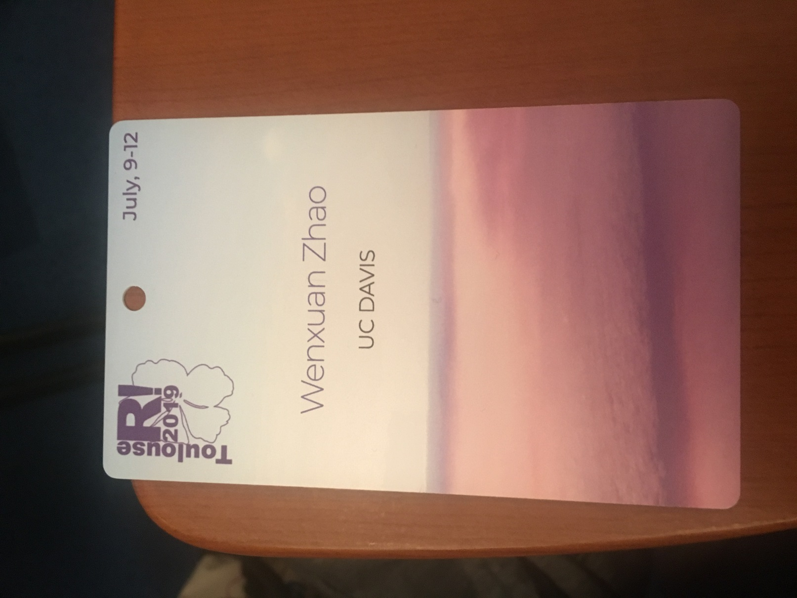
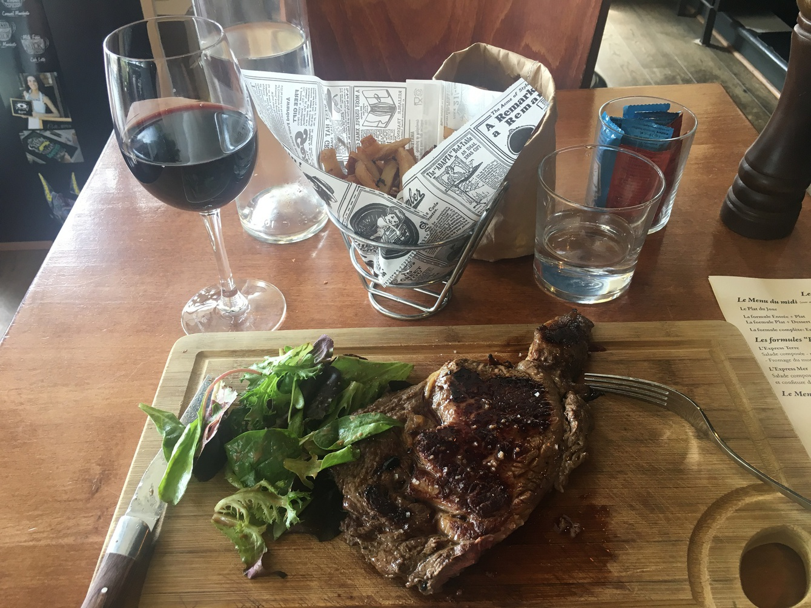
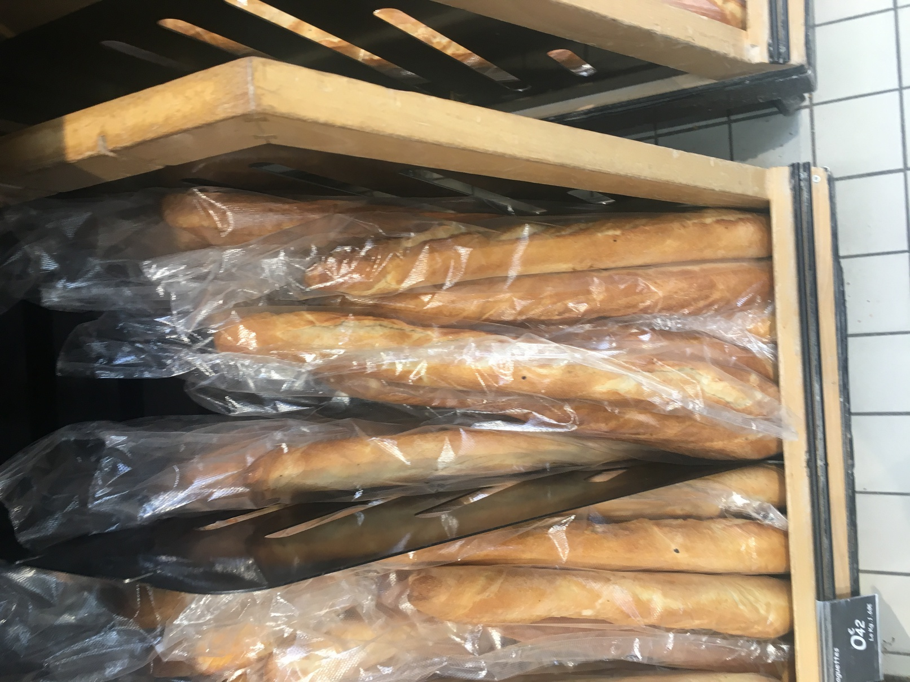
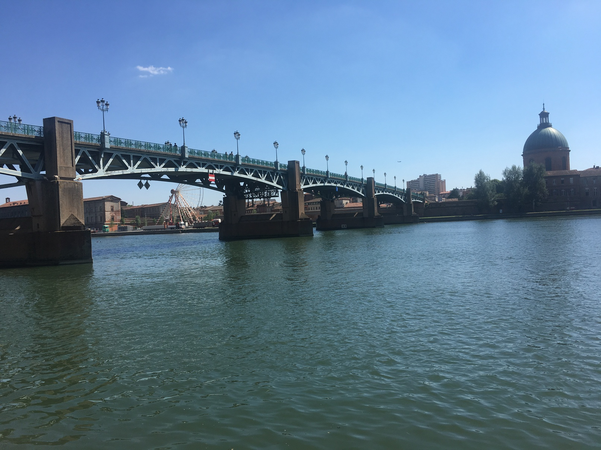
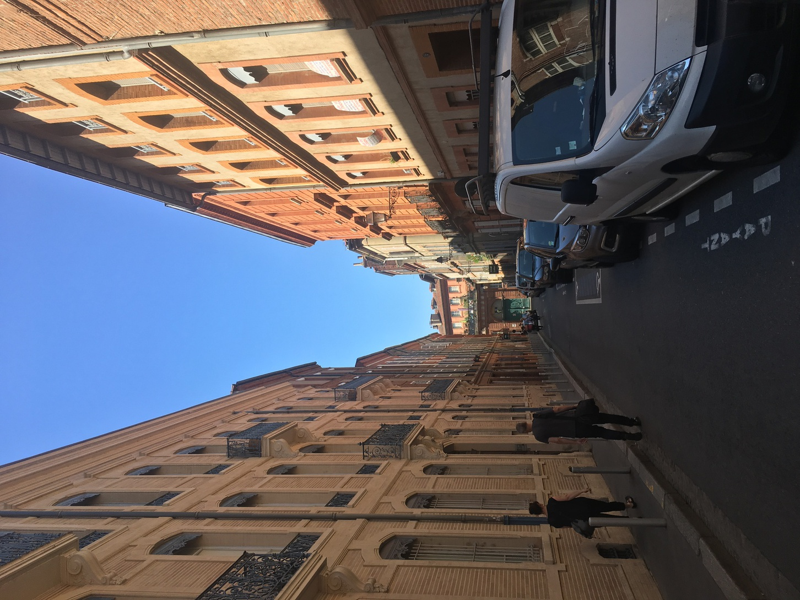
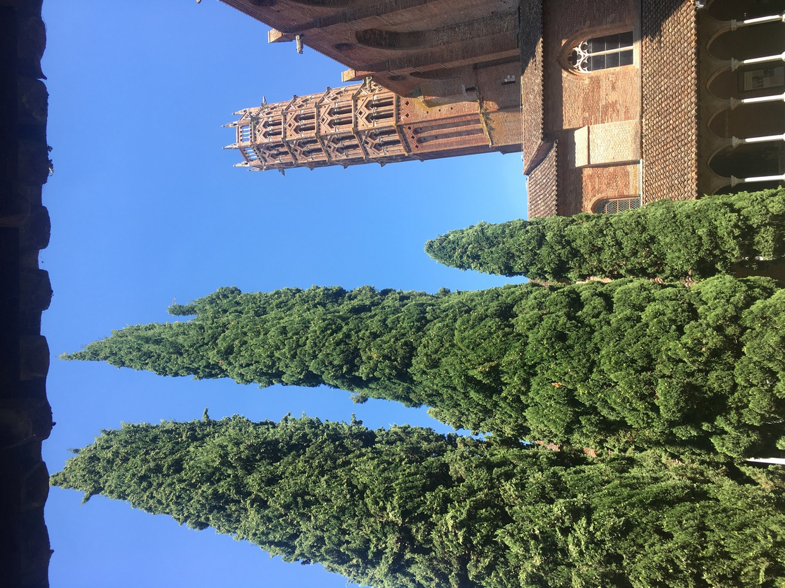
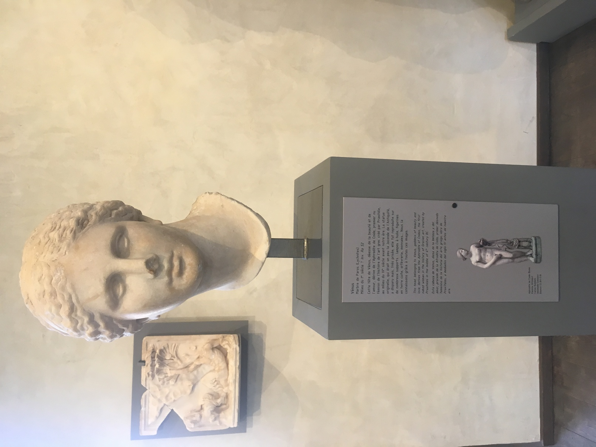
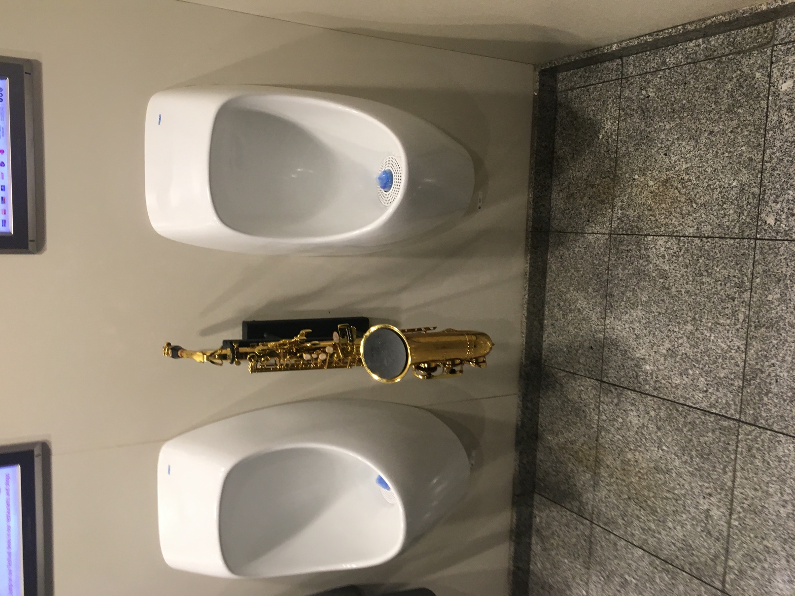

第一次落脚欧洲，就到了法国第五大城市（本地人宣称第四大）的城市图卢兹。我环绕着这个城市走了几圈（因为Google Map显示不出当地公交和城铁线路），逐渐确信，城市不一定越大越好，这种走路横穿只需要两个小时的大小最合适。

_当时是去参加在图卢兹举办的 useR!_

[talk的视频](https://www.youtube.com/watch?v=r6nd9cfm2jA&list=PL0pTTgKNw7_ZIf8txy9NIQsugA7u97iW6&ab_channel=RConsortium)
- 当时门牙还缺了一颗，底下的观众还是很专业的哈哈哈（虽说还是捕捉到了一个底下观众当我开始张嘴时掩饰不住的笑意），包括 Session Chair认真听完还鼓励我说我的 presentation 是整个 session 他听过的最好的。总之，感谢 Norm 对我的信任。

_家乐福里有几十种不同的法棍，还都特别便宜，我买了根后实在咬不动（而且当时门牙也因为某些原因留在美国休假，不愿意跟过来）_

_午后的 the pink city_

_像不像 the Isle of the Dead 那幅画里的那几棵树_

_当时刚上完希腊神话与罗马史这两节课，结果路过这个博物馆发现里面的雕像、石碑和石棺都与课上的内容有关，第一次那么认真地逛了博物馆，感觉这两节课的春游就应该设在这里_

_如果一定要选一个乐器放进男厕，我也选萨克斯_