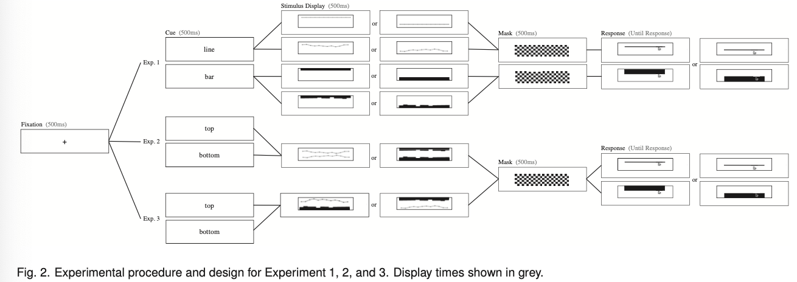

## Introduction
Preceptual psychology reveals that preception of visual information can be systematically influenced by/biased based on **context** and **recent history**. This is also true in data visualization. 

Position in past literature is believed to be the most precise channel to encode information. In this paper, they will show systematica biases in perception of data using positional encodings.

## Perceptual Biases
- lower-levels biases: size, features that include hue, brightness, orientation, and position perception 
- biases mechanisms: context (background, neighbor, categorical boundary, salient points), adaptation
    - Positions are encoded somewhat categorically (similar to color), so that changes to a category boundary are easier to detect, compared to equally distant changes that do not cross a category boundary
    - he position memory of a briefly presented object can be biased by context or nearby salient points in the display. Memory for the position of an object can be biased toward the average position of an associated group of objects.

## Cognitive Biases
- higher level biases: estimation, decision, judgement
- biases mechanisms: recent history: *priming*, and context
    - anchoring effect: uncertain target estimates can be strongly biased by other provided values, even if they are objectively irrelevant.
    - Such higher-level cognitive influences may also affect pattern perception in data visualizations
        - slope estimate
        - judgments of class separability
        - eg. viewers who saw a high-intensity title recall a steeper slope than those who saw a low-intensity title 

## Contributions 
Previous work on investigating perceptual biases has focused on biases within visualizations in a higher-level, cognitive context. 
    - how do semantics of titles, axes, or other visualization elements, or priming influence perception. 

This paper focus on potential biases found in lower-level perception of data — can people accurately perceive purely graphical information?
    - possible biases within **average position estimations**

## Study Overview

### Stimuli and procedure
The stimuli could appear at top and/or bottom. 3 means of height for both top and bottom: low, medium, high
    - determined in pilot trial by two-alternative forced choice. Following conventions from psychophysics, an ideal distance between means would have participants accurately discriminating them in at least 75% of all trials: 12 pixels for line, 5 pixels for bar in a 140 pixel display frame with average viweing distance of 47 cm.

Procedure: 

Three experiments:
1. One line or one set of bars: investigates whether systematic biases exist in position estimates for *simple graphs*, where a single line or a single set of bars is the only present, graphed data series.
2. two lines or two sets of bars: how average position perception of a graphed data series can be distorted in the presence of an *identical* type of data series.
3. one line and one set of bars: how the average perception of one type of data series can be distorted by a *different* type of data series

## Experiment 1
This experiment establishes a **baseline** to understand how a single graphed data series is perceived without the potential influence of other graphed data series. These findings will be later compared to how the presence of an additional graphed data series may further bias perception.

### Design 
1. precue to cue the participant 
2. stimulus conditions: 
    - top vs bottom
    - noisy vs uniform
    - line vs bar depends on the precue
3. mask
4. use response probe to get the estimated position of lines from the participants. 

### Analysis
They used a mixed-effect linear model.

### Result
They observed an overall **underestimation* of line position, in which participants estimated average line positions to be lower than where the average position of the line actually appeared. They also tested their hypothesis on participants' heuristics and negated it: for noisy lines, participants did not base their average position estimations only on the lowest point for lines on both the top and bottom half of the display.

They observed an overall overestimation of bar position, where participants systematically estimated average bar positions to be higher than its actual position. They again excluded the possibility that the participants were simply averaging the highest and lowest points on the set of bars to generate their average positional estimates.

## Experiment 2
### Design 
1. preque participants to report the average position of a line or a set of bars presented at the top or bottom of the display. 
2. stimulus: 
    - line vs bar half half
    - judge the top vs bottom
    - all noisy
    - control trials: each participant estimated the average position of a single noisy line or a single noisy set of bars, replicating Experiment 1.

### Result
They replicated the results in experiment 1 in the control trials. They also observed an underestimation in average line positions and an overestimation in average bar positions in "compound" (two lines or two sets of bars) displays. 

Additionally, we also found an effect of “perceptual pull”: position estimates for a target data series (a set of bars or a line) were ‘pulled’ toward the irrelevant data series shown on the same graph: there was a significant interaction between location and display type
    - participants underestimated the top line even more compared to single-line displays; underestimation of the bottom line was reduced.
    - Overestimation of the top bars was reduced; overestimation of the bottom set of bars was exaggerated.

## Experiment 3
### Design
Similar to experiment 2 except with different graph types in the same display: compound bar-line and compound line-bar displays.

### Result
Results from the first 2 are replicated, and the extent of perceptual pull does not depend on data series type.

### Perceptual pull as anchoring effect
- Perceptual pull is exerted on a target data series when an irrelevant data series acts as a non-target baseline.
- Similar to the cognitive anchoring effect, the observed perceptual pull was greater when the baseline series appeared to be farther away (high magnitude baseline). 
    - I am not sure where this comes from?

## Future direction
- Why underestimate average of line chart and overestimate average of bar charts
    - could the aspect ratio of bar charts explain?
    - figure-ground encoding: attention biases ground, and bars are grounds and will be overestimated, and the converse is true for line? 
- the root cause
    - might they be more cognitive and strategic, leaving more room for strategy interventions to mitigate the biases? Manipulating the viewer’s task could determine whether the bias stems from averaging ensemble positions, or is more generally a bias of perceiving even a single mark position.
- more complex stimuli
- alternative response probe: the current probe may also pull the reponse via "perceptual pulling".
- test encodings other than position: underestimation and overestimation when perceive values encoded in size, orientation, saturation, etc.

## Design guidelines
- Position estimation biases were smaller and judgments were more precise for bars compared to lines => in the absence of other constraints, use bars.
- Designers seeking the confidence of avoid- ing perceptual pull effects could avoid plotting two series in the same display.