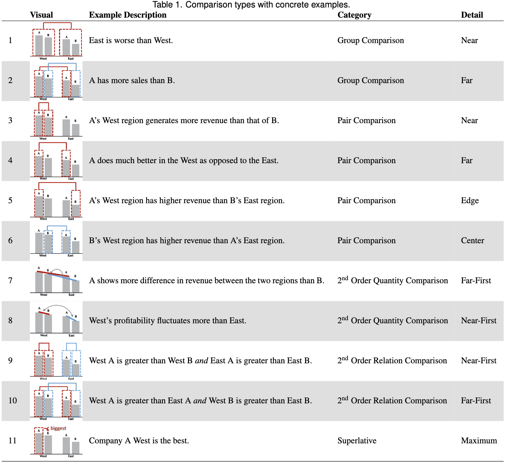

## Introduction
Comparison is a foundational perceptual operation in data visualizations, therefore it is critical to investigate how visualizations can be designed to guide the viewer toward making the appropriate comparisons. 

While top-down processing mechanisms such as the viewers’ goals and expertise can influence which comparisons are made, comparisons can be profoundly impacted by how visual elements are arranged, including their location, color, and size.

### Contributions
- a taxonomy of comparisons
- two empirical studies examining the role of bottom-up attention guided by *visual grouping cues* such as spatial proximity and color in visual data comparison tasks.

## Related Work
Assumption: making comparisons entails at least two steps: grouping and the actual comparison.

### Grouping Cues
- The non-defaults: People can choose to group an arbitrary set of objects by jointly attending to them, but that operation is tough and capacity limited
- The defaults: perceptual organization: grouping objects by ‘spatial’ and ‘featural’ cues.
    - Spatial cues include proximity, connectedness, co-linearity (combining objects that lie along a common line) and region-sharing.
    - Featural cues include color, shapes, or sizes.

### How cues work and compete
When grouping cues compete, spatial cues tend to beat featural cues and are harder to inhibit, even when they are counterproductive to effective task performance.

Spatial cues also appear to be processed in parallel across a display, in contrast to featural cues which are argued to be grouped by only one value (a single color, shape, or size) at a time

Spatially proximate items can also be grouped when they are visually dissimilar, and visually similar features can be grouped even when they are spatially separated. 

Spatial proximity and color can both act as grouping cues by constraining participants to perform mental arithmetic on sets of dots.

Among featural grouping cues, research suggests that some grouping features lead to better performance in distinguishing groups of marks.
    - In multi-class scatterplots, groups with different colors are more accurately distinguished than groups with different shapes

Relying on perceptually-modulated color spaces can help a designer choose sets of colors that are maximally distinguishable, thus forming groupings that are most easily dissociated from other groups
    - similar work is beginning to appear for shape spaces

Motion cues like common fate also automatically lead to grouping in visualizations, and recent work compares its strength to featural cues in visualization contexts. 

### Current work
The present experiments purposely strip most context and meaning from the tested visualizations, in an attempt to isolate the influence of spatial and color grouping cues. 

## Framework and Hypotheses
### Framework: a comparison taxonomy for 2x2 bar charts

This taxonomy was tested empirically via their pilot experiment. 

Some key terms:
- group comparison: pairs of bars are grouped together and then select those groups for comparison
- second-order comparison: comparison over the results of other comparisons
    - second-order *quantity* comparison: one quantitative difference is being compared to another quantitative difference to determine which is greater.
    - second-order *relation* comparison: generating groups (therefore more relevant with perceptual grouping), and compare within groups to produce a *structured representation* for that group, then compare the structured representations.  
        - A structured representation describes relationships between elements within a group.
        -  This distinction is important because a large body of research suggests humans are adept at comparing structured representations to find commonalities or differences in their relations. 
    - my questions: why does 2nd order relation comparison require grouping? does grouping make it "faster"? The differences between 2 types of 2nd order comparison are not totally clear. 
- superlative "comparison": finding the max and/or min. Unlike comparative relations, which take more effort to extract because they require shifting attention between two elements, finding the maximal or minimal element is automatic and effortless. 
- pair comparison: select any 2 bars out of the 4 for comaparison. Here, the basic unit for comparison is an individual bar. 

Based on this taxonomy, they formulated their hypotheses.

### Hypotheses
1. Viewers will make group comparisons before making pair comparisons
    - because there is a strong bias towards grouping elements together. 
        - the visual system automatically organizes visual input into groups.
2. Among group comparisons, viewers will more often group spatially proximate bars, but this tendency will be moderated by the color and size similarities of the bars.
    - people might be more likely to group bars that share features like color and size
3. Second-order comparisons (both quantity and relation) will be made less frequently than group comparisons and pair comparisons. Among second-order comparisons, relation comparisons will be more common than quantity comparisons.
4. Superlative comparisons will be made the earliest and most frequently.
5. Among pair comparisons, viewers will make more near and far pair comparisons and fewer edge and center pair comparisons. 
    - Because near/far are more semantically useful. 
6. Among pair comparisons, viewers will more often compare spatially proximate bars, but this tendency will be moderated by the color and size similarities of the bars.
    - once the visual system selects one element as the focus of attention, it typically becomes more sensitive to nearby elements.
    - people may be more likely to compare visually similar pairs
7. Among group comparisons, once people make a near-group comparison, they will be less likely to make a far-group comparison, and vice versa.
    - perceptual reorganization is hard

## Pilot Experiment