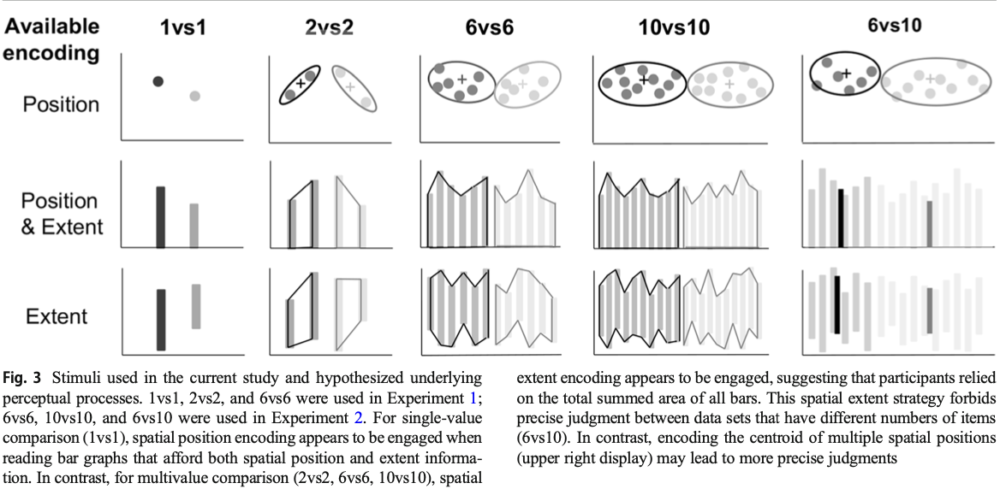

## Intro
The power of visualizations is constrained by the limitations and idiosyncrasies of the human visual system.
    - this is how they use the word "constraints" 

One of the findings based on constraints is a hierarchy of judgment precision among visual features that encode data values
    - eg. spatial position encoding (eg. compare length on the common ground) > length (stacked bar chart) > area (treemap).

The catch: The precision of these encodings was determined for comparisons between *single* values, under the assumption that what is true for comparing single values is also true for multiple values.
    - researchers therefore often decompose graph reading into elementary perceptual processes. 

There hypothesis is that the advantage of position encoding is not availble for comparisons involving larger sets: the visual system fails to use the most precise feature (position) and uses a less precise feature (length or even the area of the bars), because it may not be able to extract averages from multiple bar values; it may be restricted (or at least, irresistibly tempted) to considering sums only.

## Experiment 1
### Stimuli
Task: Participants judged which one of two variables had a higher value (1vs1) or higher mean (2vs2 and 6vs6). 

Three types of comparisons: 1 vs 1, 2 vs 2, and 6 vs 6. 

Three graph types: dot plots (position only), bar graph (position and spaial extent (length and area)), and misaligned bar graph (spaital extent only).

This graph shows the stimuli usign in both experiments: 

### Design
They used a 3 by 3 (3 comparison type by 3 graph type) with-in subject design to measure just noticeable differences (JND) using a staircase procedure. 
    - A small JND means a participant can detect a small difference between two groups, reflecting higher perceptual discriminability.
    - During the staircase procedure, if participants correctly (or incorrectly) answered the previous trial, the difficulty (defined by the difference between the means of the y-axis values of each group) of the next trial increased (or decreased) by one level. 
        - 12 levels of staircase.
            - The "ceiling" of the staircase could be determined by simulating random guess. People should do better than random guess. 
        - A separate staircase was run for each of the nine conditions.

They also did several manipulations in generating stimuli to rule out the possibility that participants used statistical information other than the mean in their judgment. 
    - for 6vs6, for example, they randomized which set had the larger mean with which set had the larger standard deviation, largest single value, and smallest single value.

The nine unique conditions were randomly presented in each block of nine trials. Each block was followed by a break that the participant could end by pressing a key. A new block of trials was then be shown in a random order, and these blocks continued until the end of the experiment. Once the 1vs1 conditions were complete, only 2vs2 and 6vs6 trials were shown. 

### Procedure
Participants were introduced to the experiment as a graph-reading task. They were told that the y-axis represented the time it took for a red and a blue team to finish a car racing game. Sometimes there was only one car within each team; sometimes there were multiple cars. Participants were told to judge which team on average took longer. For the misaligned bar graph condition, they were told explicitly that the length of the bars represented the time values.

For each trial: a fixation (500ms) + a left-right judgement on which side has higher average (2s, if no response after 2s, then marked incorrect and participants were reminded to response quicker).

([25 trials for 1vs1] + [49 trials for 2vs2] + [49 trials for 6vs6]) × [3 graph types] = 369 trials plus a set of two practice trials. 
    - why such imbalance

### Results 
To prove their hypothsis, they are able to find a significant interaction between comparison type and graph type: in 1vs1, the average JND differnece of misaligned bar graph is significantly higher than the other two. 
    - These results indicate that participants had relied on the spatial position information when comparing individual values on normal bar graphs.

In contrast, for 2vs2 comparison, performance on the dot graphs was marginally significantly worse than on the normal bar graphs, but there was no significant performance difference between the normal bar graphs and the misaligned bar graphs. For 6vs6 comparisons, there was no significant difference among conditions.

The ANOVA analysis also revealed a main effect of comparison type: comparisons between single values significantly better than 2vs2, which were significantly better than 6vs6. They did not find a main effect of graph type.

### Discussion
In 1vs1, participants relied on the spatial position.
In 2vs2 (pair comparison), participants had relied on the spatial extent of the bars rather than their spatial position in bar and misaligned bar graph conditions. 
For 6vs6 (mutivalue comparison), it is possible that participants treat entire set of bars as a single unit, summing the area of its shape envelope instead of the averaging the length of its bars. If so, this strategy should suffer for displays with an unequal number of bars between the groups. Thus, here comes the 2nd experiment. 

## Experiment 2
### Stimuli
2 new comparison types: 10vs10 and 6vs10. They also added small set size conditions (1vs1 and 2vs2) and used them as base-line measures to exclude outliers (whoever could not perform these baseline conditions within 3 SD from mean is excluded).

### Design
They used the staircase method with the three-down/one-up design: three correct answers in a row multiplied the staircase value by 0.75, and one incorrect answer multiplied the staircase value by 1.11.
    - These constants yielded a staircase that would converge on a JND equivalent to 68% accuracy. 

The experiment comprised three blocks. In each block, 16 trials of one condition were presented consecutively. Following a break, this process was repeated until all conditions were seen. The second and third blocks were the same as the first, but the order of the conditions was randomized each time. The staircase of each condition in the second and third block was a continuation of the previous bock’s staircase. The experiment included a total of (5 set sizes) × (3 graph types) × (3 blocks) × (16 trials) = 720 trials per subject. Feedback was given for the first 16 trials for all conditions (the easiest part of the staircase) to ensure that subjects understood the task.

### Results 
Anova shows no significant effect for both set size and graph type and their interaction in 6vs6 and 10vs10 set size, so they combined these 2 into the *same set size* comparison condition and treated 6vs10 as the *different set size* comparison condition. 

The ANOVA revealed a robust main effect between the forementioned two comparison types (same vs. different set size). The ANOVA did not detect a significant main effect of graph type.

When there was unequal numbers of items between groups (different set sizes), a planned comparison between dot graphs and the normal bar graphs indicates that performance was significantly better on the dot graphs than on the normal bar graphs.

### Discussion

It is possible that, for the dots in the six versus ten condition, a center-of-mass proxy might be used for the dots, as opposed to a summed area proxy for the bars.

## Conclusion & Future Directions
The hierarchy of encoding precision of single-value comparisons (Cleveland & McGill, 1984) is typically assumed to extrapolate to more complex displays. The present results suggest that it does not, and that multivalue comparisons can rely on surprisingly different perceptual proxies for the desired statistics.

Why did participants appear to rely on sums instead of averages? Their result is particularly surprising given the extensive evidence that the visual system can compute visual statistics across basic features. This incongruent result may provide a case of use-inspired basic research (Shneiderman, 2015), leading visual cognition researchers to find the limiting factors to such statistical extraction. 

The visual system is biased to deal with whole objects, rather than the features or parts of the objects, When asked to track multiple moving objects, observers have extreme difficulty tracking just one end of a moving bar, reflexively snapping their attention to the whole bar instead, and a similar reflex may lead viewers to bias recall of values plotted in bar graphs toward the center of the bar, instead of the top edge (with-in-the-bar-bias). In the current study, although spatial position might be the most relevant feature on a bar graph for comparing the averages between groups of values, viewers seem to be incapable of ignoring the spatial extent (length or area) information, and select the whole bars as the unit of attention.