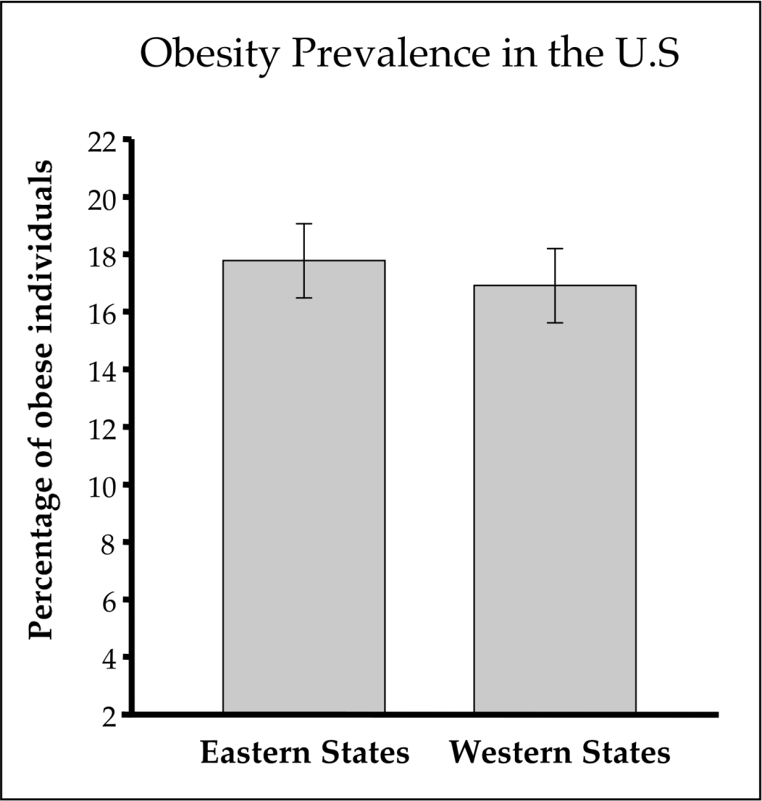
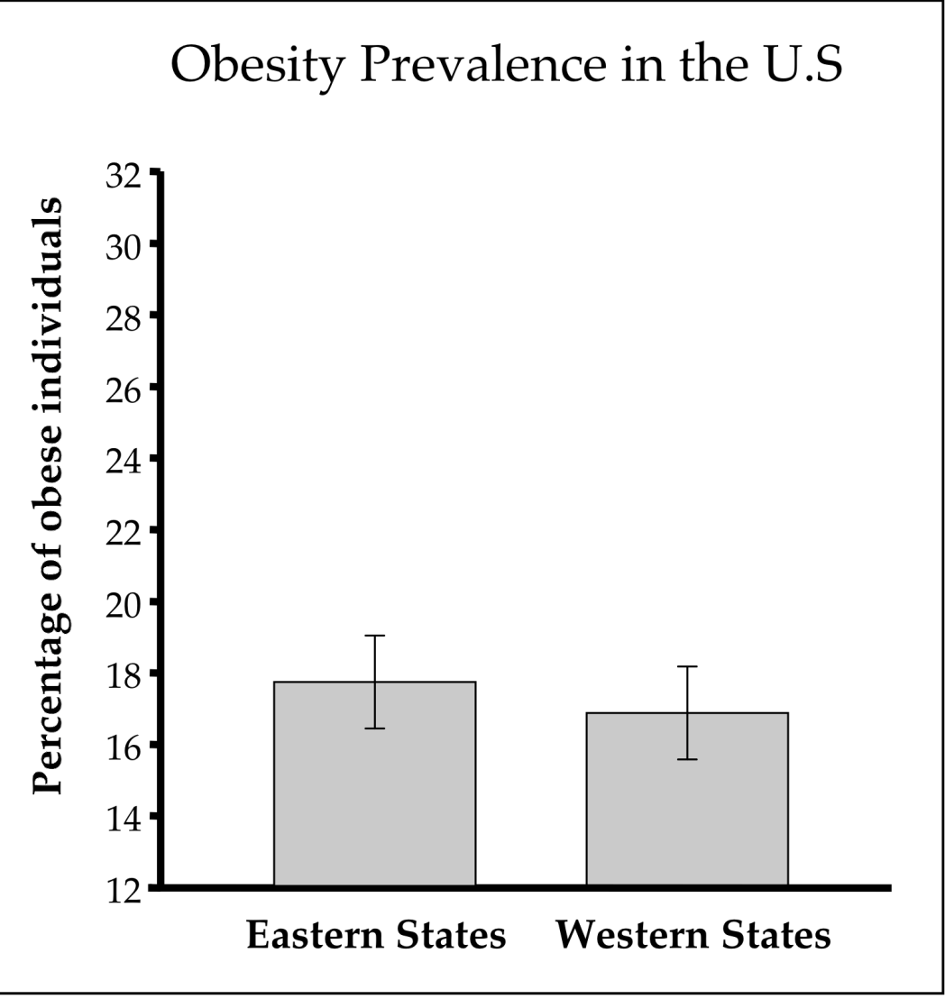
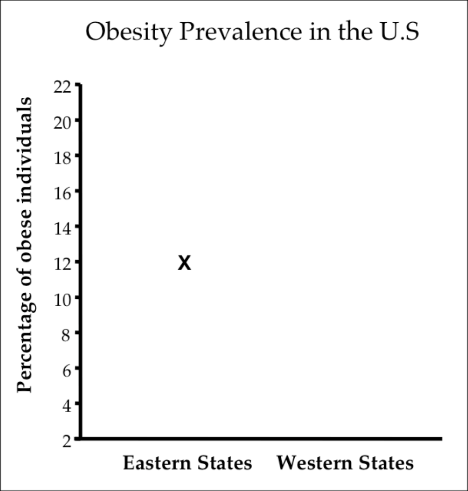
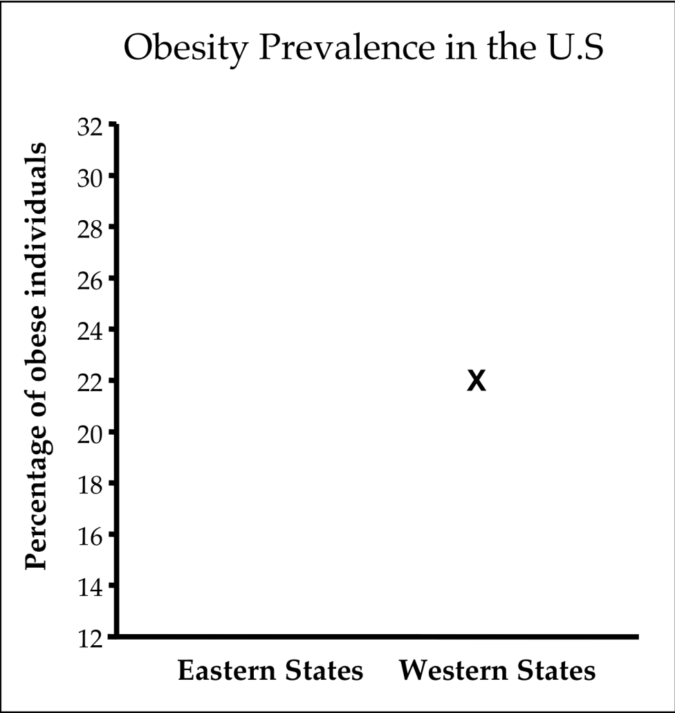
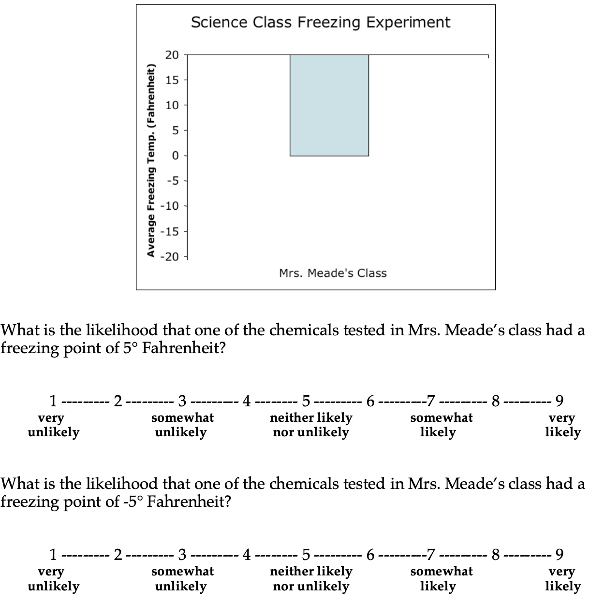

## Introduction 
Broadly, the paper focus on how bar graphs are *naturally* interpreted. 

The mean value, a symmetric value that is influenced to the same degree by values that are located at equal distances above and below the mean, is represented by the farthest edge of a bar that originates from one particular axis, most typically below the mean. 

Visual objects are defined by the closure of their boundaries, such that attention is attracted to such objects but does not flow beyond the boundaries. 

==> Hypothesis:
When viewers are shown a bar graph that depicts a mean and are then asked to judge the likelihood that a particular value was part of its underlying distribution, they will judge points that fall with-in the bar as being more likely than points equidistant from the mean, but outside the bar. 
    - they reflexively attend to the bars, and so to mistakenly prioritize regions within the bars over equivalent regions outside the bars

## Experiment 1: typical bar graph with error bar

### Design 
1. The participants were first shown a vertical bar graph with two bars originating from the lower x-axis
    - half saw this: 
    - The other half saw this: 
    - The actual means were the same, the y-axis (and in turn the bar height) is different between subjects. 
2. Some filler items.
3. Participants were then presented with a new page with the same graph axes as they just saw(remember, in step 1, the y-axis is different between 2 conditions) and a single test point, drawn at the midpoint of the y-axis. They then were asked to judge the likelihood from 1-9 that this value was part of the distribution that had been depicted by the bar seen earlier.
    - this graph will be shown to participants who saw the overall "higher" bars: the within-condition group: 
    - the outside-bar group would see this: 
    - the test point stays at the midline across all conditions. The western and the eastern, as well as whether the test point was within or outside of the bar are balanced between subjects.

### Results
Although the test point was equidistant from the initially depicted means, it was judged to be more likely to have come from the distribution when it was below the mean than when it was above the mean.

## Experiment 2
A potential confounding variable in experiment 1 is that the systematic differences in behavior between conditions may also due to viewers have a more general bias to favor points that are numerically below the mean.

To deconfound that, two additional y-axis sets of labels that represent the two types of "falling" bars were introduced. In total we have four conditions: rising-"short" bar, rising-"long" bar (short and long share the same numerical mean, one is short and one is long b/c of the manipulated y-axis labels), falling-"short" bar, and falling-"long" bar. Since the testing point is the same across conditions, participants who saw short bar are in "outside-bar" conditions, the same as what is in experiment 1. The catch is that the testing point will fall outside of the bars *and* below the mean in the falling-short condition. 

### Result

Test points that originated from within the bar again produced greater likelihood ratings, and it held for *both* rising bars and falling bars.

## Experiment 3
A second alternative explanation could be that participants assigned higher likelihood values to less extreme numeric labels. In experiment 1 and 2, the within- the-bar points had less extreme numeric labels than did the outside-the-bar points.

### Method
This experiment differed from the previous studies in the following ways:
- The y-axis labels were identical across all conditions; 
- The graphs contained only a single bar with no error bar (to minimize memory load); 
- The graph depicted a new hypothetical source of the data (freezing points of chemicals in a science class) that was amenable to both positive and negative numbers centered at zero. 

In all conditions the bar depicted a mean of zero, and y-axis are the same. Therefore, the 4 conditions are: 
- falling bar, 5 (inside - not extreme)
- falling bar, -5 (outside, extreme)
- rising bar, 5 (outside, not extreme)
- rising bar, -5 (inside, extreme)
I am not sure if -5 should be seen as the "extreme" value, compared to 5, or I am understanding incorrectly here. 

### Result
In both rising bar and falling bar conditions, points within the bars were judeged significantly more likely to belong to the distribution. 

## Experiement 4: bar stays when making the judgement

They wonder if in the "free viewing" condition the effect is still there: they made the graph was still present when they asked participants for their judgements. The rest of the setup is the same as that of experiment 3. 

The effect is still here. 

## Experiment 5: 
They changed the between-subject design to *within-subject*. They counterbalanced the question order and maybe also the rising, falling order. 
The rest stays the same as experiment 4. 

### Result
The effect is still significant: though 73% of the participants did rate the points as equally likely, 
the other 27% of participants reliably favor with-in-bar points. 

## Experiment 6: effect on downstream decisions

### Design
A between-subject design? with 3 groups:
- control group: no graph shown, were given the same scenario as the other 2 conditions and were asked for a decision using a sliding bar (if the new tires should increase BTS ot decrease the BTS).
- rising bar group: the bar rises from -200 to 0 and stops at 0 to represent the mean.
- falling bar group: the bar falls from 200 t0 0 and stops at 0 to represent the mean.

### Result
The presence of a rising bar led participants significantly increase BTS levels relative to control, while a falling bar caused participants to significantly decrease BTS levels relative to control. 
A further comparison confirmed that the resulting BTS levels differed between the rising- and falling-bar graph conditions. 

### Discussion
This confirms that the influence of the within-the-bar bias is not limited to reasoning about bar graphs and statistical distributions per se, but can also influence decisions made about the content that the bar graphs depict.

## Discussion of the results
Bar graphs of means will doubtless remain ubiquitous, but in some situations means might be better represented with points rather than asymmetric bars—or, where possible, with depictions of the *distributions themselves*.

**[The stimuli and instructions can be found at here.](https://static-content.springer.com/esm/art%3A10.3758%2Fs13423-012-0247-5/MediaObjects/13423_2012_247_MOESM1_ESM.pdf)**