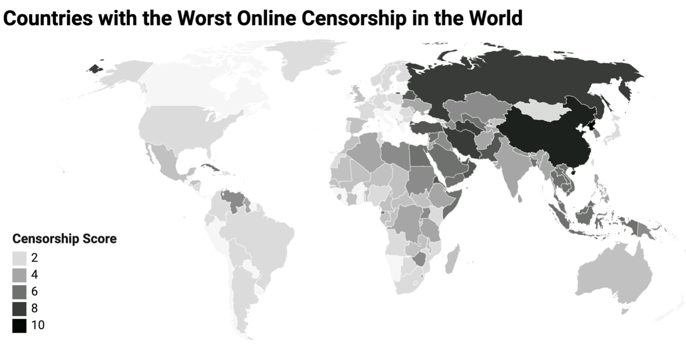

## Abstract 

Internet, the network of networks, has long been regarded as the borderless utopian world where people across the world can communicate and share anything they want. This vision is reinforced by the continual growth of the internet powered by advances in both hardware and software. However, as the report shows, the future of the global network may be shaped by regional differences [1]. One notable difference is how different governments censor online information. In this report, I will discuss internet censoring techniques, what types of information are censored specifically in China, and ethical concerns regarding internet censorship in China.

*_Internet censorship 2020: [2]_*

## Introduction

Censorship is where an entity in a position of power - such as a government, organization, or individual - suppresses communication that it considers objectionable, harmful, sensitive, politically incorrect, or inconvenient [3]. If someone is censored, she could be suppressed in either accessing or publishing certain information or both. In the context of the internet, censorship is composed of three elements [4]: prescription, identification, and interference. In the section below that discusses internet censorship techniques, I will list more details on how those elements are implemented.

The Great Firewall of China, the internet version of the Great Wall that censors both domestic and international internet traffic, is extremely controversial. Ever since China was connected to the Internet, the Chinese government realized its potential and attempted to control the internet [5]. Over the years, we have seen events that scream censorship led by the government: Google’s eventual retreat after years of attempts to reach a mutual agreement with the government regarding censorship [6], the block of YouTube, Facebook, Twitter, Wikipedia, etc. [7], the internet shutdown during the Uyghur protest [8], and many others. In a later section, I will discuss the patterns behind censorship and the related ethical issues in more detail.

## Technical background

The three elements, prescription, identification, and interference, serve as a three-step process to accomplish the censorship goal. Censors determine what to censor during the prescription stage. Identification is the process to identify traffics to be censored based on the prescribed results. Finally, censors implement ways to block or impair access to those identified connections and traffics.

The prescription process can be either static or dynamic or both [9]. The static approach uses a blocklist to maintain a list of elements to be blocked. There are three types of blocklist elements [4]: keyword, domain name, and IP address. The prescription may happen in real-time as well. During traffic bursts, the censors may use web crawling, machine learning, or even massive human labor to evaluate real-time contents and decide if they should be censored [10].

The last two steps, identification and interference, can happen at all levels of the network hierarchy where the internet traffics is transmitted. I will call points controlled by the censors in the network hierarchy as points of control, which include but are not limited to: the Internet backbone [11], internet service providers, content distribution networks, and service providers (e.g., search engines, video hosting services, online forums, etc.). After identifying the points of control, the censors can install identification and interference hardware to perform the last two steps.

Censors can identify prescribed elements in either the application layer or the transportation layer or both (they often use both to get more accurate results). **At the application layer**, the most straightforward way to identify blocklist elements is by looking at the HTTP request/response header. The header contains a list of useful information such as the domain name of the requested service under the “host” field. In this way, the censors can block or impair traffics with the hosts in the blocklist [12]. Another related method is URL filtering. A more expensive and intrusive way for identification is called Deep Packet Inspection (DPI). DPI reassembles network flows to examine the application "data" section, as opposed to only headers, and is therefore often used for identifying prescribed keywords [13]. DPI is also used in blocking Tor in China [14]. **At the transport layer**, the transport header contains the source IP address and destination IP address that can be used to identify the prescribed IPs. The port number along with properties of payload data and flow behavior can be used to identify the protocol used [15], to detect and block traffics generated using circumvention tools. China uses this protocol identification to block Tor [12]. Furthermore, internal identification where content providers identify keywords within their services can be also deployed. A commonly used method of instrumenting content distributors/providers consists of keyword identification to detect restricted terms on their platform. The distributors are willing to comply either due to pressure from the government or incentives from the government or both.

After prescribing and identifying elements, the next step is to interfere with those elements by blocking or impairing them. **At the application layer**, the most commonplace point censors use to interfere is at Domain Name System (DNS). When users enter a domain name to access the website, the browser iteratively asks DNS servers about the IP address associated with the domain to request contents from the website. If the domain name is in the blocklist, determined in the prescription and identification phase, the censor will interfere with the translation process (from domain name to IP address). There are many ways that censors can use to block access to content by altering responses from the DNS, including blocking the response, replying with an error message, or responding with an incorrect address [4][16]. The most prominent technique is DNS cache poisoning. To increase the “translation” performance, DNS servers usually cache the translations for future uses. However, if the DNS servers controlled by the censor respond more quickly than the authoritative DNS resolver with a fake IP address, then the fake address will be cached in all downstream DNS resolvers, which will affect all computers that use those resolvers. **At the transport layer**, packet dropping is a simple way to block any connection with certain prescribed elements. For example, China once dropped all packets to GitHub (the destination IP belongs to GitHub) [17]. If the connection has already been established, the censor can inject RST packets to both sides of the connection that signify the session has been terminated.

Other interfering techniques include Distributed Denial of Service (DDoS), network shutdown, manual filtering, self-censorship, and server takedown [4]. The DDoS attack uses botnet or other distributed platforms to flood the services to be blocked by sending enormous traffic to the website so that legitimate requests are ignored. The “Great Cannon”, part of the Great Firewall of China, once redirected web visits to attack certain services [18]. The network shutdown and server takedown, as the names suggested, shut down certain services or all services. China shut down the network in the Xinjiang region during unrest in 2009 in an effort to prevent the protests from spreading to other regions [19]. To avoid being held liable by the government, companies are pressured or incentivized to apply self-censorship. Weibo and Google before its retreat agreed to conform to be "self-disciplined" in order to get the business license to operate in China [20]. Self-discipline involves taking down content that has certain keywords. Manual filtering is more accurate in marking or removing content with certain keywords than automatic filtering using machine learning. China’s army of monitors employs a lot of human laborers to censor the contents [10].

## Implications of the censorship in China

Technologies have implications when they are deployed in the real world. All of the techniques described above can be used to censor child porn, pirate music, or political content. Why the internet censorship is particularly controversial in China, when other countries censor online content to some extent as well? To figure out that question, we need to know what contents are blocked or impaired in China.

According to [10], there are three types of censorship regarding human expression in China: entire websites in [7] such as Facebook, and YouTube; keyword blocking; hand/manual censoring. The first two censorship techniques can be evaded if you really want to express yourself. China has close alternatives to banned websites such as Weibo (vs Twitter), Baidu (vs Google), and WeChat (vs Facebook, Snapchat, Instagram), and people can express themselves on those platforms. The keyword blocking can be evaded easily since netizens in China can outwit automated keyword binding programs by coming up with clever phasing due to the characteristics of the Chinese language. However, none of the evading techniques could pass the third technique, manual censoring. Since the third technique is the most expensive, extensive, and the strictest technique and the first two have little effect on suppressing human expression, [10] argues that measuring what the manual censoring tries to block gives us an idea of what the Chinese government tries to censor. After comparing the contents of censored posts and non-censored posts, [10] concludes that posts with collective potential, porn, and criticisms of the censors are heavily censored. Posts with collective potential refer to posts posted by someone other than the government and have the potential to join people together to express themselves collectively or even generate collective actions such as protests. On the contrary, posts about government policies, and verbal attacks on government and government officials are much less censored, unless they are attacks on censorship itself. For example, posts about people rushing to buy salt after the earthquake and posts about supporting the government’s actions in the Philippine-China island dispute are censored and blocked as they are considered to have collective potential, despite they are innocuous and pro-government. On the other hand, posts about local corruption that do not have collective potential are not censored by the central government (might be censored by the local governments) and might be even encouraged since the central government wants to know the truth and better control the local governments and maintain its stability. [5] uses the word "solidarity" to refer to the same idea of the collective potential.

In summary, posts/contents that have collective potential or encourage solidarity without the intention of the central government are censored and likely to be blocked, along with porn and criticisms of the censorship. Additionally, foreign services that do not comply with the censorship agreement, keywords that are deemed “harmful” by the government [21], and posts that are blocked by stricter censorships rules made by content providers to avoid liability (government might allow certain posts but companies just ban them outright) are also censored. Now that we have some ideas on what contents will be censored, what are the ethical issues with such decisions that censor those types of information mentioned above?

## Ethical arguments

### Freedom of speech

The central ethical issue of censorship is whether it violates freedom of speech. If we interpret freedom of speech to its “extreme” form, namely, everyone shall have the right to seek, receive and impart information and ideas of all kinds, through any media of his choice [22], then any kind of censorship violates this right. In reality, it is used with Mill’s harm principle: the only purpose for which power can be rightfully exercised over any member of a civilized community, against his will, is to prevent harm to others [23]. In other words, people can seek and express whatever they want only if it does not produce harm to others. As a matter of fact, the constitution of China closely follows Mill’s harm principle. According to Article 35 of the Constitution of the People's Republic of China, citizens of the People's Republic of China enjoy the freedom of speech, of the press, of assembly, of association, of procession, and of demonstration [24]; according to Article 51, when the citizens of the People's Republic of China exercises freedom and rights, they must not harm the interest of the state, society, people and other citizen’s freedom and rights [27].

If we believe in freedom of speech as a human right using Mill’s harm principle, then the morality of censorship in the case of porn, collective potential, and criticism of censorship is dependent on whether those three things produce harm. If they do not produce any harm, then censoring them is immoral.

Does, the first category of censorship in China, porn produce harm? It is worth noting that porn here refers to producing, disseminating, or selling porn, not watching porn privately. The censoring of child porn in Australia and many other countries can be justified using Mill’s harm principle if we think harm is produced because child porn involves actual sexual abuse or exploitation of children [25]. But can we justify the claim that extends the censorship to the block of all porn on the internet (if porn is put on the internet, it is considered disseminating/selling porn)? To do that, we have to extend the notion of harm beyond explicit harm as there is no explicit harm involved in the production/dissemination/selling of non-child porn:
1. If X is intrinsically morally wrong [25], then X produces harm.
2. Porn is intrinsically morally wrong.
3. Porn produces harm (1,2)
4. If porn produces harm, then it is morally permissible to censor porn.
5. Censoring porn is morally permissible (3, 4). 

The 2nd assumption follows because the Chinese government regards porn as "spiritual pollution" [26] and if anything pollutes the mind or spirit, it can be seen as intrinsically wrong.

The same framework can be applied to the second and third categories of censorship in China: collective potential and criticisms of censorship itself. To simplify things a bit, I would regard the criticisms of censorship as one type of collective potential since it has the potential to gather public expressions such as collective disapproval. To justify the censorship of collective potential, harm must be shown. Does collective potential have explicit harm? Collective actions can be either a peaceful demonstration or protest that is legal under Article 35, or protests that explicitly harm others. Since collective potential only has the potential to be either one of them, it currently does not have explicit harm. Collective potential also cannot be determined to be intrinsically morally wrong due to the same reason. Therefore, an argument against the morality of censoring collective potential can be formed:
1. If collective potential does not produce harm, then censorship of collective potential is morally impermissible as it violated freedom of speech.
2. Collective potential does not produce harm.
3. It is not morally permissible to censor collective potential (1,2).

If we really want to justify the morality of censoring collective potential, we have to extend the notion of harm one step further: actions that are “very likely” to produce harm are considered harmful in themselves. For example, posts about people rushing to buy salt after an earthquake may very likely lead to collective actions that result in people who are in dire need of salt cannot buy salt, so it is harmful under the newly extended notion of harm. Therefore, it is morally permissible to take down such posts as we are “almost 100% sure” that they will harm others. A problem with such an extension on the definition of harm is that it is naturally under arbitration and ambiguity. The notion of “very likely” is extremely open to interpretation. This ambiguity is exacerbated by the fact that most censorship occurs at the company level under the category of self-censorship. Because there exists little clear guideline on what to censor, companies have to do guesswork themselves. When Google was questioned by the U.S. Congress on whether they have confirmed with the Chinese government on what to censor before actually censoring those contents, Google said they were just following what others did (local companies, Yahoo!, etc.) [5]. Essentially, it was not the government that was censoring, it was Google that made the decisions. Furthermore, the users will do self-censorship before they express themselves if they fear their speech would be considered “very likely” to produce harm. Therefore, the argument against considering “very likely” to cause harm as harm can be formed:
1. If everyone in the world has to perform self-censorship and others might censor your expression based on arbitrary criteria, then the freedom of speech is violated.
2. It is the case that everyone has to self-censor and the censorship criteria are arbitrary since we do not have standard censorship rules.
3. The freedom of speech is violated (1,2).

Therefore, we have to reject the arbitration in determining the harm of some actions. As a result, it is not morally permissible to censor collective potential.

### Internet access as a human right

It is not entirely true that foreign services such as Google, YouTube, and Wikipedia are blocked altogether. Circumvention tools such as Virtual Private Network (VPN) still exist and are functional, although VPN service providers are often engaged in the “cat and mouse” game with the government as using VPN is not illegal while providing VPN to the public is illegal. As a result, elites with the knowledge and money to use VPN, elite universities, foreigners, and foreign companies do have the access to the “whole” internet, although with some costs and some hassles such as the need to change VPN providers from time to time. On the other hand, people without such capabilities do not have access to part of the services on the internet. If we define internet access as access to the internet infrastructure and web services on top of that and internet access is one of the human rights, then most Chinese people’s right to access the internet is violated.

## Conclusion

The report first discusses general techniques to perform censorship. Then it focuses on China to discuss the implications of using censorship techniques. Specifically, the report shows what the government really tries to censor and block: information with collective potential, porn, and critics of the censorship. Finally, the report discusses the ethical issues of the censorship performed in China around violation of freedom of speech and violation of internet access as a human right.

Since censorship in itself is not intrinsically wrong, as we have shown in discussing the censorship of child porn. However, the only way to justify censoring collective potential is to treat information that is “very likely” to cause harm as real harm, leading to the problem of arbitration and self-censorship. To resolve that, we can either stop censoring collective potential or define “very-likely” in clear, transparent, and standardized ways.

## References

[1] There May Soon Be Three Internets. America’s Won’t Necessarily Be the Best -https://www.nytimes.com/2018/10/15/opinion/internet-google-china-balkanization.html

[2] Internet Censorship 2020: A Global Map of Internet Restrictions - https://globalfreedomofexpression.columbia.edu/publications/internet-censorship-2020-a-global-map-of-internet-restrictions/

[3] Censorship, Wikipedia - https://en.wikipedia.org/wiki/Censorship

[4] A Survey of Worldwide Censorship Techniques: draft-irtf-pearg-censorship-04

[5] The Great Firewall of China: How to Build and Control an Alternative Version of the Internet

[6] S. Levy, In the Plex: how Google thinks, works, and shapes our lives, New York NY: Simon and Schuster, 2011, p. 306.

[7] https://en.wikipedia.org/wiki/List_of_websites_blocked_in_mainland_China

[8] Trapped in a virtual cage: Chinese state repression of Uyghurs online, Uyghur Human Rights Project, 2014, p. 2.

[9] Centralized Content-Based Web Filtering and Blocking: How Far Can It Go? - 

http://citeseerx.ist.psu.edu/viewdoc/download?doi=10.1.1.132.3302&rep=rep1&type=pdf

[10] How Censorship in China Allows Government Criticism but Silences Collective Expression 

[11] Measuring and Analyzing National AS Chokepoints - https://forrest.biodesign.asu.edu/data/publications/2019-compass-chokepoints.pdf

[12] Inferring Mechanics of Web Censorship Around the World - https://www.usenix.org/system/files/conference/foci12/foci12-final1.pdf

[13] Deep Packet Inspection and Internet Censorship: International Convergence on an ‘Integrated Technology of Control’ - http://advocacy.globalvoicesonline.org/wpcontent/uploads/2009/06/deeppacketinspectionandinternet-censorship2.pdf

[14] How China is Blocking Tor - http://arxiv.org/pdf/1204.0447v1.pdf

[15] Breaking and Improving Protocol Obfuscation https://www.iis.se/docs/hjelmvik_breaking.pdf

[16] Report of the AFNIC Scientific Council: Consequences of DNS-based Internet filtering - http://www.afnic.fr/medias/documents/conseilscientifique/SC-consequences-of-DNS-based-Internet-filtering.pdf

[17] GitHub blocked in China - how it happened, how to get around it, and where it will take us - https://en.greatfire.org/blog/2013/jan/github-blocked-china-how-it-happened-how-get-around-it-and-where-it-will-take-us

[18] An Analysis of China’s "Great Cannon" - https://www.usenix.org/system/files/conference/foci15/foci15-paper-marczak.pdf

[19] China Shuts Down Internet in Xinjiang Region After Riots - https://opennet.net/blog/2009/07/china-shuts-down-internet-xinjiang-region-after-riots

[20] China employs two million microblog monitors statemedia say - http://www.bbc.com/news/world-asia-china-2439695

[21] https://blockedonweibo.tumblr.com/tagged/list

[22] Freedom of Speech, Wiki - https://en.wikipedia.org/wiki/Freedom_of_speech

[23] https://plato.stanford.edu/entries/freedom-speech/#HarPriFreSpe

[24] http://en.people.cn/constitution/constitution.html

[25] https://plato.stanford.edu/entries/pornography-censorship/

[26] https://en.wikipedia.org/wiki/Pornography_in_China

[27] https://baike.baidu.com/item/%E8%A8%80%E8%AE%BA%E8%87%AA%E7%94%B1

 