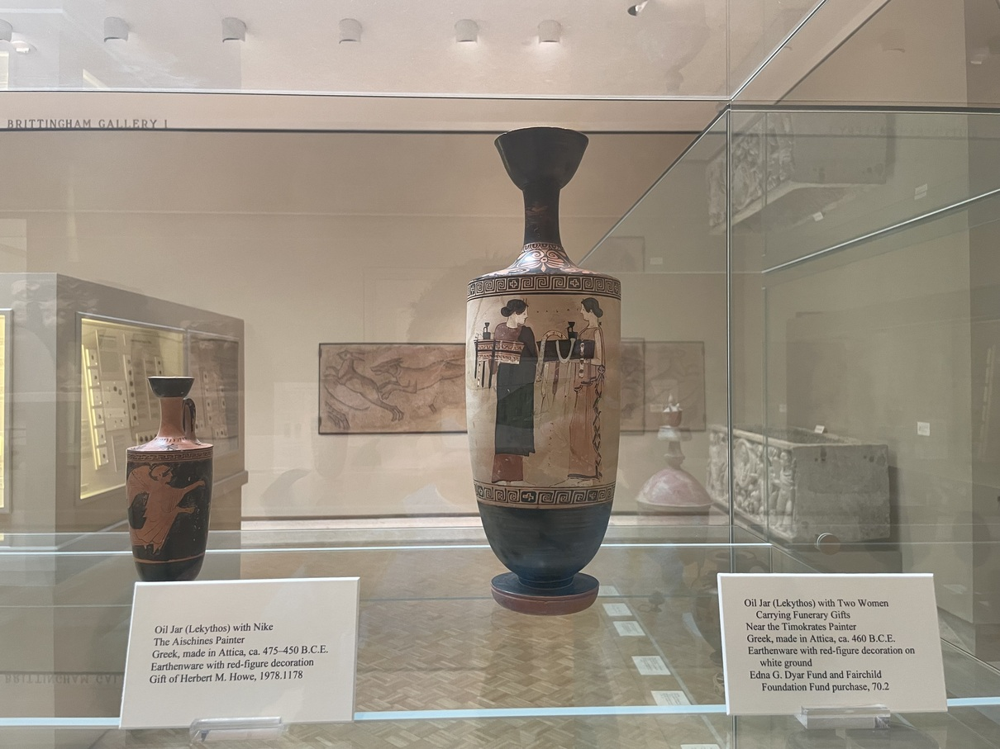

## Lekythos, its etymology
The Greek word *lekythos* had a broader meaning than the modern, archaeological term “lekythos.”[^1] It was a generic term for oil or perfume jug.[^2] Evidence could be found in the literature: in Aristophanes’ Ploutos, a lekythos is used as a vessel for oil[^3]; in his play *Birds*, a slave of Pisthetaerus exclaims, "there is no oil in the lekythos".[^4] In fact, the earliest use of the term occurs in Homer’s Odyssey, where Nausicaa is given olive oil in a golden lekythos by her mother to anoint herself.[^5] Besides the literary evidence, an inscription found on a vase that the archaeologists now call aryballos (a small, rounded oil bottle used by ancient athletes) says that it is a *lekythos* owned by Asopodoros.[^6] Alabastron, in addition to aryballos, was also called *lekythos*.[^7] To sum up, the term *lekythos*, rather than pinpointing certain shapes in ancient Greece, was a term used to denote the function of certain pots, namely, a flask for carrying oil or perfume, or unguents.

## Lekythos, archaeologically speaking
In the modern, archaeological sense, lekythos refers to a variety of shapes that share certain features that distinguish them from, say, aryballos or alabastron: one-handled, narrow neck, and deep mouth.[^8] Archaeologists identify and distinguish between three main types of Attic Lekythos that were developed starting from the sixth century.[^9] Type One has a body that continuously and gently curves from neck to base (which makes it look like it does not have a neck).[^10] Type One, or the Deianeira lekythoi, appeared in the early sixth century B.C. as an essentially black-figure shape (most of them use the black-figure technique).[^11] It continued to be used until the third quarter of the century.[^12] 

Type Two, the shoulder lekythoi, aptly gets its name from its distinct shoulder. It was introduced around 570 – 560 B.C.[^13] and continued to be made until the end of the fifth century. Around 530 B.C. this type achieves its standard cylindrical form (unlike earlier shoulder lekythoi, whose body turn sharply towards the base, the cylindrical lekythoi have a cylindrical body that does not turn at all).[^14] In fact, the development of the shape of Type Two was decisively affected by the introduction of the new red-figure style (also invented around 530 B.C.).[^15] Therefore, the cylindrical form could enjoy both the black-figure and the red-figure (as well as the white-ground technique as we will later see) techniques. It is the most common type among existing lekythoi.[^16] 

Type Three is the squat type that is broad at the base and has no distinct shoulder. It becomes popular starting from the second half of the fifth century. Some think that this form is popular during the fourth century[^17], but others think that it phases out a decade after it replaces the cylindrical form at the end of the fifth century. Given its circulation time, Type Three is essentially a red-figure shape[^18].

Besides the three major Attic lekythos shapes that are popular during the Archaic and the Classical period, archeologists also use the term lekythos to refer to Sub-Mycenae and Protogeometric vessels with bulbous body, thin neck, strap handle, and flaring foot[^19]. 

## A Lekythos in the Chazen Museum 

The vase I chose is of cylindrical shape.

__Front view (note its size from the other lekythos)__

__A detailed view on the painting__

Like all other lekythoi exhibited in the museum except for the one that is of squat shape. Its inventory number is Chazen 70.2. 

The subject of the vase painting is two women on their way to somewhere, each carrying a basket. The baskets they prepared have lekythos and some ribbons or sashes. The black dress of one woman is a mourning cloak, and it matches the color of the basket of the other woman, and conversely, the woman with the white dress matches the color of the other basket. Between their eyes, there is an inscription that spelled “kalos”, which means “beautiful”. I am not sure whether the inscription is trying to tell us about the beauty of the two women. Also, the meaning of such an inscription in a funeral scene is unclear. 

From the second quarter of the fifth century, around the time when this vase was made (ca. 460 B.C.), lekythos painted with the white-ground technique is almost exclusively funerary. The scenes painted, like this one, are illustrative of Athenian rites of death and burial.[^20] White lekythos are often specially made for funerals because oil was believed to be important to the dead as well as to the living, therefore they are made as offerings to the dead. Also, white slips are less stable and thus impractical for daily use, but it is perfectly fine to be used as funeral gifts[^21]. The dimension of this vase is 15 7/8 by 5 1/4 inches. It is relatively large when compared with other lekythoi. Since it was made for funeral uses, its size was not limited by handiness[^22].

To sum up, the size of this vase, its technique used, and the subject matter suggest and are determined by its function. 

## The Function of Lekythos

It was discussed above in the etymology section that lekythos in the broader sense refers to a container of oil (or unguents that is also “oily”, or perfume that is made from oil). Therefore, we know that the main function of those three types of vases discussed above that fall under what we now call lekythos is to hold oil, potentially for storing and distributing. However, the same can be said to be true of what we now call aryballos and alabastron. I think the reason that they are all suitable for storing and pouring oil is that they share the narrow neck feature that distinguishes them from say, water jugs. The narrow neck was designed so that the flow of oil was limited to a thin stream or to drops.[^23] Nonetheless, a call for some finer distinctions from such a generalization is unavoidable. Specifically, if they were said to hold oils, why did Greeks need and devise different shapes for the same use? In other words, do the differences in shape and size contribute to slightly different uses? Also, are they used in different places or contexts? 

One way to approach these questions is to connect the variety of uses of oil (and its derivatives) in ancient Greek to the variety of shapes that could hold oil. Oil was very popular then and could be used as offerings and dedications for the dead, as prizes for victorious athletes[^24], as a scented perfume[^25], for consumption, and in bathing. 

Aryballos, a shape of size smaller than lekythos and alabastron on average (7 or 8 cm[^26]) and often rounded, has a small handle (or an ear) used for attaching a strap to the user’s wrist. The small size, attachability, and rounded body that enables easy grabbing contribute to its portability and usability in bathing. Therefore, aryballoi are used by athletes or youths at the bath[^27]. The evidence of such attribution can be found in multiple vase paintings that show either aryballos was suspended from the wrist of an athlete, or it was hanged on the wall, or it was used in bathing.[^28] Statistically, using the Beazley Archive, I found that out of 655 vases that are decorated with aryballos, 574 of them include “Draped” as the decoration Termword, many of which depict women bathing. 368 (over half) out of the 655 vases include youth(s) as the subject. I randomly sampled several of them and all of them show youth taking bath. The same can be said of the 166 vases with athletes as subjects. Another good statistical evidence is that 304 of them include sponges, which means likely all of them depict bathing scenes, and the inclusion of the sponge is likely a sufficient but not necessary condition for a bathing scene. Furthermore, non-bathing paintings that include aryballos often depict a youth/athlete walking or doing something with the aryballos attached to his wrist, showing its portability: it is hard to imagine shapes like lekythos could be carried like this and be used in bathing. 

Alabastron has an elongated body with mostly a rounded bottom that might need a stand for support[^29] (though there are flat-bottomed variations[^30]). It either has no handle or has small lugs or handles to attach strings[^31]. However, it is not totally clear to me how the shape of an alabastron connects to its function as a perfume bottle[^32], at least not as clear as in the case of aryballos[^33]. So again, I turn to the representations of alabastron in vase paintings. One major type of scene that includes alabastron is “domestic” (308 out of 560), and some “seated” scenes that are not categorized as “domestic” (another 95) are also quite “domestic” in my opinion[^34]. Therefore, “domestic” scenes are the dominant type. The inclusion of objects like “mirror” (131), chairs (98), and stools (75) also contributes to the “domesticity” of the scenes, therefore making the vase attractive to the targeted buyers of perfume, women, because it reflects the ideal life or the needs of the contemporary women. For example, the inclusion of mirrors might reflect the self-awareness of women, of themselves, and of their beauty.[^35] 

The second but relatively minor type of scene is the “funerary” type (85 occurrences out of 560). Objects usually included in a funeral are also included: sash (60), fillet (51), stele (42), and lekythos (41, the funerary use of lekythos will be discussed later). The common subjects that are depicted across those two types of scenes are women: woman takes part in both domestic affairs and in funerals. 

### Lekythos in the Narrow Sense

Let us turn to lekythos, after describing the shapes and uses of its two “close” brothers. 

#### Funeral Uses
Besides being a generic term for oil or perfume jug, lekythos in Greek literature is also associated with something that is buried or burnt with the dead, i.e., it is for funeral uses. In Aristophanes’ Ecclesiazusae, three such associations are made: Blepyrus describes the way Praxagora left him as the way “the dead are left, bar the chaplets and perfumes (in lekythos)”[^36]; the young man refers to “the most gifted of painters” as someone “who paints the lekythoi on coffins”[^37]; the young man commands the first old woman to prepare things for a funeral, and the preparation involves “spreading out a layer of origanum upon four pieces of wood; binding fillets round your head, bringing lekythoi of scent and placing a bowl filled with lustral water before your door”[^38]. 

In addition to literary evidence, we can find in Beazley’s archive that out of the 128[^39] vases that contain lekythos as part of the scene depicted, 69 (over half) of them are depicting a funeral. Moreover, funeral scenes usually involve at least a woman (42 out of 69). In fact, if a scene includes (at least) a woman and (at least) a lekythos, then it is guaranteed to be a funeral scene. Among the objects that are depicted in a funeral scene (that also includes a lekythos), a stele, a wooden or stone slab that is served as a grave marker, is depicted most frequently (43 out of 69). Basket (33 occurrences), sash (20), and fillets (16), along with stele, are “companions” of the lekythos as they might be used together in an Athenian funeral. These statistics, except that of the stele, confirm the literature evidence mentioned above and the funeral scene depicted in the Chazen lekythos 70.2, providing us with some sense of what was going on in Athenian funerals. Another striking evidence for the use of lekythoi in funerals is that most funeral scenes that contain lekythoi are painted on lekythoi (53 out of 69), whereas non-funeral scenes that contain lekythoi are painted on various other shapes with a relatively small portion of them are painted on lekythoi (22 out of 61). This evidence shows that not only lekythoi are illustrated as part of a funeral (they are painted so), but they are actually used in funerals (they are painted on lekythoi that presumably would later be used in funerals). As for the painting techniques used in funeral scenes that have lekythoi, they are painted predominantly using the white-ground technique (47 out of 69). Connecting to the previous observation[^40], incidentally, all of them are painted on lekythoi.  As a result, white lekythoi’s (lekythos painted using the white-ground technique) primary function was funerary[^41]. 

We have now established the connection between funerals and white lekythos. However, why does such a connection exist in the first place? What are other uses of lekythoi during a funeral other than burying them with the dead so that the dead could enjoy the same life as the living? The white background is desired because it goes well with the marble grave monument and the bones.[^42] Moreover, white lekythoi use the same material as the contemporary wall- and panel-paintings and are desired because they remind people of those paintings.[^43] Shape-wise, most white lekythoi are of cylindrical shape that is straight-sided. I think the cylindrical shape provides the painter with a wall-like canvas and painters might paint or the buyer might desire paintings with the wall-painting style because of its monumentality.[^44] Late in the fifth century, some massive examples called the 'Huge Lekythoi' are produced (up to 1m), serving perhaps as equivalents for stone grave-markers.[^45] I think the ability to achieve such scale is in part due to the secure foot that is lacking from alabastron. Another use in the funeral setting is enabled by the innovation in shape: small interior is made inside the lekythos around 470. B.C.[^46] 

The interior vessel is added, as some scholars believe, to accommodate lekythos’ use for libation by making pouring oil easier, and because libation does not require much oil[^47]. 

White lekythos, however, is only a subset of all lekythoi, although they are represented more often than other types because of their use in funerals. Another group of scenes besides funerary is “domesticity”. Objects appeared dominantly with alabastrons, such as mirror (21 occurrences out of 128), chair (18), stool (16), and states like “seated” (54) and “domestic” (37) suggest similar usage, or at least, similar marketing targets as the alabastron. Therefore, it is no strange that lekythoi were mainly used by women as containers for oil and perfumed oil.[^48] 

## Summary
In this essay, I am attempting to analyze the shape(s) and function(s) of lekythos. We start with finding out how Greeks used the term lekythos and find out that the term defines its function rather than its shape. From there we get a first taste of the function of lekythos. Then we explore how archeological convention defines the term and the subgroups that are embodied in the same term. This time, the focus is instead on shape[^49]. We then visit a lekythos in Chazen and discuss specifically the shape and function of this specific instance that hopefully will lead to a more general discussion later. After that, we focus on the differences in terms of the shape and function between aryballos, alabastron, and lekythos. We analyze the function of certain shape by looking at its representations and figure out the major functions by counting the frequencies of certain objects or certain states. Furthermore, it is shown that the function is influenced by shape. It is also shown that certain shapes are developed to accommodate new functions. 

[^1]: Cook, Greek Painted Pottery, 221. Kurtz, Athenian White Lekythoi, 78. Richter and Milne, Shapes and Names of Athenian Vases, 14. Oakley, Picturing Death in Classical Athens, 4. 
[^2]: Ibid. 
[^3]: Aristoph, Pl, 810.
[^4]: Aristoph, Birds, 1589.
[^5]: Homer, Odyssey, Book 6, 79. 
[^6]: Oakley, Picturing Death in Classical Athens, 4. 
[^7]: Kurtz, Athenian White Lekythoi, 78.
[^8]: Richter and Milne, Shapes and Names of Athenian Vases, 15. 
[^9]: Kurtz, Athenian White Lekythoi, 78. Richter and Milne, Shapes and Names of Athenian Vases, 15. Oakley, Picturing Death in Classical Athens, 5. 
[^10]: Ibid.
[^11]: Kurtz, Athenian White Lekythoi, 78.
[^12]: Oakley, Picturing Death in Classical Athens, 5.
[^13]: Ibid.
[^14]: Ibid.
[^15]: Kurtz, Athenian White Lekythoi, 78.
[^16]: Oakley, Picturing Death in Classical Athens, 5.
[^17]: Richter and Milne, Shapes and Names of Athenian Vases, 15. 
[^18]: Oakley, Picturing Death in Classical Athens, 5.
[^19]: Ibid. 
[^20]: Kurtz, Athenian White Lekythoi, General Introduction.
[^21]: Ibid. 
[^22]: Cook, Greek Painted Pottery, 221.
[^23]: Clark, Elston, and Hart, Understanding Greek Vases: 112.
[^24]: Neils, Goddess and Polis, 5.
[^25]: Clark, Elston, and Hart, Understanding Greek Vases: 112.
[^26]: Cook, Greek Painted Pottery, 222.
[^27]: Richter and Milne, Shapes and Names of Athenian Vases, 16.
[^28]: Ibid.
[^29]: Richter and Milne, Shapes and Names of Athenian Vases, 17.
[^30]: Cook, Greek Painted Pottery, 222.
[^31]: Kanowski, Containers of Classical Greece, 95.
[^32]: Richter and Milne, Shapes and Names of Athenian Vases, 17.
[^33]: though if the representations of aryballos do not exist, its function is also arguably nonobvious by just looking at its shape. 
[^34]: for example, scenes depicting two women looking at each other. 
[^35]: my guess.
[^36]: Aristoph, Ec, 538. 
[^37]: Aristoph, Ec, 996. 
[^38]: Aristoph, Ec, 1032. 
[^39]: A side note: a slightly strange thing is that, although there are only around 1500 aryballos in the Beazley Archive, 655 representations of aryballos are found on all types of vases. A similar ratio is achieved by alabastron, where 564 representations are found and 1500 alabastrons are recorded in the Archive. However, in the case of lekythos, over 16000 lekythoi are in the Archive, but only 128 vases have painted lekythos on them. This disproportion might be explained in several ways: 1. Greek painters just refrained from painting lekythos for some reason, relatively to the other 2 shapes; 2. in ancient Greek, there used to be much more aryballos and alabastron, but only a very small proportion exists now. Since lekythos are used as offerings, most of them are kept. I don’t know which one is correct. 
[^40]: Funeral scenes that include lekythoi are (mostly) painted on lekythoi.
[^41]: Oakley, Picturing Death in Classical Athens, Foreword.
[^42]: Oakley, Picturing Death in Classical Athens, 9.
[^43]: Ibid. 
[^44]: My guess, no source I found support it. 
[^45]: Beazley [Archive](https://web.archive.org/web/20161201195122/http:/www.beazley.ox.ac.uk/tools/pottery/shapes/lekythos.htm), Lekythos.
[^46]: Oakley, Picturing Death in Classical Athens, 8.
[^47]: Ibid. 
[^48]: Kanowski, Containers of Classical Greece, 95.
[^49]: As shown later, the shape versus function is not a dichotomy. Rather, shape can influence function, and vice versa.  

## Bibliography
- Kurtz, Donna Carol. Athenian White Lekythoi: Patterns and Painters. Oxford University     
Press, 1975. 
- Cook, R. M. Greek Painted Pottery. Routledge, 1997. 
- Oakley, John H. Picturing Death in Classical Athens: The Evidence of the White Lekythoi. Cambridge University Press, 2015. 
- Richter, Gisela M. A., and Milne, Marjorie J. Shapes and Names of Athenian Vases. The Metropolitan Museum of Art, 1935.
- Clark, Andrew J., and Elston, Maya, and Hart, Mary Louise. Understanding Greek Vases. Los Angeles: J. Paul Getty Trust, 2002.
- Kanowski, M.G. Containers of Classical Greece: A Handbook of Shapes. University of Queensland Press, 1984.
