## Introduction

On May 25th 2005, the 2005 UEFA Champions league final took place at the
Atatürk Olympic Stadium in Istanbul. 65000 audiences at the stadium and
hundreds of millions of fans worldwide were about to witness a soccer
game that would be later called the **Miracle of Istanbul**. The
full-of-talent team AC Milan first took the lead within the first minute
by their captain Maldini. They further scored two more goals before
half-time, making it a 3-0 lead. Rumors said that the Milan team opened
bottles of champagnes in the locker room during the half-time break to
celebrate their soon-to-be 2nd champions league title in three years.
However, in the second half Liverpool launched a comeback and scored 3
goals in a dramatic six-minute spell to level the score at 3–3, and beat
Milan 3-2 in the brutal penalty shoot-out stage. The English commentator
said:“If this doesn’t prove fate exists, then nothing will” at the end
of the game. To be sure, this epic comeback defies any words that try to
describe it, but I will try to use visualizations to do this job and
more importantly, try to figure out how the comeback happened.

### The underdog

The Liverpool captain Steven Gerrard described his team as the underdog
before the match, compared to the all-star Milan side, and he was right.
According to data from the transfermarkt.co.uk,

``` r
# get the data for the miracle of istanbul
Matches <- FreeMatches(FreeCompetitions())
istanbul <- get.matchFree(Matches[which(Matches$match_id == 2302764),])
milanLineup <- istanbul[[24]][[1]]$player.name
liverpoolLineup <- istanbul[[24]][[2]]$player.name
milanmv <- c(13.5, 2.7, 9.0, 29.7, 2.7, 18.9, 22.5, 16.2, 23.4, 31.5, 13.5)
liverpoolmv <- c(4.05, 3.6, 6.75, 6.08, 1.8, 13.5, 7.88, 27, 11.25, 11.7, 15.75)
mvSums <- data.frame(name = c("Milan", "Liverpool"), value = c(sum(milanmv), sum(liverpoolmv)))
library(RColorBrewer)
coul <- suppressWarnings(brewer.pal(2, "Set2")) 
barplot(height=mvSums$value, names=mvSums$name, col=coul, main = "Market value of Starting XI", sub = "184M £ vs 109M £", ylab = "in million pounds", font.sub = 4)
```

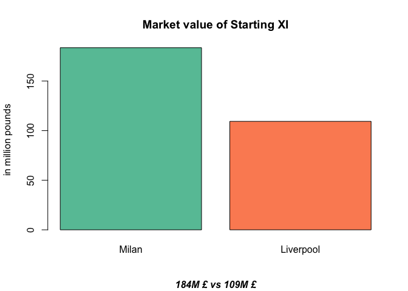<!-- -->

``` r
mv <- data.frame(name = c(milanLineup, liverpoolLineup), value = c(milanmv, liverpoolmv))
mvtop10 <- head(mv[order(-mv$value), ], n = 10)
library(forcats)
mvtop10 %>%
  mutate(name = fct_reorder(name, value)) %>%
  ggplot( aes(x=name, y=value)) +
    geom_bar(stat="identity", fill="#f68060", alpha=.6, width=.4) +
    coord_flip() +
    xlab("") +
    theme_bw()
```

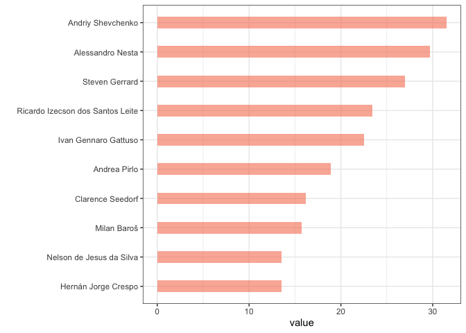<!-- -->
we can see that the market value of Milan’s starting XI is significantly
higher than Liverpool’s. Individually, Milan’s players took 8 places out
of the top 10 highest market value players of the joint teams. The
captain Steven Gerrard and the striker Baros are the 2 exceptions for
Liverpool.

After setting the stage, let us go to the actual match.

## The Data

### Description

The dataset comes from the open-source github repository of the soccer
data analytic company *statsbomb*. They make public 878 datasets in JSON
format, one per game, including this one. Every dataset contains
thousands of events, each event is characterized by about 100 or more
variables that describe the event.

``` r
dim(istanbul)
```

    ## [1] 4648  126

The dataset that records events about the miracle of Istanbul has 4648
events, each is described by 126 variables.

``` r
head(colnames(istanbul), n = 10)
```

    ##  [1] "id"             "index"          "period"         "timestamp"     
    ##  [5] "minute"         "second"         "possession"     "duration"      
    ##  [9] "related_events" "location"

The above shows the first 10 variables. The first variable `id` is the
unique identifier of each event; `period` denotes which time period this
event occurs (eg. 1 = the first half); `timestamp` records the exact
time of each event; `location` is another important variable that
records the coordinate information of the event. An example event
therefore would be: player x at time 00:31:52.716 passes the ball at the
pitch coordinate (24, 40) at mid-height with angle y…. As I go forward, we
will use and visualize more interesting variables. 

### Characteristics of the data

-   The dataset is really sparse (lots of NULL or NA values). This makes
    sense, because at one time point only one player is able to make one
    action. For example, Variable `dribble_nutmeg` is not NA if and only
    if some player nutmugs someone else (ouch!).

``` r
length(which(!is.na(istanbul$dribble.nutmeg)))
```

    ## [1] 4

4 nutmegs in 120 minutes (90 mins regular time plus 30 mins extra), not
bad!

-   We need to take special care of the `location` variable. The
    `location` denotes the pitch coordinates of each event. The
    coordinate is standardized as dimension 120 \* 80. However, soccer
    pitch size varies and the Atatürk Olympic Stadium has dimension 105
    meters \* 68 meters. We need to scale the coordinate from the
    relative location to the actual meters, so that the event will show
    up on the correct location on the pitch I draw.

``` r
location.x <- location.y <- rep(NA, nrow(istanbul))
for (i in 1:nrow(istanbul)) {
  if (! is.null(istanbul$location[[i]])) {
    location.x[i] <- istanbul$location[[i]][1] * 105 / 120
    location.y[i] <- istanbul$location[[i]][2] * 68 / 80
  }
}
istanbul$location.x <- location.x
istanbul$location.y <- location.y
```

## Timeline of the match

To figure out how the game evolves, we need to know the milestones of
the match. The milestones of a match are the key events, and according
to convention, including match start, goals, 1st half ends, 2nd half
starts, cards, substitution, penalties.

``` r
# get the goals and penalties  
goalEvents <- istanbul[which(istanbul$shot.outcome.id == 97 | istanbul$shot.type.name == "Penalty"), ]
# get the subs
subEvents <- istanbul[which(!is.na(istanbul$substitution.outcome.name)), ]
# get the cards 
cardEvents <- istanbul[which(!is.na(istanbul$foul_committed.card.name)), ]
keyEvents <- rbind(goalEvents, subEvents, cardEvents)
# Format the data to conform to timevis 
contents <- c("First half", "Second half", "1st half extra", "2nd half extra", "Penalty shootout")
contents <- c(contents, "yellow card", "yellow card")
contents <- c(contents, "Kewell out, Smicer in", "Finnan out, Hamann in", "3-1", "3-2", " 3-3", "Baros out, Cisse in", "O","O", "X","O")
contents <- c(contents, "1-0", "2-0", "3-0", "Crespo out, Tomasson in", "Seedorf out, Serginho in", "Gattuso out, Rui Costa in", "X",  "X", "O",  "O",  "X")
contents <- c(contents, "Timeout")
start <- c("2005-5-25 19:45:00", "2005-5-25 20:45:00", "2005-5-25 21:30:00", "2005-5-25 21:45:00", "2005-5-25 22:00:00")
# liverpool
start <- c (start, "2005-5-25 21:15:28", "2005-5-25 21:19:58"
, "2005-5-25 20:07:00", "2005-5-25 20:45:00", "2005-5-25 20:53:04", "2005-5-25 20:55:02", "2005-5-25 20:59:52", "2005-5-25 21:24:28", "2005-5-25 22:00:50", "2005-5-25 22:02:37", "2005-5-25 22:04:11", "2005-5-25 22:05:44")
# Milan
start <- c(start, "2005-5-25 19:45:51", "2005-5-25 20:23:12", "2005-5-25 20:27:57", "2005-5-25 21:24:50", "2005-5-25 21:25:05", "2005-5-25 21:51:20", "2005-5-25 22:00:02", "2005-5-25 22:01:40", "2005-5-25 22:03:17", "2005-5-25 22:05:03", "2005-5-25 22:06:24")
start <- c(start, "2005-5-25 20:30:00")
end <- c("2005-5-25 20:30:00", "2005-5-25 21:30:00", "2005-5-25 21:45:00", "2005-5-25 22:00:00", "2005-5-25 22:07:00", rep(NA, 23), "2005-5-25 20:45:00")
group = c(rep("time", 5), rep("Liverpool", 12), rep("Milan", 11), NA)
style = c(rep(NA, 5), rep("color:yellow;",2), rep(NA, 8), "color:red;", NA, rep(NA, 6), rep("color:red;",2), NA, NA, "color:red;", NA)
data = data.frame(content=contents, start, end, group, style)

timevisDataGroups <- data.frame(
  id = c("time", "Liverpool", "Milan"),
  content = c("Time", "Liverpool", "Milan")
)
library(timevis)
timevis(data, groups = timevisDataGroups)
```

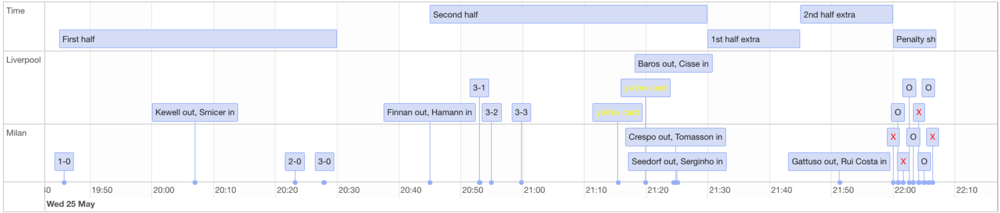

To summarize the timeline that we see above. In the first half, Milan
scored immediately when the game began, and scored two more goals
towards the end of the first half. On the other hand, Liverpool made a
substitute because of injury. Before the start of the 2nd half,
Liverpool was already 3-0 down and used one (out of total 3)
substitution involuntarily. At the beginning of the 2nd half, Liverpool
made yet another substitution. This substitution is due to the tactical
consideration by the Liverpool manager, trying to turn things around,
and it did. About 10 minutes later, Liverpool score their first goal,
making it 3-1, and in this 6 minutes spell, they score three goals in
total, levelling the score to 3-3. Both teams did not score in the later
parts of the game, and Liverpool beat Milan 3-2 in Penalty shootout (the
red X denotes penalty missing or being saved by the goalkeeper).

By seeing this timeline plot, all the key events are laid out clearly.
Furthermore, we can immediately gain insights towards our question,
which is, how the miracle happened:

-   The three comeback goals were scored in 6 minutes! What happened in
    those 6 minutes?
-   The distribution of goals are quite “even”, in that Milan scored 3
    in the first half and Liverpool scored 3 in the second half. Why
    that is the case?

Another thing that stands out from the timeline graph is that there were
only 2 yellow cards (all from Liverpool) and 0 red card in the game.
That is extremely rare for a soccer game, especially for the Champions
League final, the biggest game of the year. It shows how both teams were
focusing on playing the game actively, not on playing the game passively
(by fouling a lot to stop the other team’s play). It is truly a smooth
and high quality game, and dramatic.

## Heaven or Hell

As the timeline suggested, we see a distinction between the 1st half and
the 2nd half. Each team scored three goals and the other team scored
nothing. Specifically, the 1st half is the heaven for Milan, the hell
for Liverpool; the 2nd half is exactly the reverse of the 1st half. Can
we visualize the difference, the difference between heaven and hell?

### Shots

``` r
is <- tibble::as_tibble(istanbul)
is %>%
  filter(minute < 46) %>%
  soccerShotmap(theme = "dark")
```

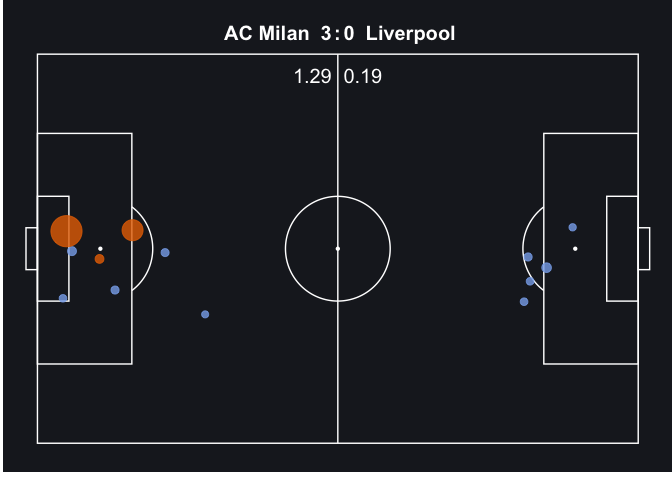

As we can see, in the 1st half, Milan made 8 shots (8 dots on the pic
above) and Liverpool made 5. However, most of the shots by Milan (6 out
of 8) were inside the box, whereas Liverpool only had 2.

``` r
is %>%
  filter(minute >= 45 & minute <= 90) %>%
  soccerShotmap(theme = "dark")
```

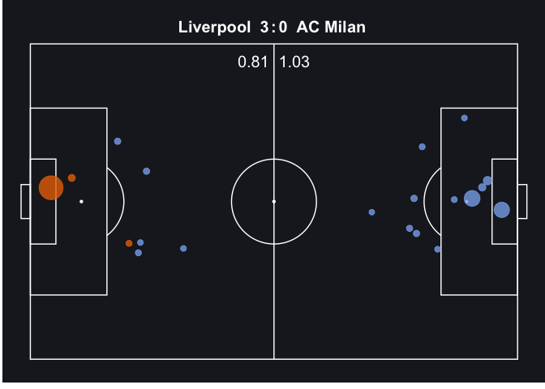
In the 2nd half, we’d expect that Liverpool dominates the shots and
shots in the box. On the contrary, Milan still dominates the number of
shots and shots in the box. Liverpool made only 2 shots inside the box
and they all made it into the net, and Liverpool also scored a
long-ranger. However, Milan attempted 6 shots inside the box and 6 more
outside the box, none of them made it.

Let’s see the comparison between shots made by both teams in the extra
time.

``` r
is %>%
  filter(minute >= 90 & minute <= 120) %>%
  soccerShotmap(theme = "dark")
```

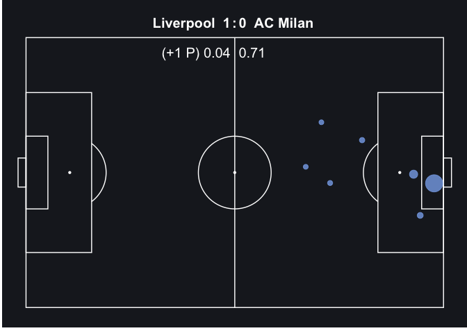
Surprisingly (or not so surprisingly after seeing the shots made in the
2nd half of the game), Liverpool made no attempts and Milan made 7 more
shots, 3 of them inside the box with 1 near the post of the goal (so
close!) and yet, Milan scored nothing.

### Passes

Passes are a essential part of a soccer game. By looking at the
locations of the passes (both the starting locations and the end
locations), we can also see the positions of the ball and the players.

#### 1st half

``` r
is %>%
  filter(team.name == "AC Milan" & period == 1 & minute <= 24) %>%
  soccerPassmap(fill = "lightblue", arrow = "r",
                title = "Milan's passing map in the 1st half")
```

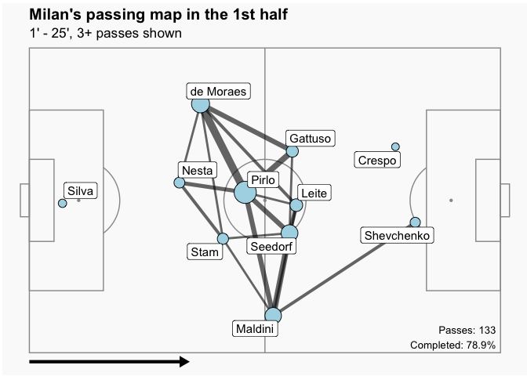
_picture 1_

``` r
is %>%
  filter(team.name == "AC Milan" & period == 1 & minute > 24) %>%
  soccerPassmap(fill = "lightblue", arrow = "r",
                title = "Milan's passing map in the 1st half (25' onwards)")
```

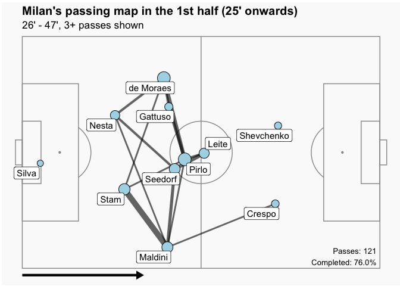
_picture 2_

``` r
is %>%
  filter(team.name == "Liverpool" & minute <= 24 & period == 1) %>%
  soccerPassmap(fill = "lightblue", arrow = "r",
                title = "Liverpool's passing map in the 1st half")
```

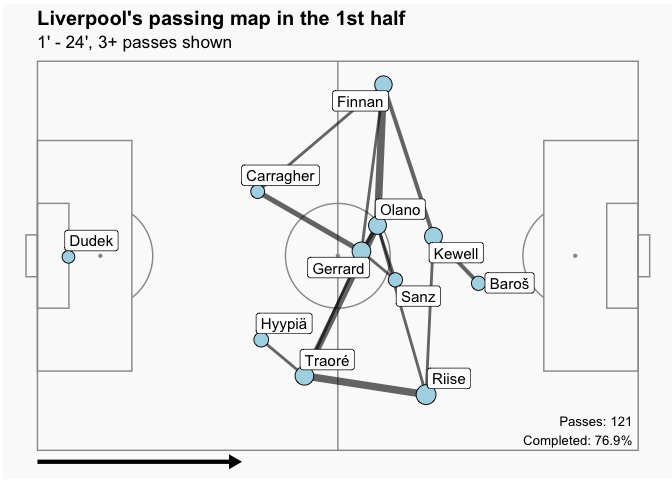
_picture 3_

``` r
is %>%
  filter(team.name == "Liverpool" & minute > 24 & period == 1) %>%
  soccerPassmap(fill = "lightblue", arrow = "r",
                title = "Liverpool's passing map in the 1st half (25' onwards)")
```

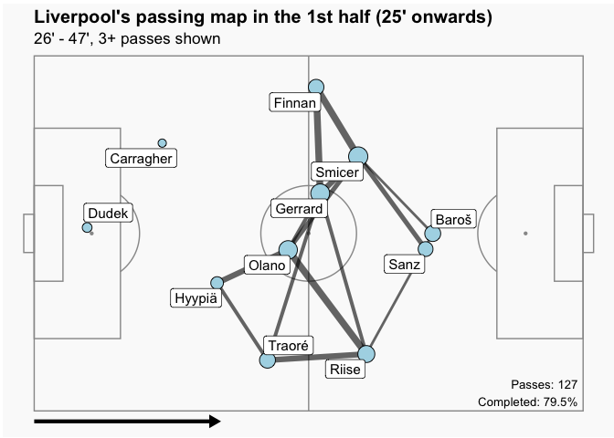<!-- -->
_picture 4_

We break the 1st half into two halves. The **picture 1** shows the
passing map of AC Milan in the first 24 minutes, with Pirlo being the
center of the passing map (the biggest blue dot in the map), Milan’s
transition (from attack to defense and vice versa) depended on him.
Another thing to notice is that one of the Milan’s forward, Crespo, was
not really involved in the game. The **picture 2** is the passing map
of Milan in the second half of the 1st half. Compared to the first
picture, Milan’s formation retrieved to their goal. For example, in the
first 24 minutes, Maldini (left back), Gattuso, Seedorf, were standing
in front of the Pirlo; they were behind Pirlo in the later half of the
1st half. I would guess the reason was due to the increase in
aggressiveness of Liverpool, as well as their own strategy of
contracting their defensive lines and playing counterattack, since they
led 1-0 as early as 1 minute into the game. And that strategy was
fantastic! They scored two more goals on counter attack at 39’ and 44’
when Liverpool tried really hard attacking (since they were 1-0 behind).
The scorer of both goals is Crespo, the man who were not “involved” in
terms of passing in the first 24 minutes, and he became lethal in the
second part.

The **picture 3 and 4** tell the Liverpool’s part of the story
in the 1st half. The first thing to notice is that Kewell was out and
Smicer was in for him (Kewell was in the 3rd pic but not in the 4th, and
Smicer the opposite) because Kewell was injured. And compared the 4th
with the 3rd picture, Gerrard and Sanz were pushing forward and to the
center, while the two wingers Riise and Smicer were roughly in the same
position as before.

#### The six minute spell

``` r
is %>%
  filter(team.name == "AC Milan" & minute >= 53 & minute <= 60) %>%
  soccerPassmap(fill = "lightblue", arrow = "r",
                title = "Milan's passing map in the 6 minute spell", minPass = 1)
```

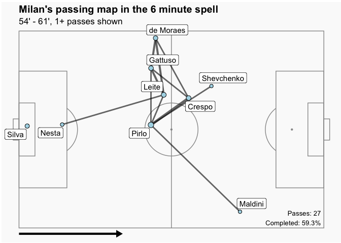
_picture 1_

``` r
passMap(is, "AC Milan", 2, 54, 60)
```

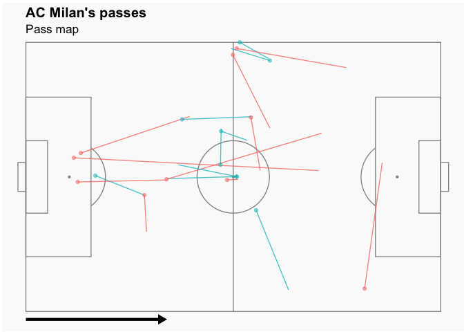
_picture 2_

``` r
is %>%
  filter(team.name == "Liverpool" & minute >= 53 & minute <=60) %>%
  soccerPassmap(fill = "lightblue", arrow = "r",
                title = "Liverpool's passing map in the 6 minute spell", minPass = 1)
```

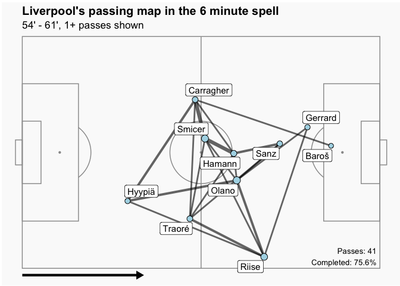
_picture 3_

``` r
passMap(is, "Liverpool", 2, 54, 60)
```

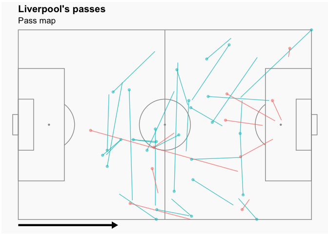
_picture 4_

We have seen the hell for Liverpool, i.e., the first half of the game,
where Milan scored an early goal and player on counter and scored two
more goals while Liverpool was struggling in attacking. However, as the
timeline suggests, in the second half of the game, there was a 6-minute
spell where Liverpool scored 3 goals. That spell was really the heaven
for Liverpool and for Liverpool’s fans. What happened? Since we are in
the passing section and analyzing passes are really effective in
analyzing the whole game, let’s look at all the passes happened in that
spell. In the **picture 1**, Milan achieved 27 passes with less than
60% of them completed. Only 8 players of Milan were involved in passing
the ball one or more times. Looking more closely, the **picture 2**
indicated that the passes from defense to midfield and midfield to
attack all failed (red: failure, blue: success).

On the contrary, the **picture 3** shows that all 10 players
(excluding the goalkeeper) were involved in passing, and they achieved
more than 75% passing accuracy. The **picture 4** shows the exact
passes.

In the 1st half, the passing accuracy was 78% for Milan. What causes
this decline in passing accuracy and number of passes on the Milan side,
whereas Liverpool somehow maintained their passing accuracy? I then look
at the defensive acts by both teams in that six minutes. 

``` r
d2 <- is %>% 
  filter(type.name %in% c("Interception", "Block", "Dispossessed", "Ball Recovery") & team.name == "Liverpool" & period == 2 & minute >= 54 & minute <= 60)

soccerPitch(arrow = "r", 
            title = "Liverpool", 
            subtitle = "Defensive actions") +
  geom_point(data = d2, aes(x = location.x, y = location.y, col = type.name), size = 3, alpha = 0.5)
```

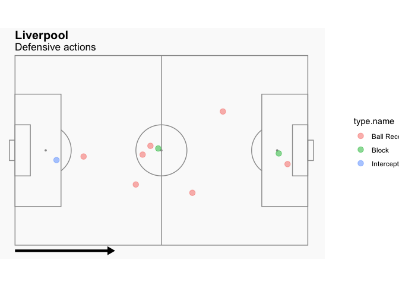
_picture 1_

``` r
d2 <- is %>% 
  filter(type.name %in% c( "Interception", "Block", "Dispossessed", "Ball Recovery") & team.name == "AC Milan" & period == 2 & minute >= 54 & minute <= 60)

soccerPitch(arrow = "r", 
            title = "Milan", 
            subtitle = "Defensive actions") +
  geom_point(data = d2, aes(x = location.x, y = location.y, col = type.name), size = 3, alpha = 0.5)
```

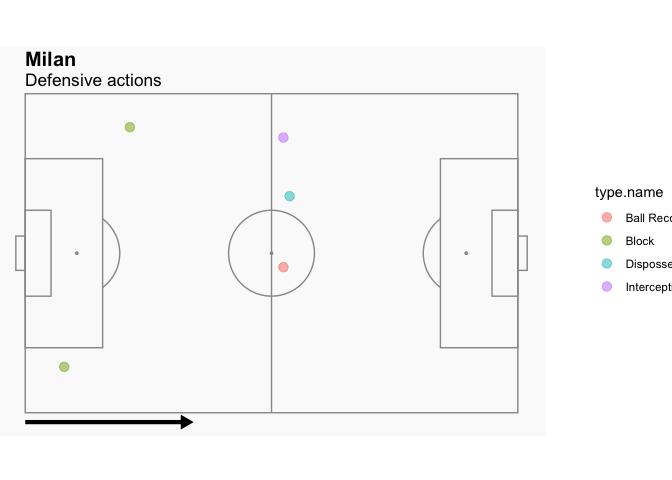
_picture 2_

The **picture 1** is the defensive actions done by Liverpool players
in 6 minutes. What is staggering is that they managed to achieve 7 ball
retrievals, leading to the decline in Milan’s passing accuracy. The
**picture 2** shows the defensive actions done by Milan. The mere 1
ball retrieve hardly influenced Liverpool’s passing and possession.

### Position

We have seen some visual information about the position of the players
in the passing maps earlier, to the point that we saw some deliberate
position shifts from the Milan side in the 1st half when they contracted
their defense lines. Through the viualizations below, we can see more
about the shifts in positions in terms of the whole team (i.e. shifts in
team formation) and individual key players.

#### 1st half

``` r
is %>%
  filter(!is.na(location.x) & team.name == "AC Milan" & period == 1) %>% 
  soccerPositionMap(id = "player.name", x = "location.x", y = "location.y", 
                    fill1 = "blue", theme = "grass", arrow = "r", 
                    title = "AC Milan", 
                    subtitle = "Average position (1st half)")
```

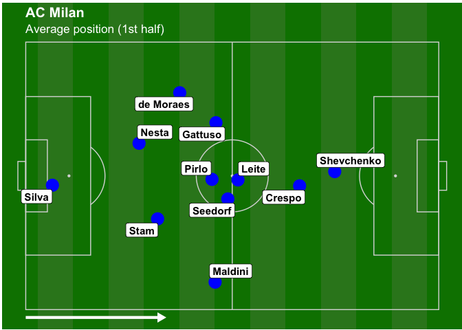
_picture 1_

``` r
is %>%
  filter(!is.na(location.x) & team.name == "Liverpool" & period == 1 & minute >= 25) %>% 
  soccerPositionMap(id = "player.name", x = "location.x", y = "location.y", 
                    fill1 = "blue", theme = "grass", arrow = "r", 
                    title = "Liverpool", 
                    subtitle = "Average position (1st half)")
```

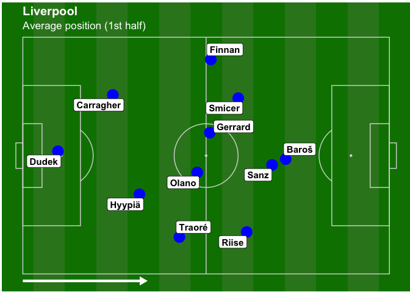
_picture 2_

The **picture 1** is the average position of the Milan in the 1st
half. The average position is defined as the average coordinates of
players when they take any actions, not only the passing ones. As we can
see, the Milan’s formation were really tight in the center of the
midfield. In addition to the 4 midfielders, one of the forwards Crespo
was close to midfield as well. And they were close together in the
center for a reason (as explained below).

In the **picture 2**, Liverpool’s formation in the 1st half was rather
scattered acrossthe width of the field. This was due to their tactics of
playing wide on the sides. Gerrard and Olano were together as a pair,
sitting in the midfield. However, their attacks on the sides were not
going very well, so Milan decided not to put too many players on the
sides (indicated by the 1st pic) and focused their attacks and later
their counter attacks in the center.

#### first 15 mins at 2nd half

``` r
is %>% 
  filter(!is.na(location.x) & team.name == "AC Milan" & period == 2 & minute <= 60) %>% 
  soccerPositionMap(id = "player.name", x = "location.x", y = "location.y", 
                    fill1 = "blue", theme = "grass", arrow = "r", 
                    title = "AC Milan", 
                    subtitle = "Average position (2nd half)")
```

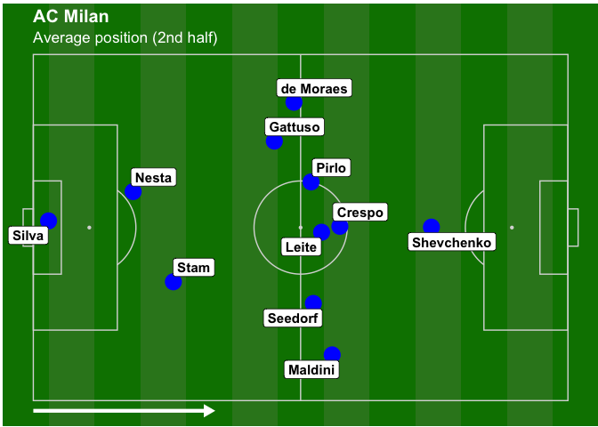
_picture 1_

``` r
is %>%
  filter(!is.na(location.x) & team.name == "Liverpool" & period == 2 & minute <= 60) %>% 
  soccerPositionMap(id = "player.name", x = "location.x", y = "location.y", 
                    fill1 = "blue", theme = "grass", arrow = "r", 
                    title = "Liverpool", 
                    subtitle = "Average position (2nd half)")
```

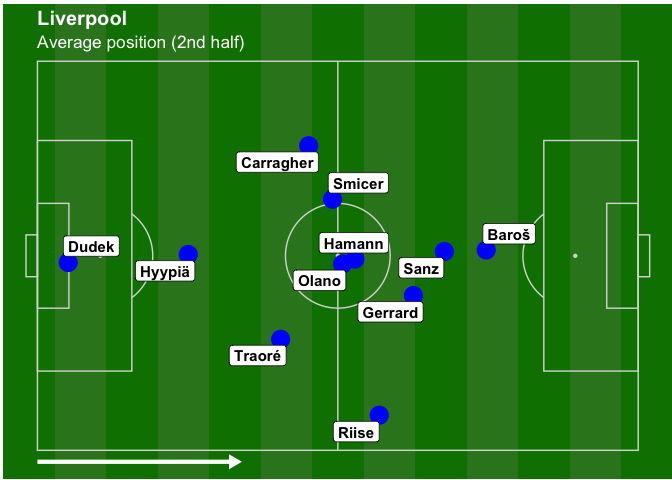
_picture 2_

With 3-0 down, Liverpool took right back Finnan down (therefore
forfeiting the attacking on the sides tactics) and put Hamman up
immediately in the beginning of the 2nd half, and the result was
astonishing! In the **picture 2**, Hamann took the position of where
Gerrard was in the 1st half, and freed Gerrard. By sacrificing the right
back, the Liverpool squeezed their formation towards the center.
Gerrard, together with Sanz and Baros, were constantly charging to the
Milan’s box carefree, since Hamann took care of his defensive duties.
And Boom! Gerrard scored the first goal, a header inside the box, and
created a penalty (later converted to the 3rd goal).

## Conclusion

Some may say that there is no need to visualize a soccer match, since it
is a visual art/sport in itself. I have to agree since I am a soccer fan
and have had so much joy and pain watching the games. It is especially
hard to try to visualize a miracle. However, I did it anyway because an
EDA process on a soccer match dataset can achieve the following things:

1.  A visual summary. In normal games, audiences see the motions of
    players in terms of motions of pictures, and they do not have good
    enough memory to remember everything and do not have time to
    summarize those information, as they are concentrated on the game
    itself. After the match, audiences will see lots of statistics about
    the game, such as the number of shots, the possession rate, number
    of passes, pass accuracy, etc, and they do not make much sense and
    they are not even comparable. A 65% possession rate in a game by a
    side is not the same thing as another team having 65% in another
    game. Go ask Barcelona fans. Their team used to have 65% possession
    and ended up winning all trophies, and now win nothing with the same
    possession rate. Visualizations like this can combine the visual
    part with the summary part, providing fans with a more immersive and 
    insightful perspective towards understanding the game.
2.  A good starting point for models about soccer game. As the advance
    of data science, models about soccer games are in dire need. A
    prominent example would be the model to predict expected goals given
    the data about soccer games. This EDA process is great for:
    1. See the data and find the characteristics of the data. In my example, it would be a lot of None values in the dataset and incompatible field dimension that I need to manually change.
    2. Visualize the key events that may lead to goals.
    3. Find out directions that may worth pursuing. I find out the 6 minute Liverpool spell and think this may be the direction to look further into. 

Main lessons learnt: It is no doubt a miracle, because:

1.  Super dramatic. Liverpool dominated the game for only 6 minutes, and
    ended up scoring three goals. Milan took the show for 114 minutes,
    including 7 shots in extra time, and they failed to score any after the 1st 
    half. The inefficiency in shooting influenced their mindset in the final
    penality shoot out, missing 3 out of 5. And Dudek’s (Liverpool’s
    goalkeeper) double save from Shevchenko in the 117th minute was
    voted the greatest Champions League moment of all time.
2.  Some reasons behind the comeback drama. 6 minutes spell because of
    the introduce of Hamann that freed Gerrard to attack. Milan’s
    success in the 1st half was also due to the formation factor, where
    Milan was tight in the center and Liverpool scattered.
3.  Human factor. The hard part to visualize. The psychological change
    of the Milan side as they went from ecstasy to doubt, and to fear.
    Their change in mindset when they repeatedly attack but scored
    nothing. On the other side, Gerrard and his influence on the
    whole team.

## Credits

### Data
- Statsbomb 

### Visualization package
- soccermatics
- ggplot2

## My working session

``` r
sessionInfo()
```

    ## R version 4.1.0 (2021-05-18)
    ## Platform: x86_64-apple-darwin20.4.0 (64-bit)
    ## Running under: macOS Big Sur 11.4
    ## 
    ## Matrix products: default
    ## BLAS:   /usr/local/Cellar/openblas/0.3.15_1/lib/libopenblasp-r0.3.15.dylib
    ## LAPACK: /usr/local/Cellar/r/4.1.0/lib/R/lib/libRlapack.dylib
    ## 
    ## locale:
    ## [1] en_US.UTF-8/en_US.UTF-8/en_US.UTF-8/C/en_US.UTF-8/en_US.UTF-8
    ## 
    ## attached base packages:
    ## [1] parallel  stats     graphics  grDevices utils     datasets  methods  
    ## [8] base     
    ## 
    ## other attached packages:
    ##  [1] forcats_0.5.1      RColorBrewer_1.1-2 soccermatics_0.9.4 StatsBombR_0.1.0  
    ##  [5] tidyr_1.1.3        sp_1.4-5           purrr_0.3.4        jsonlite_1.7.2    
    ##  [9] httr_1.4.2         doParallel_1.0.16  iterators_1.0.13   foreach_1.5.1     
    ## [13] RCurl_1.98-1.3     rvest_1.0.0        tibble_3.1.2       stringr_1.4.0     
    ## [17] stringi_1.6.2      dplyr_1.0.6        ggplot2_3.3.3     
    ## 
    ## loaded via a namespace (and not attached):
    ##  [1] zoo_1.8-9         tidyselect_1.1.1  xfun_0.23         lattice_0.20-44  
    ##  [5] colorspace_2.0-1  vctrs_0.3.8       generics_0.1.0    htmltools_0.5.1.1
    ##  [9] yaml_2.2.1        utf8_1.2.1        rlang_0.4.11      R.oo_1.24.0      
    ## [13] pillar_1.6.1      glue_1.4.2        withr_2.4.2       R.utils_2.10.1   
    ## [17] tweenr_1.0.2      plyr_1.8.6        lifecycle_1.0.0   munsell_0.5.0    
    ## [21] gtable_0.3.0      SDMTools_1.1-221  R.methodsS3_1.8.1 codetools_0.2-18 
    ## [25] evaluate_0.14     knitr_1.33        fansi_0.5.0       xts_0.12.1       
    ## [29] Rcpp_1.0.6        scales_1.1.1      farver_2.1.0      ggforce_0.3.3    
    ## [33] digest_0.6.27     ggrepel_0.9.1     polyclip_1.10-0   grid_4.1.0       
    ## [37] cowplot_1.1.1     tools_4.1.0       bitops_1.0-7      magrittr_2.0.1   
    ## [41] crayon_1.4.1      pkgconfig_2.0.3   ellipsis_0.3.2    MASS_7.3-54      
    ## [45] xml2_1.3.2        rmarkdown_2.8     R6_2.5.0          compiler_4.1.0

## source code
- [code](/src-code/2021-03-04-The-Miracle-of-Istanbul.Rmd)