## 引言
2005年5月25日，欧洲冠军联赛决赛在伊斯坦布尔的阿塔图尔克奥林匹克体育场举行。
体育场的 65000 名观众和全球数亿球迷即将见证一场后来被称为**伊斯坦布尔奇迹**的足球比赛。
才华横溢的AC米兰队在第一分钟就由队长马尔蒂尼先拔头筹；半场结束前，他们又进了两个球，直到 3-0 领先。
有传言说，米兰队在中场休息时就在更衣室里开香槟以庆祝他们即将在三年内第二次夺得欧冠冠军。
然而，下半场利物浦卷土重来，在戏剧性的6分钟内打进3球，将比分扳平为 3-3，
并在残酷的点球大战中以 3-2 击败米兰。英国解说员在比赛结束时说：“如果这都不能证明命运存在，
那么什么可以”。可以肯定的是，这个史诗般的逆转很难言传，但我将尝试用可视化来完成这项工作，
并且尝试弄清楚这一切是如何发生的。

### 弱者
利物浦队长史蒂文·杰拉德在赛前将他的球队称为与全明星米兰队相比的弱者，而且他是对的。
根据 transfermarkt.co.uk 的数据，
``` r
# get the data for the miracle of istanbul
Matches <- FreeMatches(FreeCompetitions())
istanbul <- get.matchFree(Matches[which(Matches$match_id == 2302764),])
milanLineup <- istanbul[[24]][[1]]$player.name
liverpoolLineup <- istanbul[[24]][[2]]$player.name
milanmv <- c(13.5, 2.7, 9.0, 29.7, 2.7, 18.9, 22.5, 16.2, 23.4, 31.5, 13.5)
liverpoolmv <- c(4.05, 3.6, 6.75, 6.08, 1.8, 13.5, 7.88, 27, 11.25, 11.7, 15.75)
mvSums <- data.frame(name = c("Milan", "Liverpool"), value = c(sum(milanmv), sum(liverpoolmv)))
library(RColorBrewer)
coul <- suppressWarnings(brewer.pal(2, "Set2")) 
barplot(height=mvSums$value, names=mvSums$name, col=coul, main = "Market value of Starting XI", sub = "184M £ vs 109M £", ylab = "in million pounds", font.sub = 4)
```

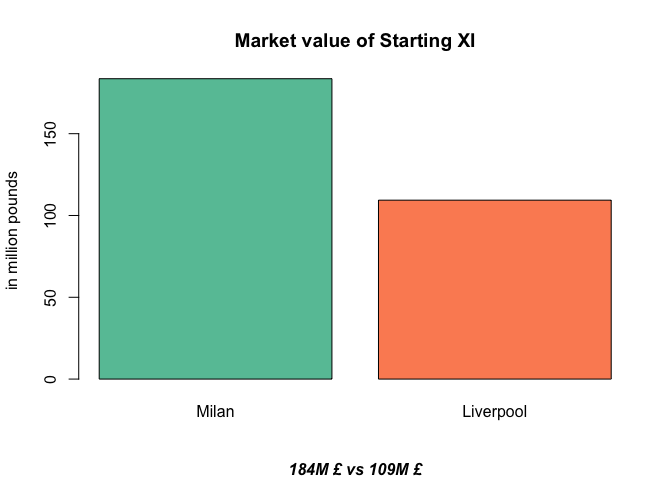

``` r
mv <- data.frame(name = c(milanLineup, liverpoolLineup), value = c(milanmv, liverpoolmv))
mvtop10 <- head(mv[order(-mv$value), ], n = 10)
library(forcats)
mvtop10 %>%
  mutate(name = fct_reorder(name, value)) %>%
  ggplot( aes(x=name, y=value)) +
    geom_bar(stat="identity", fill="#f68060", alpha=.6, width=.4) +
    coord_flip() +
    xlab("") +
    theme_bw()
```

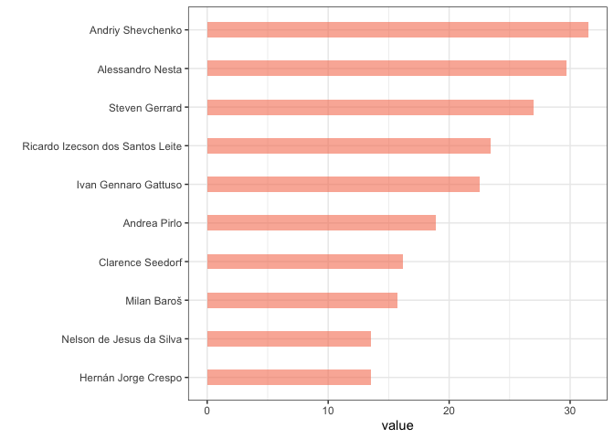

我们可以看到米兰首发十一人的市值明显高于利物浦。单从每个球员个体而言，
米兰球员在两队首发球员市值最高的前 10 名球员中占据 8 席。队长杰拉德和前锋巴罗斯是唯二的例外。

介绍完背景后，让我们进入比赛。

## 数据

### 数据集的描述
该数据集来自足球数据分析公司statsbomb的开源 github 库。他们公开了 878 个 JSON 格式的数据集，
每场比赛一个数据集，也包括这场。每个数据集都包含数千个事件，每个事件由大约 100 个或更多的变量所描述。
``` r
dim(istanbul)
```

    ## [1] 4648  126

记录伊斯坦布尔奇迹的数据集有 4648 个事件，每个事件由 126 个变量描述。

``` r
head(colnames(istanbul), n = 10)
```

    ##  [1] "id"             "index"          "period"         "timestamp"     
    ##  [5] "minute"         "second"         "possession"     "duration"      
    ##  [9] "related_events" "location"

上面显示了描述每个事件的前 10 个变量。第一个变量`id`是每个事件的唯一标识符；
`period`表示此事件发生的时间段（例如 1 = 上半场）；`timestamp`记录每个事件的确切时间；
`location`是另一个重要的变量，记录事件的坐标信息（即场上位置）。因此，一个示例事件是：
球员 x 在时间 00:31:52.716 以 y 的角度在球场坐标 (24, 40) 处传了一个半高球……。
随着文章的深入，我们将使用和可视化更多有趣的变量。

### 数据集的特征

- 数据集非常稀疏（很多 NULL 或 NA 值）。这是有道理的，因为在一个时间点，
只有一名球员能够做一个动作。例如，
`dribble_nutmeg`这个变量只有在某个球员穿了另外一个球员裆（好痛！）的时候才有值（不是 NA）。   

``` r
length(which(!is.na(istanbul$dribble.nutmeg)))
```

    ## [1] 4

120 分钟内（90 分钟常规时间加上 30 分钟加时）发生了 4 次穿裆，不坏！

- 我们需要特别注意`location`变量。`location`表示每个事件发生时的场上坐标，
而坐标的默认尺寸为 120 \* 80。但是，足球场大小各不相同，阿塔图尔克奥林匹克体育场的尺寸为 105 米 \* 68 米。我们需要将坐标从相对位置缩放到实际距离（米），以便事件显示在我后面绘制的球场的正确位置上。  

``` r
location.x <- location.y <- rep(NA, nrow(istanbul))
for (i in 1:nrow(istanbul)) {
  if (! is.null(istanbul$location[[i]])) {
    location.x[i] <- istanbul$location[[i]][1] * 105 / 120
    location.y[i] <- istanbul$location[[i]][2] * 68 / 80
  }
}
istanbul$location.x <- location.x
istanbul$location.y <- location.y
```

## 比赛时间线

为了弄清楚比赛是如何演变的，我们需要知道比赛的重要时间点。一场比赛的时间线是由一系列关键事件组成的。按照惯例，这些事件包括比赛开始、进球、上半场结束、下半场开始、出示（红黄）牌、换人、以及点球。

``` r
# get the goals and penalties  
goalEvents <- istanbul[which(istanbul$shot.outcome.id == 97 | istanbul$shot.type.name == "Penalty"), ]
# get the subs
subEvents <- istanbul[which(!is.na(istanbul$substitution.outcome.name)), ]
# get the cards 
cardEvents <- istanbul[which(!is.na(istanbul$foul_committed.card.name)), ]
keyEvents <- rbind(goalEvents, subEvents, cardEvents)
# Format the data to conform to timevis 
contents <- c("First half", "Second half", "1st half extra", "2nd half extra", "Penalty shootout")
contents <- c(contents, "yellow card", "yellow card")
contents <- c(contents, "Kewell out, Smicer in", "Finnan out, Hamann in", "3-1", "3-2", " 3-3", "Baros out, Cisse in", "O","O", "X","O")
contents <- c(contents, "1-0", "2-0", "3-0", "Crespo out, Tomasson in", "Seedorf out, Serginho in", "Gattuso out, Rui Costa in", "X",  "X", "O",  "O",  "X")
contents <- c(contents, "Timeout")
start <- c("2005-5-25 19:45:00", "2005-5-25 20:45:00", "2005-5-25 21:30:00", "2005-5-25 21:45:00", "2005-5-25 22:00:00")
# liverpool
start <- c (start, "2005-5-25 21:15:28", "2005-5-25 21:19:58"
, "2005-5-25 20:07:00", "2005-5-25 20:45:00", "2005-5-25 20:53:04", "2005-5-25 20:55:02", "2005-5-25 20:59:52", "2005-5-25 21:24:28", "2005-5-25 22:00:50", "2005-5-25 22:02:37", "2005-5-25 22:04:11", "2005-5-25 22:05:44")
# Milan
start <- c(start, "2005-5-25 19:45:51", "2005-5-25 20:23:12", "2005-5-25 20:27:57", "2005-5-25 21:24:50", "2005-5-25 21:25:05", "2005-5-25 21:51:20", "2005-5-25 22:00:02", "2005-5-25 22:01:40", "2005-5-25 22:03:17", "2005-5-25 22:05:03", "2005-5-25 22:06:24")
start <- c(start, "2005-5-25 20:30:00")
end <- c("2005-5-25 20:30:00", "2005-5-25 21:30:00", "2005-5-25 21:45:00", "2005-5-25 22:00:00", "2005-5-25 22:07:00", rep(NA, 23), "2005-5-25 20:45:00")
group = c(rep("time", 5), rep("Liverpool", 12), rep("Milan", 11), NA)
style = c(rep(NA, 5), rep("color:yellow;",2), rep(NA, 8), "color:red;", NA, rep(NA, 6), rep("color:red;",2), NA, NA, "color:red;", NA)
data = data.frame(content=contents, start, end, group, style)

timevisDataGroups <- data.frame(
  id = c("time", "Liverpool", "Milan"),
  content = c("Time", "Liverpool", "Milan")
)
library(timevis)
timevis(data, groups = timevisDataGroups)
```


总结一下上面的时间表。上半场，米兰在比赛开始时就立即取得进球，并在上半场快结束时又打入两球。另一方面，利物浦在上半场因伤换人。下半场开始前，利物浦已经 3-0 落后，而且被迫（非战术意图）用了 1 次换人。下半场开始，利物浦又换人。这次换人是由于利物浦主帅的战术考虑，试图扭转局面，而且确实做到了。约 10 分钟后，利物浦打进首球，将比分扳为 3-1，并且在 6 分钟的神奇表现中，他们一共打进 3 球，将比分扳成3-3。两队在比赛的后期面都没有再进球。最后利物浦在点球大战中 3-2 击败了米兰（图中的红X代表点球罚失，圆圈代表罚进）。 

通过这个时间表，所有的关键事件都被清晰地展示出来了。此外，我们可以找到好的角度来解释我们的问题，即奇迹是如何发生的：
- 6 分钟内打进 3 个球！那 6 分钟发生了什么？
- 从某种意义上来说，进球分布相当“均匀”，米兰上半场进 3 球，利物浦下半场进 3 球。为什么会这样？

从时间表中突出的另一件事是整场比赛裁判只出示了 2 张黄牌（全部来自利物浦）并且没有红牌。这对于一场足球比赛来说是极其罕见的，尤其是欧冠决赛。这是一年中最大的一场比赛。这显示了两支球队是如何专注于积极地比赛，而不是被动地比赛（通过犯规来阻止对方的比赛）。这确实是一款流畅且高质量的比赛，而且具有戏剧性。

## 天堂或地狱

正如时间表所建议的那样，我们看到了上半场和下半场之间的区别。每支球队都在一个半场进了 3 个球，而另一支球队则未进一球。具体来说，上半场是米兰的天堂，利物浦的地狱；下半场与上半场完全相反。我们能可视化天堂与地狱之间的区别吗？

### 射门

``` r
is <- tibble::as_tibble(istanbul)
is %>%
  filter(minute < 46) %>%
  soccerShotmap(theme = "dark")
```

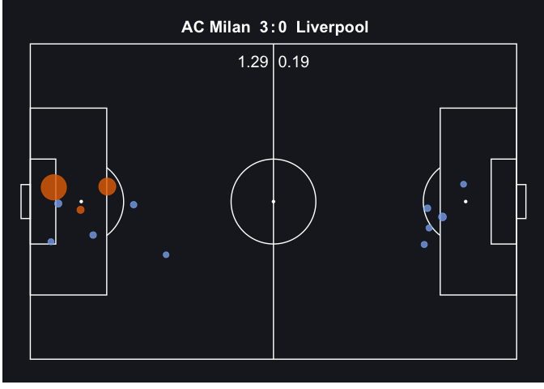

我们可以看到，上半场米兰 8 次射门（上图 8 个点），利物浦 5 次。不过，米兰的大部分射门（ 8 次中有 6 次）都在禁区内，而利物浦只有 2 次.


``` r
is %>%
  filter(minute >= 45 & minute <= 90) %>%
  soccerShotmap(theme = "dark")
```

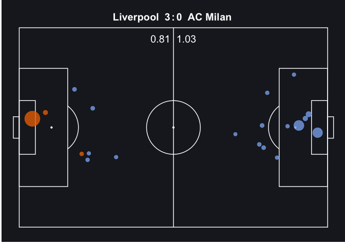

在下半场，我们预计利物浦会在射门和禁区内射门这一项中占据主导地位。相反，米兰在射门次数和禁区射门次数上仍占主导地位。利物浦禁区内仅 2 次射门就全部入网，利物浦还打进了一个远射。米兰禁区内 6 次射门，禁区外 6 次，却无一成功。

让我们看看加时赛里两队射门的对比。

``` r
is %>%
  filter(minute >= 90 & minute <= 120) %>%
  soccerShotmap(theme = "dark")
```

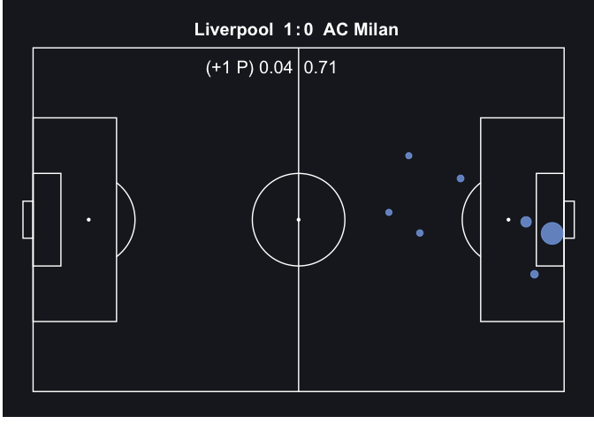

令人吃惊的是（也许在看到比赛下半场的射门后并不那么令人惊讶），利物浦没有机会尝试任何射门，米兰又射门 7 次，其中 3次在禁区内，并且 1 次靠近球门柱（差一点！）。然而，米兰一球未进。

### 传球
传球是足球比赛的重要组成部分。通过看传球的位置（开始位置和结束位置），我们可以看到球的位置和球员的站位。

#### 上半场

``` r
is %>%
  filter(team.name == "AC Milan" & period == 1 & minute <= 24) %>%
  soccerPassmap(fill = "lightblue", arrow = "r",
                title = "Milan's passing map in the 1st half")
```

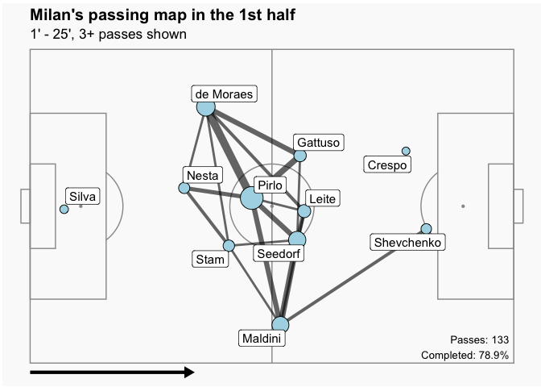
_图一_

``` r
is %>%
  filter(team.name == "AC Milan" & period == 1 & minute > 24) %>%
  soccerPassmap(fill = "lightblue", arrow = "r",
                title = "Milan's passing map in the 1st half (25' onwards)")
```

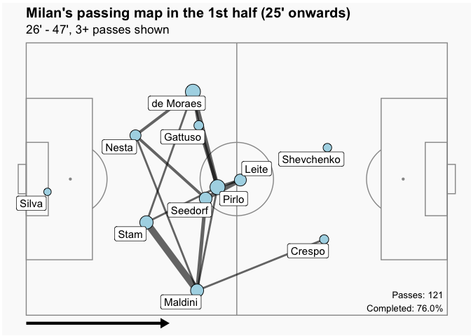
_图二_

``` r
is %>%
  filter(team.name == "Liverpool" & minute <= 24 & period == 1) %>%
  soccerPassmap(fill = "lightblue", arrow = "r",
                title = "Liverpool's passing map in the 1st half")
```

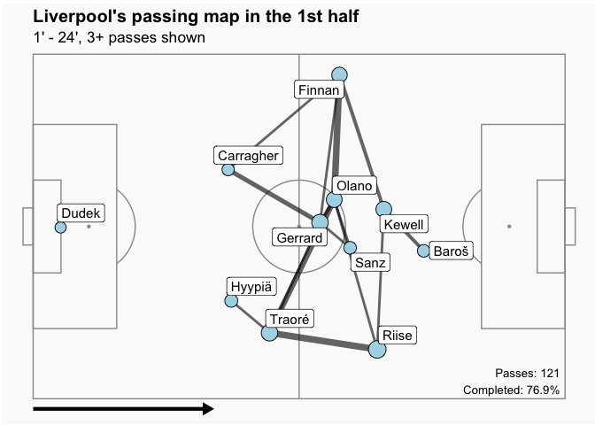
_图三_

``` r
is %>%
  filter(team.name == "Liverpool" & minute > 24 & period == 1) %>%
  soccerPassmap(fill = "lightblue", arrow = "r",
                title = "Liverpool's passing map in the 1st half (25' onwards)")
```

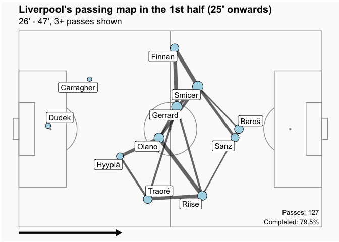
_图四_

我们可以将上半场分成两半。**图一** 是AC米兰的在前 24 分钟传球地图，皮尔洛位于图的中心（图中的最大蓝点），米兰的由守转攻以及由攻转守都依赖于他。另一件需要注意的是，米兰前锋克雷斯波这时并没有真正参与比赛。**图二** 是 24 分钟以后上半场结束前米兰的传球图。与第一张图相比，米兰的阵型向门前收缩了。比如在前 24 分钟，马尔蒂尼（左后卫）、加图索、西多夫都站在皮尔洛的身前；而在上半场第二阶段他们都位于皮尔洛身后。我猜想这是因为他们早早就以 1-0 领先，因此利物浦增加了的侵略性，以及米兰实施了收缩防线和反击的策略。这个策略简直太棒了！他们在利物浦非常努力地进攻时（因为他们以 1-0 落后， 在 39' 和 44' 的反击中又进了两个球。两个进球的得分手都是克雷斯波，他在前 24 分钟的传球中没有“参与”，在上半场第二阶段却变得致命。

**图三图四**是上半场利物浦的传球图。首先要注意的是，科威尔下场了（受伤离场），斯米切尔替补出场（科威尔在第三张图但不在第四张，而斯米切尔则相反）。而第四张和第三张对比，我们可以看出杰拉德和桑斯在向前推进并向中路靠拢，而两名边锋里瑟和斯米切尔的位置与上半场第一阶段（斯米切尔的之前是科威尔）大致相同。

#### 神奇的6分钟

``` r
is %>%
  filter(team.name == "AC Milan" & minute >= 53 & minute <= 60) %>%
  soccerPassmap(fill = "lightblue", arrow = "r",
                title = "Milan's passing map in the 6 minute spell", minPass = 1)
```

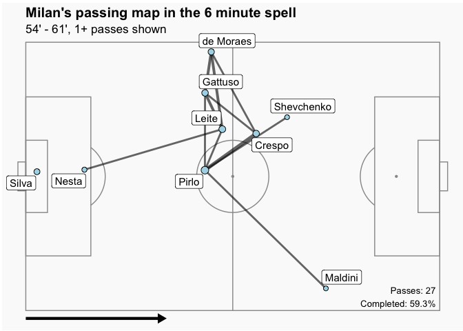
_图一_

``` r
passMap(is, "AC Milan", 2, 54, 60)
```

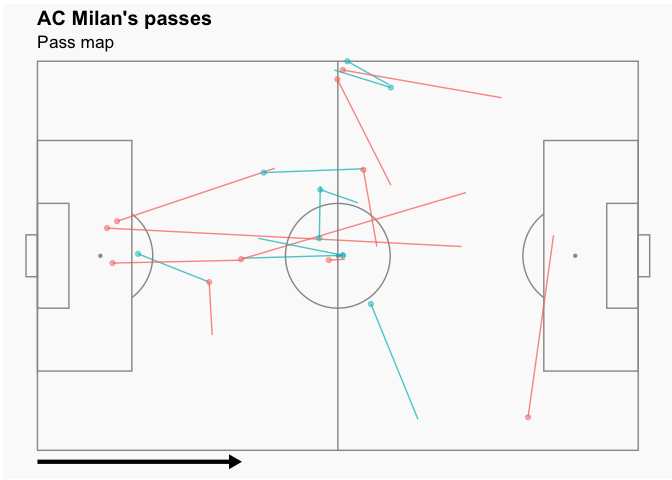
_图二_

``` r
is %>%
  filter(team.name == "Liverpool" & minute >= 53 & minute <=60) %>%
  soccerPassmap(fill = "lightblue", arrow = "r",
                title = "Liverpool's passing map in the 6 minute spell", minPass = 1)
```

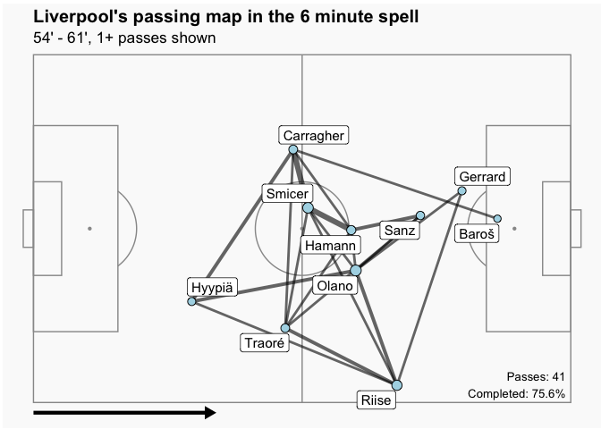
_图三_

``` r
passMap(is, "Liverpool", 2, 54, 60)
```

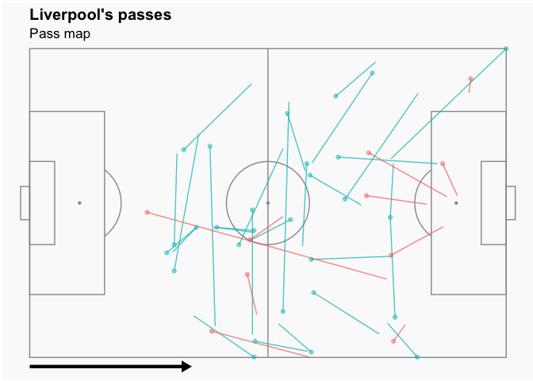
_图四_

我们已经看过了利物浦的地狱，即在上半场中米兰早早领先并且利用反击又进了两球，而利物浦则在进攻中挣扎。然而，正如时间表所显示的那样，在比赛的下半场，在 6 分钟里利物浦打进了3球扳平了比分。这神奇的 6 分钟真可谓是利物浦和利物浦球迷的天堂。这之间发生了什么？让我们看看这 6 分钟里发生的所有传球。**图一**：米兰传球 27 次，传球完成率不到 60%。米兰只有 8 名球员参与了一次或多次传球。如果我们仔细看，**图二** 显示米兰从防守到中场，以及从中场传到进攻线的传球全都失败了（红色：失败，蓝色：成功）。

相反，**图三**显示，利物浦的 10 名球员（不包括守门员）全部参与传球，传球准确率都达到了 75% 以上。**图四**显示了他们之间的传球。

在上半场，米兰的传球准确率为 78%。是什么导致米兰方面的传球准确率和传球次数的下降，而利物浦却以某种方式保持了他们的传球准确率？让我们看看两队在这 6 分钟的防守表现。

``` r
d2 <- is %>% 
  filter(type.name %in% c("Interception", "Block", "Dispossessed", "Ball Recovery") & team.name == "Liverpool" & period == 2 & minute >= 54 & minute <= 60)

soccerPitch(arrow = "r", 
            title = "Liverpool", 
            subtitle = "Defensive actions") +
  geom_point(data = d2, aes(x = location.x, y = location.y, col = type.name), size = 3, alpha = 0.5)
```

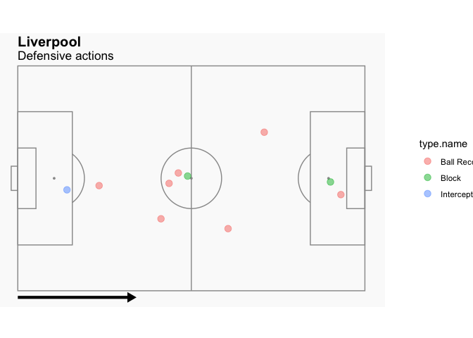
_图一_

``` r
d2 <- is %>% 
  filter(type.name %in% c( "Interception", "Block", "Dispossessed", "Ball Recovery") & team.name == "AC Milan" & period == 2 & minute >= 54 & minute <= 60)

soccerPitch(arrow = "r", 
            title = "Milan", 
            subtitle = "Defensive actions") +
  geom_point(data = d2, aes(x = location.x, y = location.y, col = type.name), size = 3, alpha = 0.5)
```

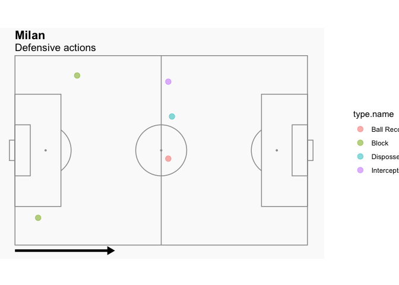
_图二_

**图一**是利物浦球员在这 6 分钟做的防守动作。令人咋舌的是，他们竟然做到了 7 次抢断，从而导致米兰传球准确率下降。**图二**则是米兰的防守动作，仅仅只有 1 次夺回球权，几乎没有影响到利物浦的控球。


### 场上位置

之前我们已经通过传球图看到了一些球员在场上的位置，比如我们看到上半场米兰一方在领先后收缩防线。通过下面的可视化，我们可以看到更多关于整个球队（球队阵型的变化）和个别关键球员的位置变化。


#### 上半场

``` r
is %>%
  filter(!is.na(location.x) & team.name == "AC Milan" & period == 1) %>% 
  soccerPositionMap(id = "player.name", x = "location.x", y = "location.y", 
                    fill1 = "blue", theme = "grass", arrow = "r", 
                    title = "AC Milan", 
                    subtitle = "Average position (1st half)")
```

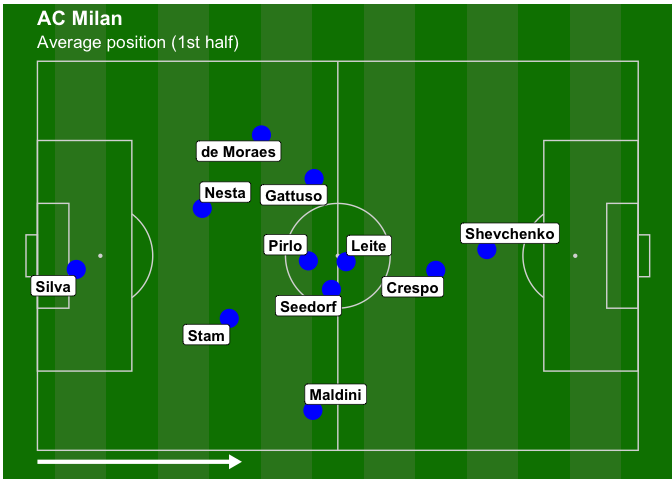
_图一_

``` r
is %>%
  filter(!is.na(location.x) & team.name == "Liverpool" & period == 1 & minute >= 25) %>% 
  soccerPositionMap(id = "player.name", x = "location.x", y = "location.y", 
                    fill1 = "blue", theme = "grass", arrow = "r", 
                    title = "Liverpool", 
                    subtitle = "Average position (1st half)")
```

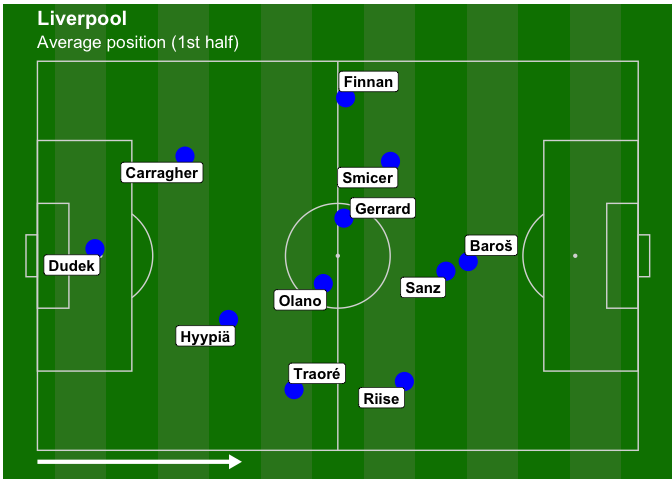
_图二_

**图一**是米兰在上半场的平均位置。平均位置是球员采取任何动作时的平均坐标，而不仅仅是传球。正如我们所见，米兰的阵型收缩在中场中央附近。除了 4 名中场球员外，其中一名前锋克雷斯波也接近中场。出于某种原因，他们在中心靠得很近（后面会解释）。

**图二**中，利物浦在上半场的阵型是比较分散的，比较注重场上宽度。这是由于他们在边路打边的战术。杰拉德和奥拉诺是双中场。然而，他们的边路进攻并不顺利，所以米兰决定不把太多的球员放在边上（如图1所示），而是集中火力进攻在中路进攻和之后的反击。

#### 上半场前15分钟

``` r
is %>% 
  filter(!is.na(location.x) & team.name == "AC Milan" & period == 2 & minute <= 60) %>% 
  soccerPositionMap(id = "player.name", x = "location.x", y = "location.y", 
                    fill1 = "blue", theme = "grass", arrow = "r", 
                    title = "AC Milan", 
                    subtitle = "Average position (2nd half)")
```

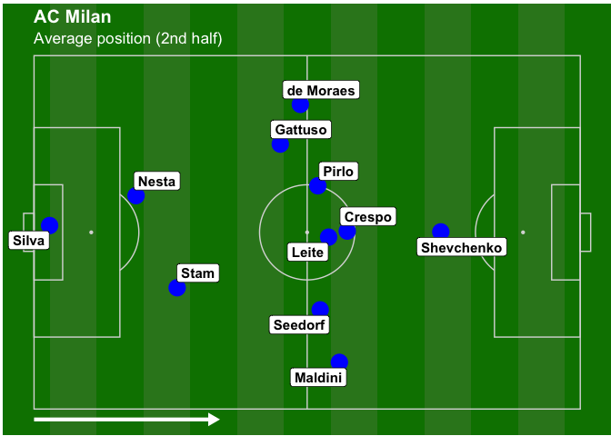
_图一_

``` r
is %>%
  filter(!is.na(location.x) & team.name == "Liverpool" & period == 2 & minute <= 60) %>% 
  soccerPositionMap(id = "player.name", x = "location.x", y = "location.y", 
                    fill1 = "blue", theme = "grass", arrow = "r", 
                    title = "Liverpool", 
                    subtitle = "Average position (2nd half)")
```

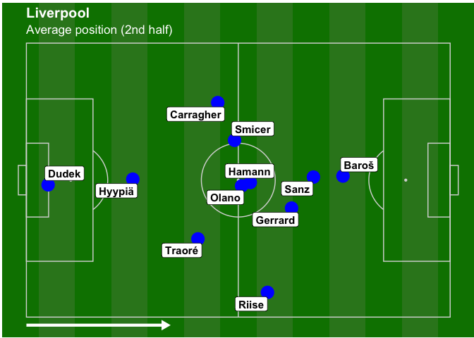
_图二_

当利物浦 3-0 落后后，利物浦做出了战术调整：在下半场开始时用哈曼换下右后卫芬南（因此放弃了边路进攻战术。结果我们大家都知道了。在**图二**，哈曼接替了杰拉德上半场的位置，并释放杰拉德。通过牺牲右后卫，利物浦将他们的阵型挤向中路。杰拉德和桑斯、巴罗斯一起，不断地冲向米兰的禁区并且不需要担心自己的身后，因为哈曼在身后负责防守。然后Boom！杰拉德通过禁区内头球攻门打进了第一个进球，并创造了一个点球（后来转换为第 3 个进球）。

## 结论

有些人可能会说没有必要将足球比赛可视化，因为它本身就是一种视觉艺术/运动。我必须同意，因为我是一名足球迷，并且在观看比赛时有很多快乐和痛苦，试图可视化一个奇迹更是困难。但是我还是这样做了，因为用探索性数据分析（Exploratory data analysis）来分析足球比赛可以实现以下目标：

1.  提供一个视觉性的摘要。在普通比赛中，球迷通过现场画面的动作来观察球员的动作。他们的记忆力不足以记住所有内容，也没有时间总结这些信息，因为他们太专注于比赛本身。比赛结束后，球迷会看到很多关于比赛的统计数据，比如射门次数、控球率、传球次数、传球准确率等，这些数据本身其实没有多太大意义，甚至不具有可比性。一方在一场比赛中拥有 65% 的控球率与另一支球队在另一场比赛中拥有 65% 的控球率不同。去问问巴萨球迷吧。他们的球队曾经拥有 65% 的控球率并最终赢得了所有奖杯，而现在以相同的控球率却一无所获。像这样的可视化可以将视觉部分与摘要部分结合起来，从而给球迷带来更投入更具洞察力的角度来理解比赛。
2.  提供一个建立足球比赛模型的很好的起点。随着数据科学的进步，迫切需要有关足球比赛的模型。一个突出的例子是根据足球比赛的数据（事件以及描述事件的变量）预测预期进球（expected goal)的模型。此过程非常适合：
    1. *看到* 数据本身以及发现数据的特点。在这个数据集中，里面有很多None/NA值以及里面的位置信息是与实际场地不匹配的，所以我通过这个过程发现了问题并解决了问题。
    2. 可视化能够导致进球的关键事件。
    3. 发现可以继续深挖的方向。比如我在EDA的过程中发现了利物浦的神奇 6 分钟，这可能是值得探索的方向之一。

学到的主要经验: 这无疑是一个奇迹，因为：

1.  超级戏剧化。利物浦仅统治了比赛 6 分钟，却最终打进 3 球。米兰统治了 114 分钟，包括加时赛 7 次射门，却在上半场后一球未进。射门效率的低下影响了他们在最后的点球大战中的心态，5罚仅仅2中。而杜德克（利物浦的守门员）在第 117 分钟对舍甫琴科的扑救则被评为有史以来最伟大的欧冠时刻。
2.  戏剧性的扳平背后的一些原因。由于哈曼的上场，杰拉德得以自由进攻。米兰上半场的成功也得益于阵型因素：米兰紧实的中场 vs 利物浦松散在两边。
3.  人的因素。这是可视化的困难部分。米兰方面的心理变化，从狂喜到怀疑，最后到恐惧。当他们反复进攻但一无所获时，他们的心态发生了变化。在另一边，杰拉德和他对整个球队的影响。

## 引用

### 数据
- Statsbomb 

### 可视化R包
- soccermatics
- ggplot2

## 我的R环境

``` r
sessionInfo()
```

    ## R version 4.1.0 (2021-05-18)
    ## Platform: x86_64-apple-darwin20.4.0 (64-bit)
    ## Running under: macOS Big Sur 11.4
    ## 
    ## Matrix products: default
    ## BLAS:   /usr/local/Cellar/openblas/0.3.15_1/lib/libopenblasp-r0.3.15.dylib
    ## LAPACK: /usr/local/Cellar/r/4.1.0/lib/R/lib/libRlapack.dylib
    ## 
    ## locale:
    ## [1] en_US.UTF-8/en_US.UTF-8/en_US.UTF-8/C/en_US.UTF-8/en_US.UTF-8
    ## 
    ## attached base packages:
    ## [1] parallel  stats     graphics  grDevices utils     datasets  methods  
    ## [8] base     
    ## 
    ## other attached packages:
    ##  [1] forcats_0.5.1      RColorBrewer_1.1-2 soccermatics_0.9.4 StatsBombR_0.1.0  
    ##  [5] tidyr_1.1.3        sp_1.4-5           purrr_0.3.4        jsonlite_1.7.2    
    ##  [9] httr_1.4.2         doParallel_1.0.16  iterators_1.0.13   foreach_1.5.1     
    ## [13] RCurl_1.98-1.3     rvest_1.0.0        tibble_3.1.2       stringr_1.4.0     
    ## [17] stringi_1.6.2      dplyr_1.0.6        ggplot2_3.3.3     
    ## 
    ## loaded via a namespace (and not attached):
    ##  [1] zoo_1.8-9         tidyselect_1.1.1  xfun_0.23         lattice_0.20-44  
    ##  [5] colorspace_2.0-1  vctrs_0.3.8       generics_0.1.0    htmltools_0.5.1.1
    ##  [9] yaml_2.2.1        utf8_1.2.1        rlang_0.4.11      R.oo_1.24.0      
    ## [13] pillar_1.6.1      glue_1.4.2        withr_2.4.2       R.utils_2.10.1   
    ## [17] tweenr_1.0.2      plyr_1.8.6        lifecycle_1.0.0   munsell_0.5.0    
    ## [21] gtable_0.3.0      SDMTools_1.1-221  R.methodsS3_1.8.1 codetools_0.2-18 
    ## [25] evaluate_0.14     knitr_1.33        fansi_0.5.0       xts_0.12.1       
    ## [29] Rcpp_1.0.6        scales_1.1.1      farver_2.1.0      ggforce_0.3.3    
    ## [33] digest_0.6.27     ggrepel_0.9.1     polyclip_1.10-0   grid_4.1.0       
    ## [37] cowplot_1.1.1     tools_4.1.0       bitops_1.0-7      magrittr_2.0.1   
    ## [41] crayon_1.4.1      pkgconfig_2.0.3   ellipsis_0.3.2    MASS_7.3-54      
    ## [45] xml2_1.3.2        rmarkdown_2.8     R6_2.5.0          compiler_4.1.0

## 源代码
- [代码](/src-code/2021-03-04-The-Miracle-of-Istanbul.Rmd)