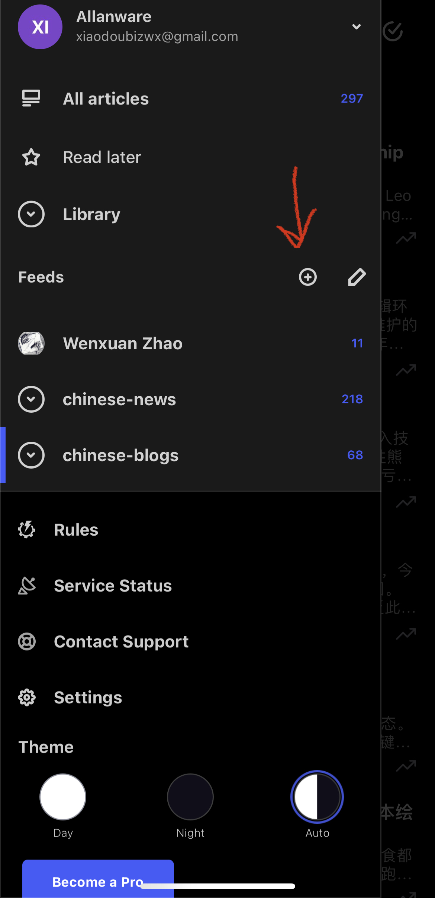
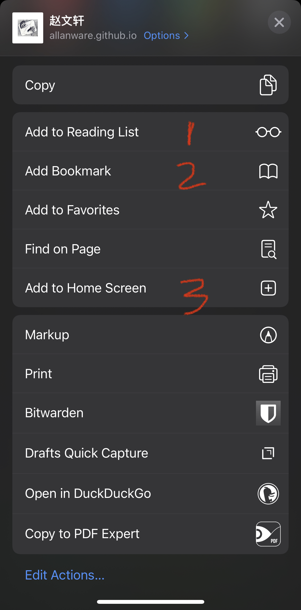

## 为什么开始写这个博客
### 初衷
- 侯世达一开始只是想写一本关于哥德尔不完备定理的小册子，结果在写的过程中他联想到了巴赫的音乐，艾舍尔的绘画，甚至禅宗。最终这么一本小册子变成了一本巨著：[哥德尔, 艾舍尔, 巴赫]()。他在巴赫的音乐（如*音乐的奉献*)和艾舍尔的画作里找到了和证明哥德尔不完备定理里一样的元素：一种奇怪的圈。这里就不详述这种圈是什么了，但这种相似，甚至同构的思维方式联结起了三个不同的领域，让我们不禁思考人的意识与智能是不是有一些基本的普遍的元素。例如，我们可以通过类比，建筑同构来达到某种相通，不仅是在不同领域，也在人与人之间。
- 所以，我希望在这里不仅单独探索在[关于]()里列举的比于谦还多两个的爱好，我更关心的是它们之间的联系，比如我能不能找到有意思的类比甚至同构。比如：
    - 电影，音乐，以及足球，都是在一个时间线上的前进的艺术形式（我认为足球也是艺术），在每一个时间点上，又有很多因素影响它们。比如电影里，每一个时间点是一个镜头，这个镜头里包含了所有的 Mise en scène（场面调度）。音乐里，每一个时间点都在演奏乐谱里一个或多个音符的音高。足球里，每一个时间点都包含甚至由21个人的无球跑位（他们的场上位置）和持球队员的选择（停传带射）所决定。但单丝不成线，人们感知这三种艺术不是通过一个一个时间点单独感知的，而是连续地，通过当前这个时间点与过去时间点总和之间的的关系（这个关系可能是连续地承接，也可能是强烈的对比，也可能是“令人满足的”结束）来感受它们。
    - 它们还有一个相同的地方：它们都展现了理性与感性之间的张力。我们在欣赏足球比赛，音乐会，和电影的过程中，情绪也随之跌宕起伏。但从另外一个角度而言，作曲家（与演奏家），导演（等），教练（与球员）在每一个时间点都在做决定，这些决定很多时候甚至是极度理性的，比如一首曲子背后的乐理，电影镜头背后的剧本，摄像，灯光等，场下的训练与战术，但最后的结果对观众而言又是情绪的获得，累计与释放。
    - 人们所常说的通感也是很有意思的，比如管弦乐团用那么多种的乐器来利用尽可能多的不同音色来表达不同情感，这里的“色”令人自然想到它们和颜色的关系，而颜色又被王家卫、马力克、韦斯安德森等在电影里利用布景，灯光，摄像等所影响来表达情绪。
    
### 个人原因
- 把所思所见记录下来是一种正反馈。即使只有一个读者（我自己，当然读者越多越好），也会很有成就感，这会促进我读和看得更多，然后就会记录更多，以此类推。这种正反馈也是一种奇怪的圈，确切来说是一个两步的圈：读/看/听 指向写，写再指回去。
- 写作是一个把虚无缥缈的想法具象化的过程，这种具像化我认为有两个好处：
    1. 能够减少迷茫。迷茫本身不是一件坏事，我认为它是进步的前奏。如果一个人思维上已经不再迷茫，那他也就停止了探索，也停止了寻找新的更强的正反馈的步伐。他可能做现在的事也能获得正反馈，甚至都已经很擅长了，但我认为随着时间的推移，做同一件事能给予他的正反馈会逐渐减少，当减少到零的时候他同样也会变得迷茫。但如果一直迷茫，那他就会一直处于一种无法经历正反馈/成就感的境地，从而很难有动力往前走，最终只能原地打转。总之，迷茫与正反馈是有张力的一对儿，正反馈不断地转化为迷茫，我们需要做的就是把刚转化过来的这份迷茫再转过去，使得迷茫是正反馈的动力，而写作可能是其中一种方法。
    2. 在把思维具象化的过程中，我发现我会不断打磨，更新，整合，甚至推倒我原来的想法。最终落到笔头这一过程比在我脑中打磨会更有效果。而且，这种打磨对于一个志在能有机有效结合很多方面的野心勃勃的想法来说尤为重要。
- 这是一个记录我变化的平台。十年之后再看现在的文字，会很有意思。如果一个人作为人没有一个绝对的意义（即每个人都会生老病死，都属于大自然的规律），那这种变化与成长可能构成了一种相对的意义吧，就像是当我们感知一段优美的旋律时不是通过听一个个单独的音符，而是随着音的高低变化，起承转合而移动从而被感动：只有听过属音后，我们才能在听到主音后感到回到了家。当我回看我的博客时，我希望以后能看到我的人生是流动着的。当其他人看的时候，[接下条](#能给他人带来什么)

### 能给他人带来什么
- 如果[关于]()里有你感兴趣的东西，或者看完[初衷](#初衷)后你也对事物的联系感兴趣，例如为什么有巴萨的比赛看起来像听交响乐这种[说法](https://www.fcbarcelonanoticias.com/en/fc-barcelona/suarez-and-neymar-lead-the-symphony-of-the-barcelona-6-0_35220_102.html)（或者你可以套用你喜欢的球队，皇马也行），为什么会有一首曲子会被一本书、一部电影被一首曲子启发这种事，那以后这里会有更多这方面的东西。
- 以后我有时间也会分享我的个人经历，希望会对你来说有点意思，要么是有价值的信息，要么是作为旁观者能拥有一种美学的崇高，即可以不用亲身经历但也可以感受到被生活所“虐”的那种恐惧被宣泄的满足感。

## 订阅
既然都看到这里了，那就考虑订阅一下吧。
- 那么如何订阅呢：

### 方法一 [RSS feed](https://rss.com/blog/how-do-rss-feeds-work/)
1. 下载一个 RSS feed reader。
    - 我个人在手机上下载了一个叫 [***inoreader***](https://www.inoreader.com/) 的 app。
    - 我爸在国内苹果区商店下载并且用 ***Ego Reader*** 也成功订阅了。
    
2. 注册一个免费账号并登录。
    - inoreader 的免费账号支持订阅不超过150个 **RSS feed**。
    
3. 添加我的 feed 链接至你的 RSS feed reader：复制以下一个链接
    - 我的中文博客的链接是：https://allanware.github.io/zh/index.xml
    
    - 我的英文博客的链接是：https://allanware.github.io/index.xml
    
    - 注：我的中英文博客内容会有些区别，因为每次只会用一个语言写一篇文章，有时没时间再翻译成另外一种语言，所以有兴趣的话两个都可以（分别）订阅。然后点击加号，然后粘贴链接。 
    
      成功后应该能看到 *Wenxuan Zhao*（或者*赵文轩*如果添加的是中文版）出现在 Feeds 底下。

4. 添加成功后，每当我一更新博客，它们就会自动出现在 app 里。这样省去了经常在浏览器输入我的网站的麻烦。
   
### 方法二
1. 在手机/平板/电脑浏览器里输入我的主页网址
    - 中文博客的链接是：https://allanware.github.io/zh/
    - 英文博客的链接是：https://allanware.github.io/
2. 添加书签
    - 例如：在 ios/ipad os的 Safari 底部点击分享按钮(五个按钮中中间那个，第一个按钮是后退)，会出现下图：
    
    选项一可以把博客添加到读书列表中，选项二可以添加到书签页中，选项三可以把博客添加到主屏幕中，到时候访问博客就和在主屏幕里点击微信图标访问微信一样。

